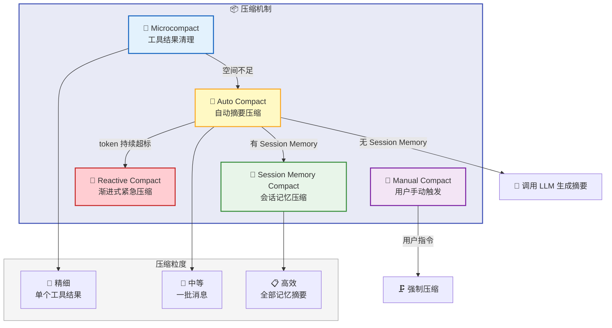
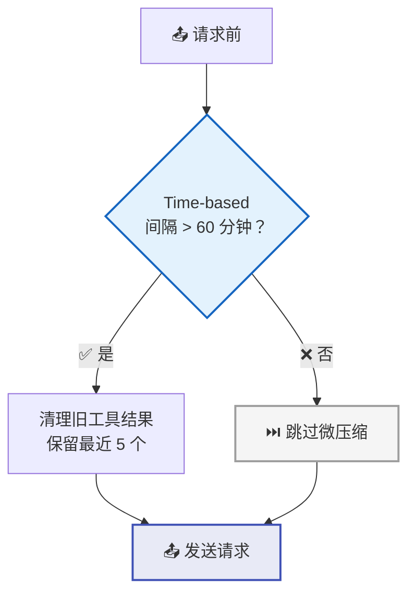
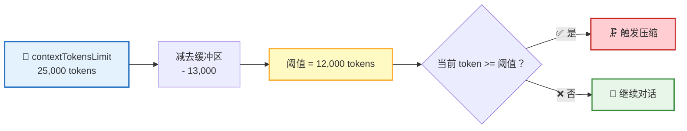
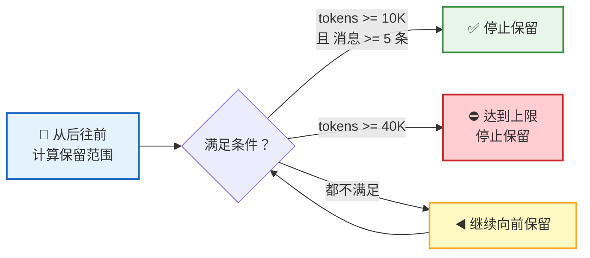
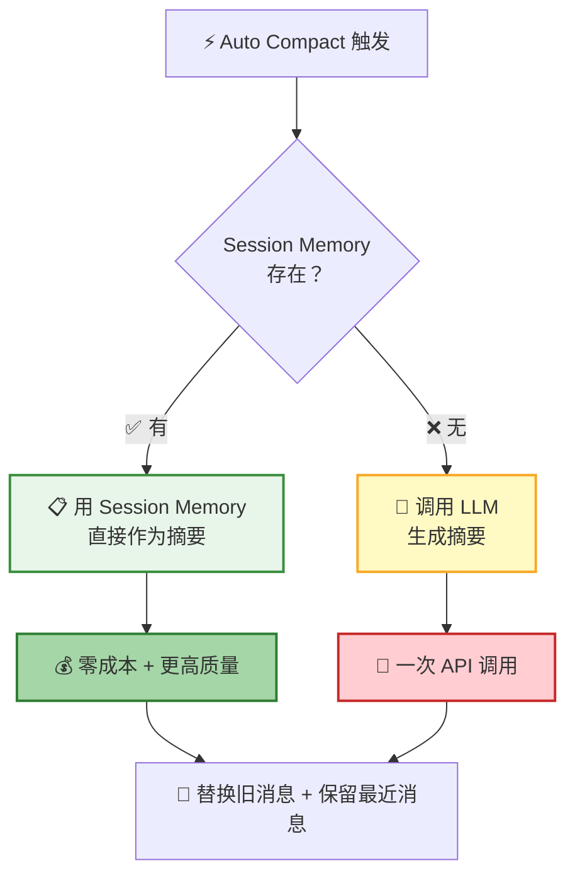
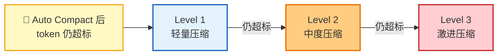
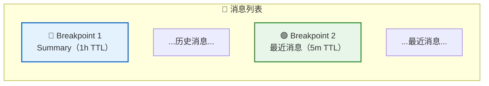
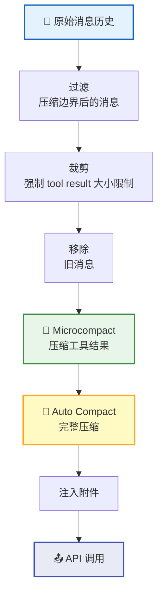
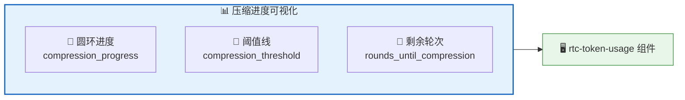

**上下文管理** 是对话持续进行的关键。当对话越来越长、工具输出越来越多时，系统通过 **五层压缩机制** 智能管理上下文窗口——保留关键信息，释放宝贵空间，让对话永不断裂。

## 五层压缩架构



| 层级 | 名称 | 触发条件 | 压缩粒度 | 成本 |
|:----:|------|----------|----------|:----:|
| 0 | Manual Compact | 用户发送 `/compact` 命令 | 全量 → 摘要 | 一次 LLM 调用 |
| 1 | Microcompact | 时间间隔 | 单个工具结果 | 零 |
| 2 | Auto Compact | token 达到阈值 | 一批消息 → 摘要 | 一次 LLM 调用 |
| 3 | Reactive Compact | Auto Compact 后仍超标 | 渐进式多级压缩 | 零 ~ 一次 LLM |
| 4 | Session Memory Compact | Auto Compact 触发时 | 会话记忆 → 摘要 | 零 |

## 手动压缩 (Manual Compact)

用户可通过 `/compact` 命令手动触发上下文压缩，适用于主动清理上下文或调整摘要方向。

**RPC**：`v1.session.compact`

```json
{
  "session_id": "uuid",
  "custom_instruction": "重点保留 API 设计决策和代码片段"
}
```

| 参数 | 说明 |
|------|------|
| `session_id` | 目标会话 ID |
| `custom_instruction` | 可选，自定义摘要指令，覆盖默认压缩提示词 |

> 💡 手动压缩使用 `force` 模式，绕过 token 阈值检查，即使上下文未超标也会执行压缩。压缩 LLM 调用禁用 thinking/reasoning 以节省 token。

## Microcompact — 工具结果清理

Microcompact 是最轻量的压缩——不生成摘要，只清理占用大量空间的旧工具结果。

### 可清理的工具

只有产生大量输出的工具才会被清理：

| 工具 | 典型输出 |
|:----:|----------|
| 📖 `read` | 文件内容 |
| ✏️ `write` | 写入结果 |
| 🔍 `grep` | 搜索结果 |
| 🔎 `find` | 文件列表 |
| ⚡ `script` | 脚本执行结果 |

### 清理策略



| 策略 | 触发条件 | 原理 |
|------|----------|------|
| 🕐 Time-based | 距上次 assistant 消息 > 60 分钟 | 直接替换旧工具结果为占位符，保留最近 5 个 |

> 💡 Time-based 策略至少保留 5 个最近的工具结果，避免模型完全失去工作上下文。

## Auto Compact — 自动摘要压缩

当 Microcompact 不够用时，Auto Compact 启动——将一批旧消息压缩为一段精炼摘要。

### 触发条件



| 配置项 | 默认值 | 说明 |
|--------|:------:|------|
| `contextTokensLimit` | 25,000 | 上下文 token 上限 |
| `autoCompactBufferTokens` | 13,000 | 安全缓冲区 |
| **触发阈值** | **12,000** | `contextTokensLimit - autoCompactBufferTokens` |

### 压缩提示词

Auto Compact 使用 **9 部分结构** 的提示词，确保摘要涵盖所有关键维度：

| 序号 | 部分 | 内容 |
|:----:|------|------|
| 1 | Primary Request and Intent | 用户的核心请求和意图 |
| 2 | Key Technical Concepts | 涉及的关键技术概念 |
| 3 | Files and Code Sections | 相关文件与代码片段（含完整代码） |
| 4 | Errors and Fixes | 遇到的错误及修复方案 |
| 5 | Problem Solving | 问题解决过程 |
| 6 | All User Messages | 所有用户消息（非工具结果） |
| 7 | Pending Tasks | 待处理的任务 |
| 8 | Current Work | 当前正在进行的工作 |
| 9 | Optional Next Step | 可选的下一步操作 |

### 消息保留策略

压缩时不会丢弃所有旧消息，而是 **保留最近的消息**：

| 配置项 | 值 | 说明 |
|--------|:--:|------|
| `minTokens` | 10,000 | 至少保留的 token 数 |
| `minTextBlockMessages` | 5 | 至少保留的有文本块的消息数 |
| `maxTokens` | 40,000 | 最多保留的 token 数 |



> 📌 **API 不变量保护**：保留消息中的 `tool_result` 必须能找到对应的 `tool_use`，压缩时会向前扩展保留范围以确保配对完整。

## Session Memory Compact

当 [记忆系统](/docs/features/memory/) 中有 Session Memory 时，压缩可以 **零成本** 完成：



这正是记忆系统与上下文管理的 **交汇点**——对话过程中持续积累的 Session Memory，在压缩时直接变成高质量摘要，无需额外调用 LLM。

## Reactive Compact — 渐进式紧急压缩

当 Auto Compact 执行后 token 数仍然超标时，系统启动 **Reactive Compact**——一套渐进式的多级压缩策略，在不增加 LLM 成本的前提下尽可能释放空间。



| 级别 | 策略 | 说明 |
|:----:|------|------|
| Level 1 | 轻量压缩 | 更激进的工具结果清理 + 减少消息保留量 |
| Level 2 | 中度压缩 | 进一步裁剪消息 + 更短的附件注入 |
| Level 3 | 激进压缩 | aggressive microcompact + 最小 retention 配置 |

> 💡 Reactive Compact 跨进程重启仍然有效——即使 Server 重启，系统会检测当前 token 状态并继续执行需要的压缩级别。

## 工具结果预算

单个工具输出被限制在 **10K tokens** 以内，防止个别工具结果独占上下文窗口：

| 策略 | 比例 | 说明 |
|------|:----:|------|
| 头部保留 | 60% | 保留输出的前 6,000 tokens |
| 尾部保留 | 20% | 保留输出的后 2,000 tokens |
| 中间截断 | 20% | 中间部分替换为 `[...truncated...]` |

截断使用 **UTF-8 安全** 算法，确保不会在字符中间截断。

## Strategic Cache Breakpoints

在消息列表的关键位置设置 **缓存断点**，使得压缩后 LLM 的 prompt cache 仍能保持高命中率：



| 断点 | 位置 | TTL | 说明 |
|:----:|------|:---:|------|
| BP1 | Summary 消息后 | 1h | 压缩后的摘要很少变化，长 TTL |
| BP2 | 最近消息后 | 5m | 活跃区域，短 TTL 保证新鲜度 |

| 效果 | 数据 |
|------|------|
| Cache hit rate | 0% → **75%**（microcompact 后） |
| Input cost 降低 | 约 **69%** |

> 💡 通过 `worker.enable_strategic_cache_breakpoints` 配置（默认 `true`）。该功能与 Anthropic 的 prompt caching 机制配合，在上下文压缩后仍能复用之前的缓存。

## 压缩后的上下文恢复

压缩后，系统会自动恢复最近读取的文件，帮助模型快速回到工作状态：

| 配置项 | 值 | 说明 |
|--------|:--:|------|
| 最多恢复文件数 | 5 | 最近读取的 5 个文件 |
| 总 token 预算 | 10,000 | 所有恢复文件的总上限 |
| 单文件 token 上限 | 2,000 | 每个文件的最大 token |

## 系统提示词组装

系统提示词由 `SystemPrompt` 配置项提供，作为 Agent 的 Instruction 传入。Agent 定义存在时，使用 Agent 的系统提示词；否则使用默认的系统提示词。

## 消息组装流程

每次 API 调用前，消息经历完整的组装管线：



## 附件系统

附件系统在对话过程中动态注入上下文信息：

| 附件类型 | 注入时机 | 说明 |
|----------|----------|------|
| 📋 AgentPrompt | 每轮 | AGENT.md 快照，包含 Agent 能力描述 |
| 📝 TodoList | 每轮 | 待办事项列表 |
| 🧠 SessionMemory | 每轮 | 最近 5 条会话记忆（最多 5,000 tokens） |
| 🗂️ UserMemory | 每轮 | 按重要性过滤的用户记忆 |

## 压缩状态可视化

Session 模型中的以下字段实时反映压缩状态，前端通过 `rtc-token-usage` 组件展示：

| 字段 | 说明 | 计算方式 |
|------|------|----------|
| `compression_progress` | 压缩进度 (0-100) | `当前 token 数 / compression_threshold * 100` |
| `compression_threshold` | 压缩触发阈值 | `contextTokensLimit - autoCompactBufferTokens` |
| `rounds_until_compression` | 距离压缩的轮次 | 基于 EWMA 预估，-1 表示已超过阈值 |
| `estimated_next_round_tokens` | 下一轮 Token 预估 | 基于 EWMA（指数加权移动平均）算法 |



### 压缩进度解读

| 进度范围 | 含义 | 用户建议 |
|:--------:|------|----------|
| 0-50% | 上下文充裕 | 正常使用 |
| 50-80% | 上下文逐渐填满 | 可继续对话，关注进度 |
| 80-100% | 即将触发压缩 | 准备接受压缩 |
| > 100% | 超过阈值，压缩已触发 | `rounds_until_compression` 变为 -1 |

> 💡 `rounds_until_compression` 基于 EWMA（Exponentially Weighted Moving Average）算法预估，综合考虑历史轮次的 Token 消耗趋势。随着对话轮次增多，预估值会越来越准确。

## 下一步

- [记忆系统](/docs/features/memory/) — 深入了解 Session Memory 和 User Memory 的工作原理
- [Remote Tool Calling](/docs/concepts/rtc/) — 了解工具调用的完整生命周期
- [会话管理](/docs/features/session/) — 了解上下文管理在会话中的位置
