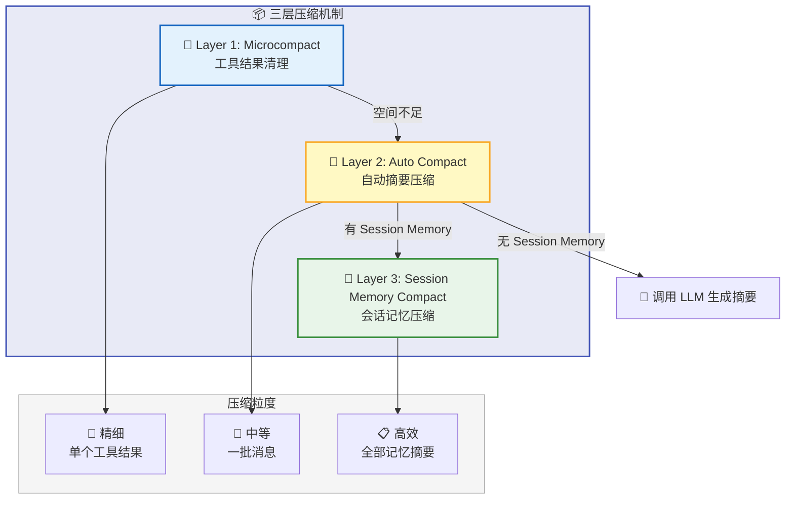
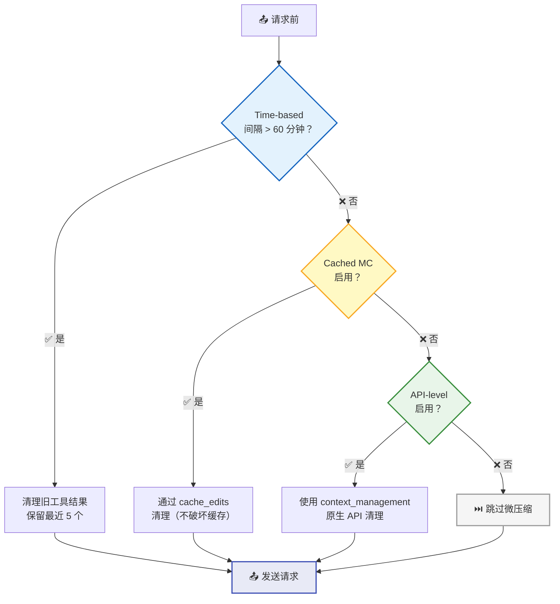
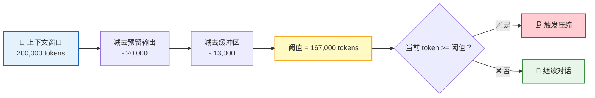
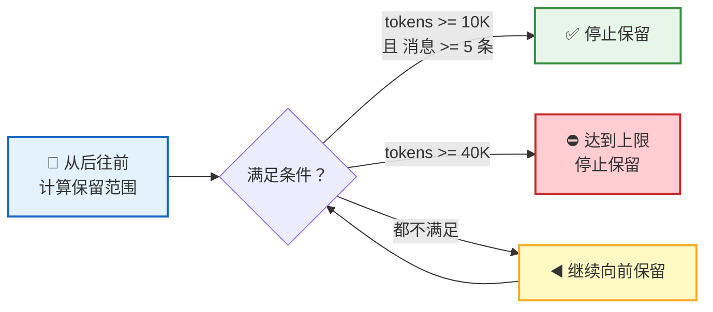
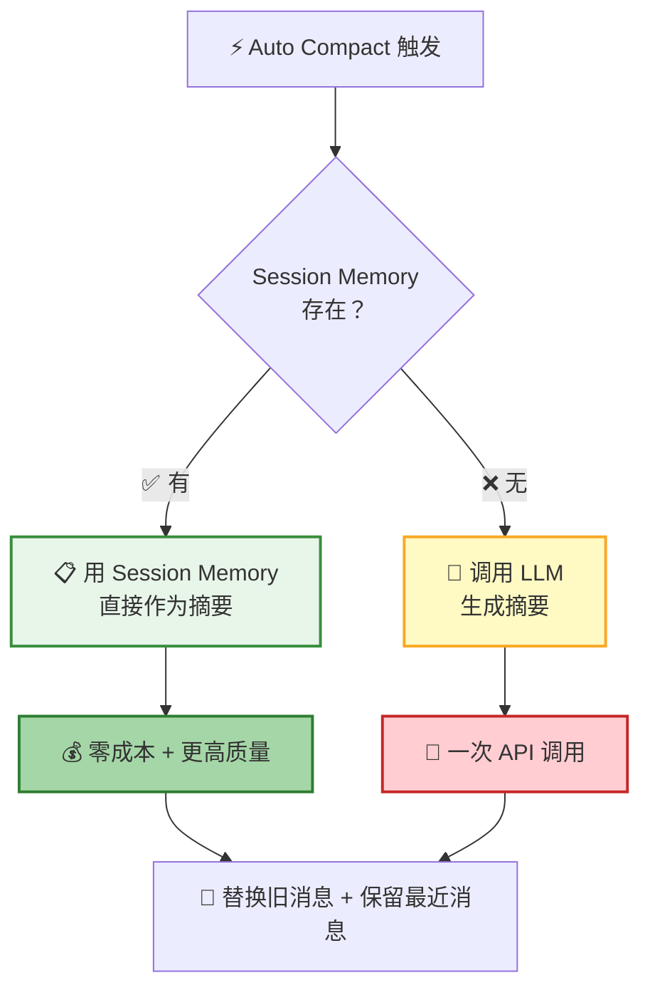
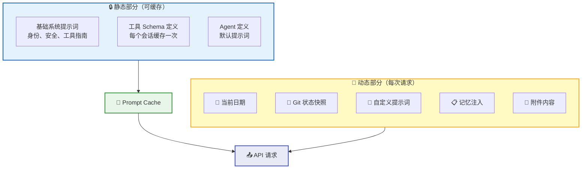
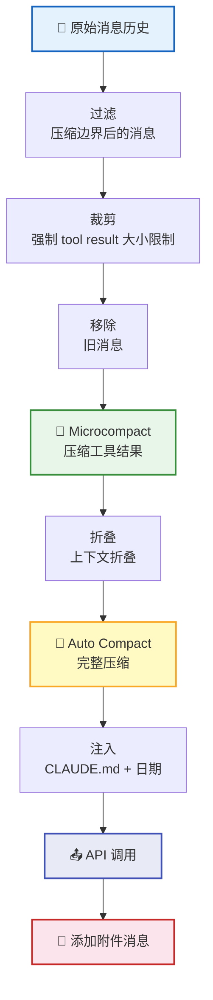

**上下文管理** 是对话持续进行的关键。当对话越来越长、工具输出越来越多时，系统通过 **三层压缩机制** 智能管理上下文窗口——保留关键信息，释放宝贵空间，让对话永不断裂。

## 三层压缩架构

| 层级 | 名称 | 触发条件 | 压缩粒度 | 成本 |
|:----:|------|----------|----------|:----:|
| 1 | Microcompact | 时间间隔 / 缓存编辑 / API 原生 | 单个工具结果 | 零 |
| 2 | Auto Compact | token 达到阈值 | 一批消息 → 摘要 | 一次 LLM 调用 |
| 3 | Session Memory Compact | Auto Compact 触发时 | 会话记忆 → 摘要 | 零 |

## Microcompact — 工具结果清理

Microcompact 是最轻量的压缩——不生成摘要，只清理占用大量空间的旧工具结果。

### 可清理的工具

只有产生大量输出的工具才会被清理：

| 工具 | 典型输出 |
|:----:|----------|
| 📖 `Read` | 文件内容 |
| ⚡ `Bash` / `PowerShell` | 命令输出 |
| 🔍 `Grep` | 搜索结果 |
| 📁 `Glob` | 文件列表 |
| 🌐 `WebSearch` / `WebFetch` | 网页内容 |
| ✏️ `Edit` / 📝 `Write` | 操作结果 |

### 三种清理策略

| 策略 | 触发条件 | 原理 | 适用场景 |
|------|----------|------|----------|
| 🕐 Time-based | 距上次 assistant 消息 > 60 分钟 | 直接替换旧工具结果为占位符 | 用户离开后回来 |
| 💾 Cached | 缓存仍然有效 | 通过 `cache_edits` 告知 API 删除特定结果 | 缓存未过期时 |
| 🔌 API-level | token >= 180,000 | 使用 Anthropic 原生 `context_management` | 接近上下文上限 |

> 💡 Time-based 策略至少保留 1 个最近的工具结果，避免模型完全失去工作上下文。

## Auto Compact — 自动摘要压缩

当 Microcompact 不够用时，Auto Compact 启动——将一批旧消息压缩为一段精炼摘要。

### 触发条件

以 200K 上下文窗口模型为例：

| 配置项 | 值 | 说明 |
|--------|:--:|------|
| `MAX_OUTPUT_TOKENS_FOR_SUMMARY` | 20,000 | 为模型输出预留空间 |
| `AUTOCOMPACT_BUFFER_TOKENS` | 13,000 | 安全缓冲区 |
| **触发阈值**（200K 模型） | **167,000** | 达到此值即触发 |

### 熔断机制

连续失败 3 次后自动停止压缩尝试，避免在不可恢复的场景下浪费资源：

### 压缩提示词

Auto Compact 使用 **9 部分结构** 的提示词，确保摘要涵盖所有关键维度：

| 序号 | 部分 | 内容 |
|:----:|------|------|
| 1 | Primary Request and Intent | 用户的核心请求和意图 |
| 2 | Key Technical Concepts | 涉及的关键技术概念 |
| 3 | Files and Code Sections | 相关文件与代码片段（含完整代码） |
| 4 | Errors and Fixes | 遇到的错误及修复方案 |
| 5 | Problem Solving | 问题解决过程 |
| 6 | All User Messages | 所有用户消息（非工具结果） |
| 7 | Pending Tasks | 待处理的任务 |
| 8 | Current Work | 当前正在进行的工作 |
| 9 | Optional Next Step | 可选的下一步操作 |

### 消息保留策略

压缩时不会丢弃所有旧消息，而是 **保留最近的消息**：

| 配置项 | 值 | 说明 |
|--------|:--:|------|
| `minTokens` | 10,000 | 至少保留的 token 数 |
| `minTextBlockMessages` | 5 | 至少保留的有文本块的消息数 |
| `maxTokens` | 40,000 | 最多保留的 token 数 |

> 📌 **API 不变量保护**：保留消息中的 `tool_result` 必须能找到对应的 `tool_use`，压缩时会向前扩展保留范围以确保配对完整。

## Session Memory Compact

当 [记忆系统](/docs/features/memory/) 中有 Session Memory 时，压缩可以 **零成本** 完成：

这正是记忆系统与上下文管理的 **交汇点**——对话过程中持续积累的 Session Memory，在压缩时直接变成高质量摘要，无需额外调用 LLM。

## 压缩后的上下文恢复

压缩后，系统会自动恢复最近读取的文件，帮助模型快速回到工作状态：

| 配置项 | 值 | 说明 |
|--------|:--:|------|
| 最多恢复文件数 | 5 | 最近读取的 5 个文件 |
| 总 token 预算 | 50,000 | 所有恢复文件的总上限 |
| 单文件 token 上限 | 5,000 | 每个文件的最大 token |

## 系统提示词组装

系统提示词分为 **静态** 和 **动态** 两部分，静态部分可全局缓存以降低成本：

**提示词优先级**（从高到低）：

| 优先级 | 来源 | 说明 |
|:------:|------|------|
| 1 | `overrideSystemPrompt` | 替换所有其他提示词 |
| 2 | Coordinator system prompt | Coordinator 模式 |
| 3 | Agent system prompt | Agent 定义存在时替换默认 |
| 4 | Custom system prompt | `--system-prompt` 参数 |
| 5 | Default system prompt | 标准系统提示词 |
| 6 | `appendSystemPrompt` | 始终追加到末尾 |

## 消息组装流程

每次 API 调用前，消息经历完整的组装管线：

## 附件系统

附件系统在对话过程中动态注入上下文信息：

| 附件类型 | 注入时机 | 说明 |
|----------|----------|------|
| 📅 当前日期 | 初始 + 日期变化时 | 通过 `date_change` 附件更新 |
| 🔀 Git Status | 对话开始时 | 当前分支、状态（截断 2000 字符）、最近提交 |
| 📋 Todo List | 每 10 轮 | 提醒待办事项进展 |
| 🧠 CLAUDE.md | 初始注入 | 项目指令和配置 |
| 📂 嵌套记忆 | 子目录操作时 | 搜索目录层级中的 CLAUDE.md |
| 🔍 相关记忆 | 异步预取 | 从 auto-memory 中检索相关记忆 |
| 🛠️ Skills | 发现 / 调用时 | 可用技能列表和调用内容 |
| 💻 IDE 上下文 | 实时 | 选中行、打开的文件 |
| 📊 Token 用量 | 实时 | 当前 token 使用情况和预算 |

## 下一步

- [记忆系统](/docs/features/memory/) — 深入了解 Session Memory 和 User Memory 的工作原理
- [Remote Tool Calling](/docs/concepts/rtc/) — 了解工具调用的完整生命周期
- [会话管理](/docs/features/session/) — 了解上下文管理在会话中的位置
