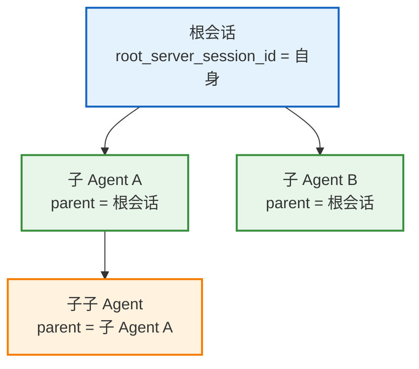
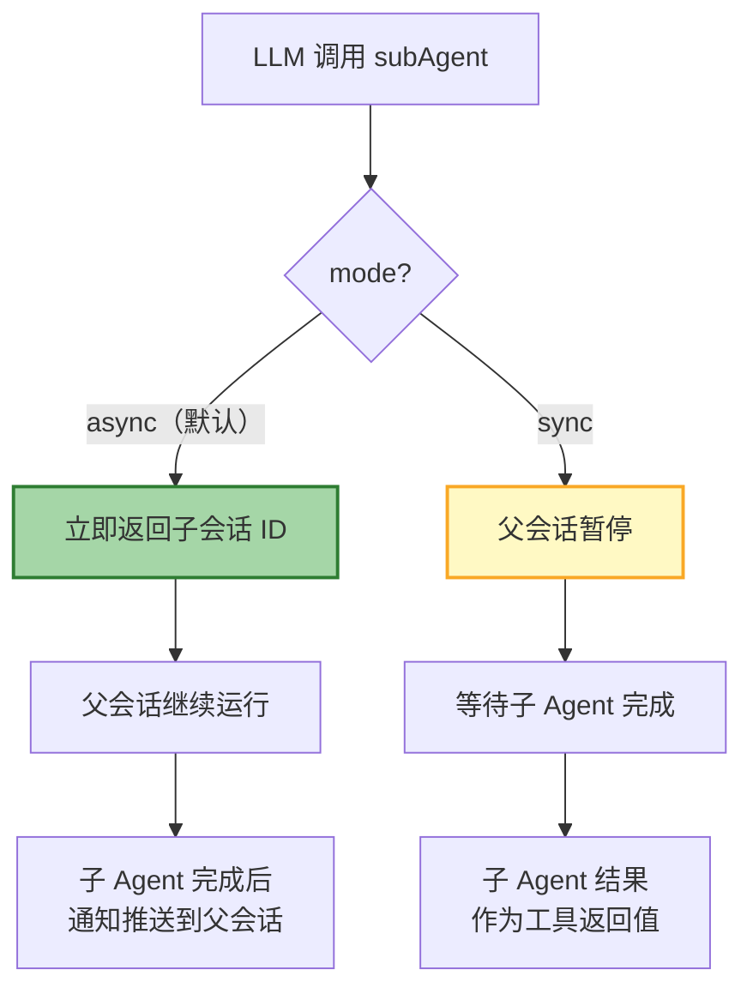
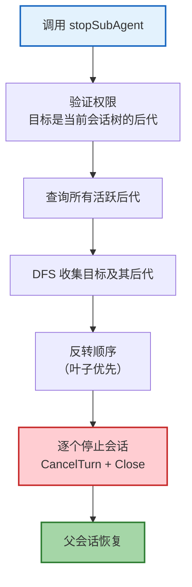
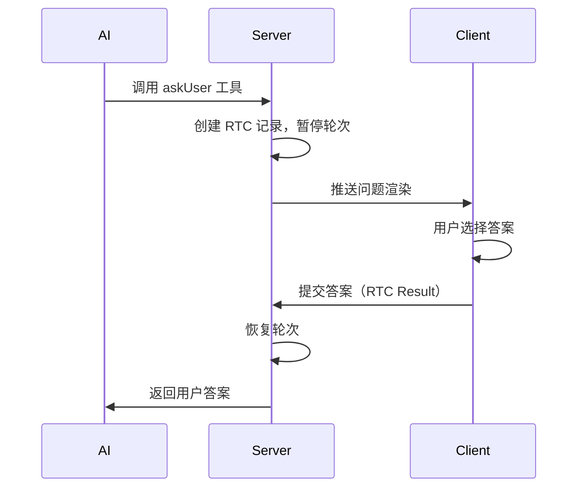
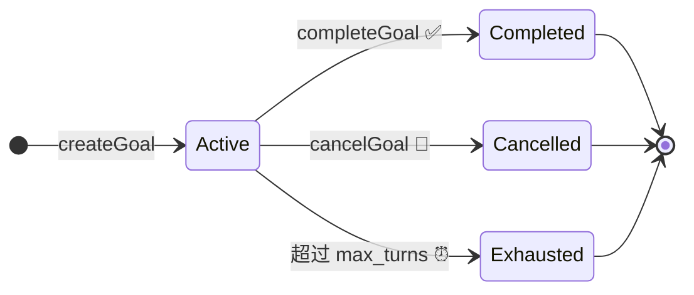
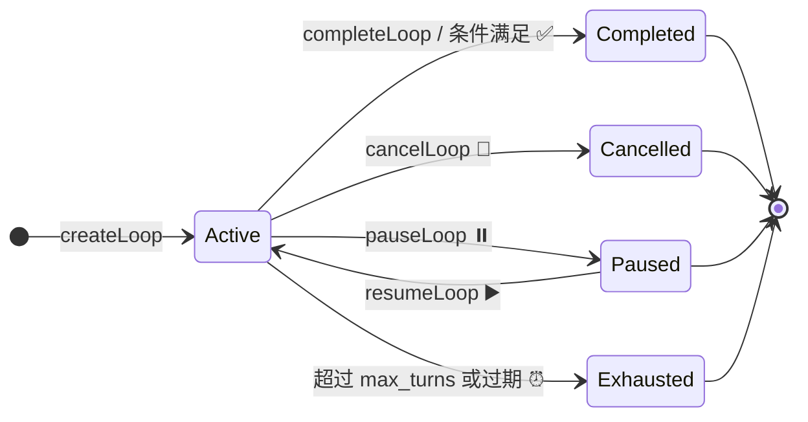
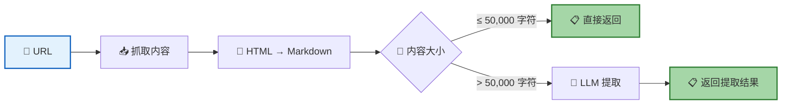

AI 在推理过程中可以调用一组**内置工具**来扩展自身能力。这些工具由后端注册，无需宿主应用额外配置。工具分为两类：**子 Agent 管理**（创建、查询、停止子 Agent）和**用户交互**（向用户提问获取决策）。

## 工具总览

| 工具 | 用途 | 是否中断轮次 |
|------|------|:----------:|
| `subAgent` | 创建子 Agent 会话，执行复杂多步任务 | 取决于模式 |
| `listSubAgent` | 列出当前会话树中所有活跃的子 Agent | 否 |
| `getSubAgentMessage` | 获取指定子 Agent 的最新消息 | 否 |
| `stopSubAgent` | 停止指定子 Agent 及其所有后代会话 | 否 |
| `sendMessageToSubAgent` | 向异步子 Agent 发送追加消息 | 否 |
| `askUser` | 向用户提出 1-4 个选择题，等待用户回答 | 是 |
| `todoWrite` | 管理任务清单（创建、更新待办事项列表） | 否 |
| `createGoal` | 创建自主目标，自动驱动后续轮次直到完成 | 否 |
| `completeGoal` | 标记目标为已完成 | 否 |
| `cancelGoal` | 取消目标 | 否 |
| `createLoop` | 创建定时循环任务，按固定间隔自动执行 | 否 |
| `cancelLoop` | 取消循环任务 | 否 |
| `completeLoop` | 将循环任务标记为已完成 | 否 |
| `listLoops` | 列出当前会话的所有循环任务 | 否 |
| `pauseLoop` | 暂停循环任务 | 否 |
| `resumeLoop` | 恢复暂停的循环任务 | 否 |
| `webSearch` | 搜索互联网，获取最新信息（需配置） | 否 |
| `webFetch` | 抓取指定 URL 的网页内容并提取信息（需配置） | 否 |

> 💡 此外，记忆系统提供了 `saveMemory`、`updateMemory`、`deleteMemory`、`listMemories`、`searchMemory` 等记忆工具。详见 [记忆系统](/docs/features/memory/)。

---

## 子 Agent 工具

子 Agent 是 RTC Agent 的**任务分解**机制。主 Agent 可以将复杂任务拆分为多个子任务，每个子任务运行在独立的会话中，拥有独立的上下文。

### 会话层级

子 Agent 通过父/根会话 ID 形成树状层级结构：



| 字段 | 说明 |
|------|------|
| `parent_server_session_id` | 直接父会话的服务端 UUID |
| `root_server_session_id` | 根会话的服务端 UUID（如果当前会话已是子会话，则继承其根） |

---

### subAgent — 创建子 Agent

创建一个新的子 Agent 会话来执行复杂的多步任务。子 Agent 从空白上下文启动，需要像给新同事做交接一样提供完整的背景信息。

#### 参数

| 参数 | 类型 | 必填 | 说明 |
|------|------|:----:|------|
| `title` | string | 是 | 任务简短描述（3-5 个词），如 `"OAuth 认证配置"`、`"登录按钮修复"` |
| `instruction` | string | 是 | 子 Agent 的任务指令。需要包含所有必要上下文，因为子 Agent 从空白上下文启动 |
| `mode` | string | 否 | 执行模式：`"async"`（默认）或 `"sync"` |

#### 执行模式



| 模式 | 行为 | 适用场景 |
|------|------|---------|
| **async**（默认） | 立即返回子会话 ID，父会话继续运行。子 Agent 完成后通过通知消息推送结果 | 父会话可继续其他工作，不需要等待结果 |
| **sync** | 父会话暂停（通过 `StatefulInterrupt`），等待子 Agent 完成后返回结果 | 父会话需要子 Agent 的结果才能继续 |

#### 使用建议

- 指令要具体——包含文件路径、相关上下文和已排除的方案
- 不要写模糊指令如"处理这个任务"——子 Agent 没有当前对话的上下文
- 标题要简短有描述性，便于在列表中识别

---

### listSubAgent — 列出子 Agent

列出当前会话树中所有活跃的子 Agent 会话。用于查看已创建的子 Agent 状态。

#### 参数

无参数。

#### 返回值

返回 JSON 数组，每个元素包含：

| 字段 | 类型 | 说明 |
|------|------|------|
| `sub_session_id` | string | 子会话的服务端 UUID |
| `title` | string | 子 Agent 标题 |
| `status` | string | 会话状态（仅返回 `active` 状态的会话） |
| `created_at` | string | 创建时间（RFC 3339 格式） |
| `updated_at` | string | 更新时间（RFC 3339 格式） |

---

### getSubAgentMessage — 获取子 Agent 消息

获取指定子 Agent 会话的最新消息内容。用于检查子 Agent 的最新输出或进度。

#### 参数

| 参数 | 类型 | 必填 | 说明 |
|------|------|:----:|------|
| `sub_session_id` | string | 是 | 目标子会话的服务端 UUID。使用 `listSubAgent` 获取可用的会话 ID |

#### 返回值

返回 JSON 对象：

| 字段 | 类型 | 说明 |
|------|------|------|
| `sub_session_id` | string | 子会话 UUID |
| `sub_session_title` | string | 子会话标题 |
| `sub_session_status` | string | 子会话状态 |
| `message_id` | string / null | 最新消息 ID（无消息时为 null） |
| `role` | string / null | 消息角色（无消息时为 null） |
| `content` | string | 消息文本内容 |
| `created_at` | string / null | 消息创建时间（无消息时为 null） |

#### 权限检查

- 目标会话必须是当前会话树的后代（`root_server_session_id` 匹配）
- 不能查询当前会话自身

---

### stopSubAgent — 停止子 Agent

停止指定的子 Agent 会话及其所有后代会话。采用**自底向上**的停止顺序（先停叶子节点，再停父节点）。

#### 参数

| 参数 | 类型 | 必填 | 说明 |
|------|------|:----:|------|
| `sub_session_id` | string | 是 | 目标子会话的服务端 UUID。使用 `listSubAgent` 获取可用的会话 ID |

#### 返回值

返回 JSON 对象：

| 字段 | 类型 | 说明 |
|------|------|------|
| `stopped_sessions` | array | 被停止的会话列表，每项包含 `sub_session_id` 和 `title` |
| `total_stopped` | int | 总共停止的会话数 |

#### 停止流程



---

### sendMessageToSubAgent — 向子 Agent 发送消息

向异步子 Agent 发送追加消息。用于在子 Agent 运行过程中提供额外指令、补充上下文或回应子 Agent 的问题。

#### 参数

| 参数 | 类型 | 必填 | 说明 |
|------|------|:----:|------|
| `sub_session_id` | string | 是 | 目标异步子会话的服务端 UUID |
| `message` | string | 是 | 发送给子 Agent 的消息内容 |

#### 使用场景

- 子 Agent 执行过程中需要追加指令
- 回应异步子 Agent 的提问
- 调整子 Agent 的执行方向

---

## askUser — 向用户提问

AI 向用户提出 1-4 个选择题，用于收集偏好、澄清歧义、理解需求或获取实现决策。用户始终可以选择"其他"来提供自由文本。

### 参数

| 参数 | 类型 | 必填 | 说明 |
|------|------|:----:|------|
| `questions` | array | 是 | 1-4 个问题对象 |

每个问题对象包含：

| 字段 | 类型 | 必填 | 说明 |
|------|------|:----:|------|
| `question` | string | 是 | 完整的问题文本，以问号结尾 |
| `header` | string | 是 | 短标签（最多 12 字符），显示在问题旁边的标签/芯片 |
| `options` | array | 是 | 2-4 个选项 |
| `multiSelect` | boolean | 否 | 设为 `true` 允许用户选择多个选项，默认 `false` |

每个选项包含：

| 字段 | 类型 | 必填 | 说明 |
|------|------|:----:|------|
| `label` | string | 是 | 选项显示文本（1-5 个词） |
| `description` | string | 是 | 选项说明，描述选择的含义或后果 |
| `preview` | string | 否 | 聚焦时显示的预览内容（支持多行文本，仅适用于单选问题） |

### 交互流程



### 使用示例

```json
{
  "questions": [
    {
      "question": "使用哪个日期格式化库？",
      "header": "日期库",
      "options": [
        {
          "label": "date-fns",
          "description": "轻量级、Tree-shakable，按需导入"
        },
        {
          "label": "dayjs",
          "description": "API 兼容 Moment.js，体积仅 2KB"
        }
      ]
    }
  ]
}
```

### 返回格式

用户回答后，AI 收到的文本格式为：

```text
User has answered your questions: "使用哪个日期格式化库？"="date-fns". You can now continue with the user's answers in mind.
```

---

## todoWrite — 任务清单管理

管理 AI 的任务清单（Todo List）。采用**全量替换**模式——每次调用传入完整的待办列表，替换之前的全部内容。更新后通过事件通知前端实时展示。

### 参数

| 参数 | 类型 | 必填 | 说明 |
|------|------|:----:|------|
| `todos` | array | 否 | 待办事项列表（完整替换） |

每个待办事项包含：

| 字段 | 类型 | 必填 | 说明 |
|------|------|:----:|------|
| `content` | string | 是 | 任务描述（祈使句） |
| `status` | `"pending"` / `"in_progress"` / `"completed"` | 是 | 任务状态 |
| `active_form` | string | 否 | 进行中的简短描述，用于状态栏展示 |

### 使用建议

- 保持任务粒度适中——每个任务应该是一个可验证的里程碑
- 及时更新状态——完成的任务标记为 `completed`，正在进行的标记为 `in_progress`
- 不需要的任务直接从列表中移除，而不是标记为取消

---

## Goal 工具 — 自主目标驱动

Goal 系统允许 AI 创建自主目标，并在后续轮次中自动推进目标完成。每个 Goal 有独立的状态生命周期和 turn 边界检查点。

### Goal 状态



| 状态 | 说明 |
|:----:|------|
| `active` | 目标活跃中，每轮自动检查进度 |
| `completed` | 目标已完成 |
| `cancelled` | 目标被取消 |
| `exhausted` | 达到最大轮次限制，自动终止 |

### createGoal — 创建目标

| 参数 | 类型 | 必填 | 说明 |
|------|------|:----:|------|
| `condition` | string | 是 | 目标完成条件描述 |
| `max_turns` | int | 否 | 最大轮次限制（默认 50） |

**执行机制**：每轮 Turn 完成后，系统自动检查活跃 Goal，递增 `completed_turns` 计数器。如果条件满足则自动标记为 `completed`；如果达到 `max_turns` 则标记为 `exhausted`。

### completeGoal / cancelGoal

| 参数 | 类型 | 必填 | 说明 |
|------|------|:----:|------|
| `goal_id` | string | 是 | 目标 ID |

---

## Loop 工具 — 定时循环任务

Loop 系统允许 AI 创建定时执行的循环任务。基于 asynq 后台任务队列，支持暂停、恢复和自动过期。

### Loop 状态



| 状态 | 说明 |
|:----:|------|
| `active` | 循环活跃中，按间隔自动触发 |
| `paused` | 循环暂停，不触发新轮次 |
| `completed` | 循环完成 |
| `cancelled` | 循环被取消 |
| `exhausted` | 达到最大轮次或过期时间 |

### createLoop — 创建循环

| 参数 | 类型 | 必填 | 说明 |
|------|------|:----:|------|
| `prompt` | string | 是 | 每次循环执行的提示词 |
| `interval_seconds` | int | 是 | 执行间隔（秒） |
| `max_turns` | int | 否 | 最大执行次数（默认 10） |

### 其他 Loop 操作

| 工具 | 参数 | 说明 |
|------|------|------|
| `cancelLoop` | `loop_id` | 取消循环 |
| `completeLoop` | `reason` | 将循环标记为已完成（附完成原因说明） |
| `listLoops` | 无 | 列出当前会话的所有循环 |
| `pauseLoop` | `loop_id` | 暂停循环 |
| `resumeLoop` | `loop_id` | 恢复暂停的循环 |

> 💡 **Loop vs Goal**：Goal 是"完成某个条件就停"，Loop 是"每隔 N 秒执行一次"。两者可以组合使用——在 Loop 中创建 Goal，让 AI 定期检查某个条件是否满足。

---

## webSearch — 网络搜索

搜索互联网获取最新信息。支持多搜索引擎（DuckDuckGo、Bing、SearXNG、Tavily）自动故障转移。需要服务端配置 `web_search` 模块后才会注册此工具。

### 参数

| 参数 | 类型 | 必填 | 说明 |
|------|------|:----:|------|
| `query` | string | 是 | 搜索查询词，应具体明确。示例：`"Go 1.22 新特性"`、`"React 19 迁移指南 2026"` |
| `max_results` | integer | 否 | 最大返回结果数。默认 10，最大 30。快速回答用较少结果，深度研究用较多结果 |
| `time_range` | string | 否 | 时间范围过滤。可选值：`"day"`（24 小时内）、`"week"`、`"month"`、`"year"`。留空表示不限时间 |

### 返回格式

返回 JSON 对象，包含：

| 字段 | 类型 | 说明 |
|------|------|------|
| `query` | string | 原始查询词 |
| `result_count` | integer | 结果数量 |
| `results` | array | 搜索结果列表，每项包含 `title`、`url`、`description`、`source` |

### 使用建议

- 搜索时包含当前年份（如 `"Go 文档 2026"`）以获取最新结果
- 结果中包含标题、URL 和摘要——分析后选择最相关的 URL
- 如果摘要已足够回答问题，可直接回复；如需深入分析特定 URL，使用 `webFetch` 工具
- 回答时**必须**在末尾附加 Sources 区块，列出引用的来源链接

---

## webFetch — 网页内容抓取

抓取指定 URL 的网页内容，使用 AI 模型提取指定信息。将 HTML 转换为 Markdown 后用小型模型处理。需要服务端配置 `web_fetch` 模块后才会注册此工具。

> ⚠️ webFetch 无法访问需要认证的 URL（如 Google Docs、Confluence、Jira、GitHub 私有仓库）。如有认证需求，请使用专门的 MCP 工具。

### 参数

| 参数 | 类型 | 必填 | 说明 |
|------|------|:----:|------|
| `url` | string | 是 | 要抓取的 URL，必须是完整的 HTTP 或 HTTPS 地址 |
| `prompt` | string | 是 | 提取提示，描述需要从页面中提取什么信息 |

### 工作机制



| 特性 | 说明 |
|------|------|
| 缓存 | 自清理 30 分钟缓存，重复访问同一 URL 时更快 |
| 重定向 | URL 重定向到其他域名时，返回重定向 URL 供再次请求 |
| 内容限制 | 最大 URL 长度 2,000 字符，最大内容 10 MB |
| 超时 | 抓取超时 60 秒 |

---

## 下一步

- [命令系统](/docs/features/commands/) — 了解用户可用的斜杠命令
- [Skill 系统](/docs/features/skill-system/) — 了解宿主如何注册自定义函数扩展 AI 能力
- [会话管理](/docs/features/session/) — 了解会话层级与上下文管理
- [Remote Tool Calling](/docs/concepts/rtc/) — 了解工具调用背后的远程调用机制
