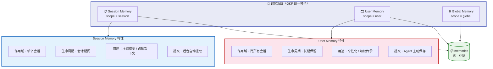
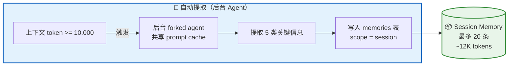
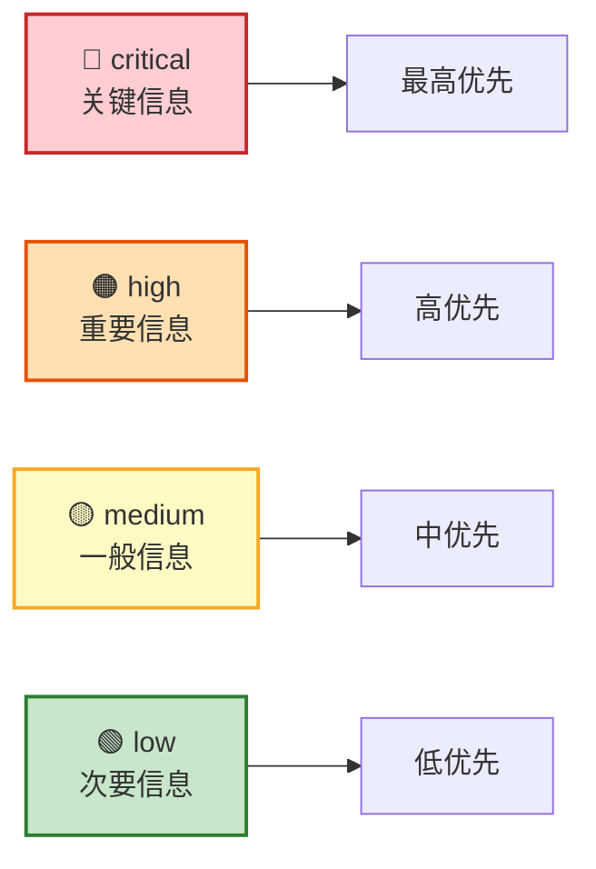
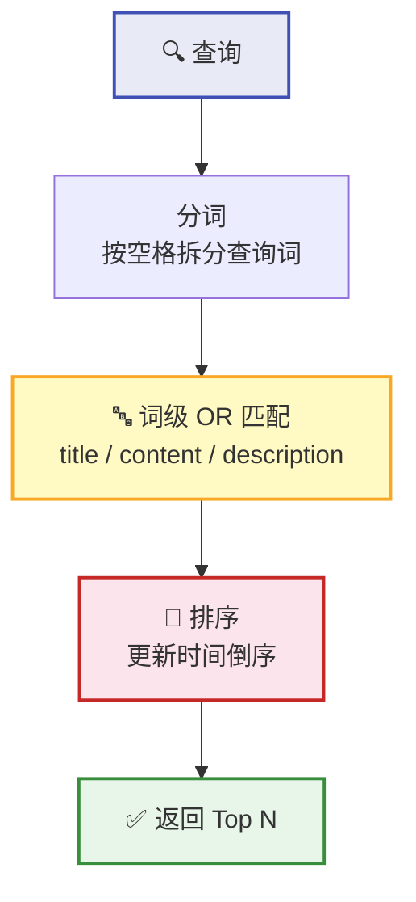
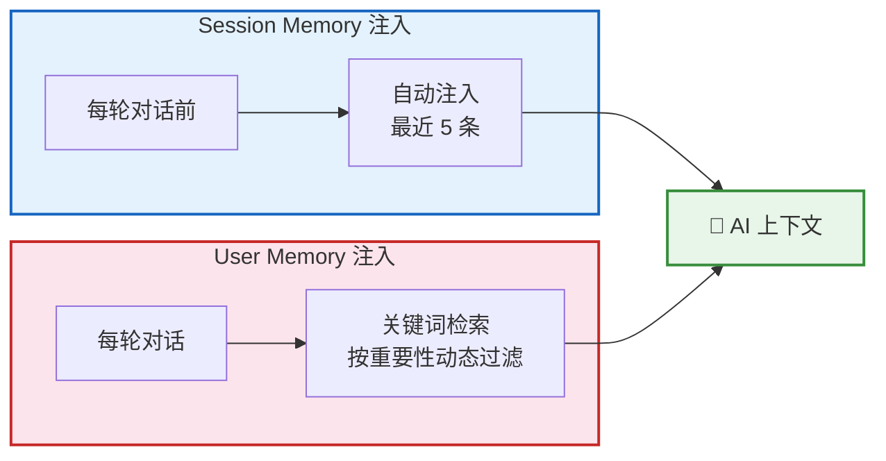
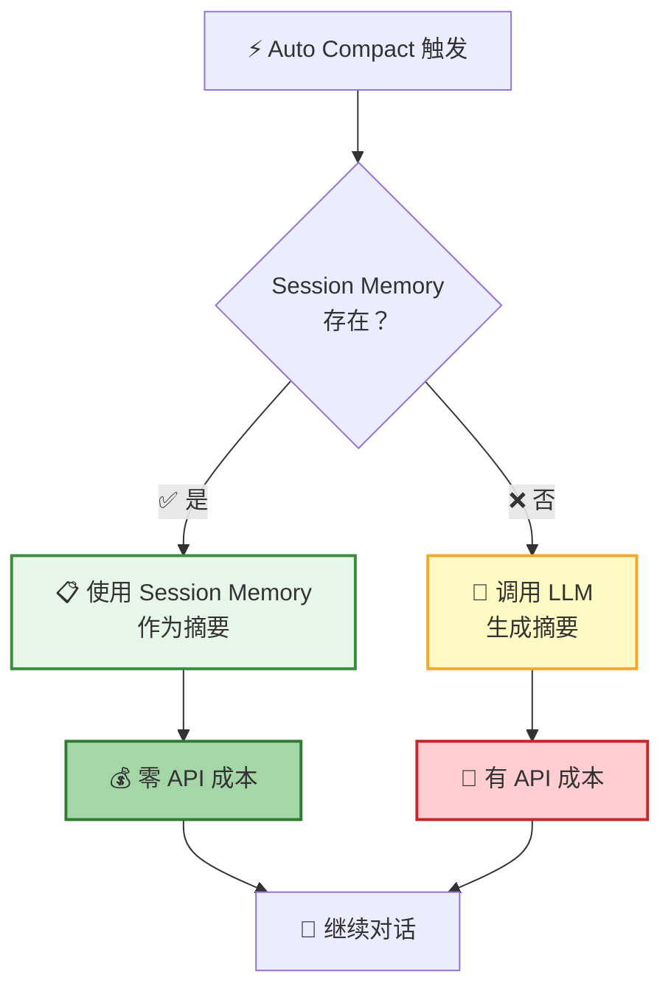
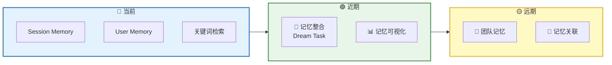

**记忆系统** 让 AI 拥有了"记忆力"。它不仅能在一次对话中持续追踪关键决策和进展，还能跨会话记住你的偏好、项目背景和工作习惯——越用越懂你。

## OKF 统一架构

记忆系统基于 **OKF（Open Knowledge Format）** 统一模型，所有记忆存储在同一个知识库中，通过 **作用域（Scope）** 字段区分归属：



| | Session Memory | User Memory | Global Memory |
|---|---------------|-------------|---------------|
| **Scope** | `session` | `user` | `global` |
| **作用域** | 单个会话 | 跨所有会话 | 跨所有用户 |
| **生命周期** | 会话期间 | 长期保留 | 长期保留 |
| **核心用途** | 压缩摘要、跨轮次上下文 | 个性化、知识传承 | 团队共享知识（预留） |
| **提取方式** | 后台 Agent 自动提取 | Agent 主动保存 | — |
| **容量上限** | 20 条，~12K tokens | 1,000 条 | — |

> 📌 **Global Memory** 目前在 OKF 模型中已定义，但尚未开放 Agent 读写工具。预留用于未来的团队共享知识场景。

## Session Memory

### 五大分类

Session Memory 将持续对话中的关键信息归纳为 **5 个分类**：

| 分类 | 说明 | 示例 |
|:----:|------|------|
| 🎯 `decision` | 技术决策和设计选择 | "选择 PostgreSQL 作为数据库" |
| 📍 `context` | 当前任务上下文 | "正在实现用户登录功能" |
| 📊 `progress` | 任务进展和完成状态 | "已完成数据库 schema 设计" |
| 🚧 `issue` | 遇到的问题和解决方案 | "CORS 错误，通过配置中间件解决" |
| 💡 `learnings` | 学到的经验和教训 | "连接池可以显著提升性能" |

### 自动提取

Session Memory 由后台 Agent **自动提取**，将持续对话中的关键信息归纳为 5 个分类：



**自动提取** 由后台 Agent 完成，触发条件：

| 条件 | 说明 |
|------|------|
| 初始化阈值 | 上下文 token >= 10,000 |
| 增长阈值 | token 增长 >= 5,000 |
| 工具调用 | tool call 数量 >= 3 |
| 对话断点 | token 满足 + 最后一轮无 tool call |

> 💡 后台 Agent 与主对话共享 prompt cache，硬限制最多 5 轮对话，几乎不影响主对话性能。

### 容量限制

| 限制项 | 值 | 说明 |
|--------|:--:|------|
| 最大条目数 | 20 条 | 存储上限，单个会话 |
| 总 token 上限 | ~12,000 | 存储上限，约等于 9 页文档 |
| 注入数量 | 每轮 5 条，最多 5,000 tokens | 每轮对话注入到上下文中 |
| 超出策略 | 删除最旧 | 保留最新信息 |

## User Memory

### 四大分类

User Memory 记录跨会话的长期知识，分为 **4 个分类**：

| 分类 | 说明 | 示例 |
|:----:|------|------|
| 👤 `user` | 用户角色、目标、偏好 | "10 年 Go 经验，React 新手" |
| 💬 `feedback` | 用户对工作方式的指导 | "不要在测试中 mock 数据库" |
| 📁 `project` | 项目进展、目标、决策背景 | "2026-03-05 起合并冻结" |
| 🔗 `reference` | 外部系统的指针 | "pipeline bug 在 Linear INGEST 项目" |

### 重要性级别

每条 User Memory 都有重要性标注，影响检索优先级：



`feedback` 和 `project` 类型的记忆还包含特殊结构：

```
规则/事实
Why: 用户给出的原因
How to apply: 这条指导何时/何地适用
```

> 📌 这种 **Why + How to apply** 结构帮助 AI 理解上下文，在正确的场景下应用正确的规则。

### 容量限制

| 限制项 | 值 | 说明 |
|--------|:--:|------|
| 最大条目数 | 1,000 条 | 单个用户 |
| 单条 token 上限 | ~1,000 | - |
| 超出策略 | 无自动淘汰 | 仅支持手动删除（`deleteMemory` 工具） |

## 关键词检索

User Memory 采用 **词级 OR 匹配** 的关键词检索策略，兼顾召回率和排序质量：



| 阶段 | 策略 | 说明 |
|------|------|------|
| 分词 | 按空格拆分 | 查询 `"saveMemory tool test"` 拆为 3 个词 |
| 匹配 | 词级 OR | 每条记忆匹配**任一**词即命中（title/content/description） |
| 排序 | 时间倒序 | 最近更新的结果排在前面 |
| 输出 | Top N | 默认返回 5 条，可配置 |

> 💡 词级 OR 匹配相比短语匹配有更高的召回率——查询 `"saveMemory tool test"` 会匹配包含 `saveMemory`、`tool` 或 `test` 中任意一词的记忆。搜索使用 SQL LIKE 模糊匹配，PostgreSQL 下自动使用 ILIKE（不区分大小写）。

## 注入策略

记忆通过精心设计的注入策略进入 AI 的上下文：



| 记忆类型 | 注入时机 | 注入数量 | 触发条件 |
|----------|----------|:--------:|----------|
| Session Memory | 每轮对话前 | 5 条，最多 5,000 tokens | 自动 |
| User Memory | 每轮对话 | 按重要性动态过滤 | 基于关键词检索 |
| Session Memory（压缩时） | Auto Compact 触发 | 全部 | 作为压缩摘要 |

> 💡 User Memory 按重要性动态过滤：`critical` / `high` 全部注入，`medium` 每类最多 10 条，`low` 不注入。

## Session Memory Compact

当上下文需要压缩时，Session Memory 可以 **零成本** 充当摘要：



| 方案 | 成本 | 摘要质量 | 速度 |
|------|------|----------|------|
| Session Memory Compact | 零 API 成本 | 更高（持续更新） | 更快 |
| 标准 Auto Compact | 一次 LLM 调用 | 一般（一次性生成） | 较慢 |

> 📌 Session Memory 是在对话过程中**持续积累**的，比压缩时一次性生成的摘要更完整、更准确。

## 未来规划



| 功能 | 说明 |
|------|------|
| 🌙 记忆整合（Dream Task） | 定期合并重复记忆、删除过时记忆、提取共性知识 |
| 👥 团队记忆 | 支持团队共享的偏好、规范和最佳实践 |
| 📊 记忆可视化 | 在 UI 中查看、编辑、搜索记忆，查看使用统计 |

## 下一步

- [上下文管理](/docs/features/context-management/) — 了解记忆系统如何与压缩系统协作
- [Remote Tool Calling](/docs/concepts/rtc/) — 了解 AI 如何在前端执行工具
- [会话管理](/docs/features/session/) — 了解记忆在会话中的上下文
