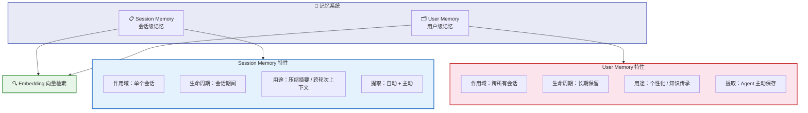
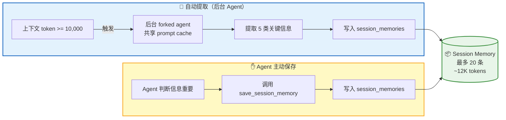
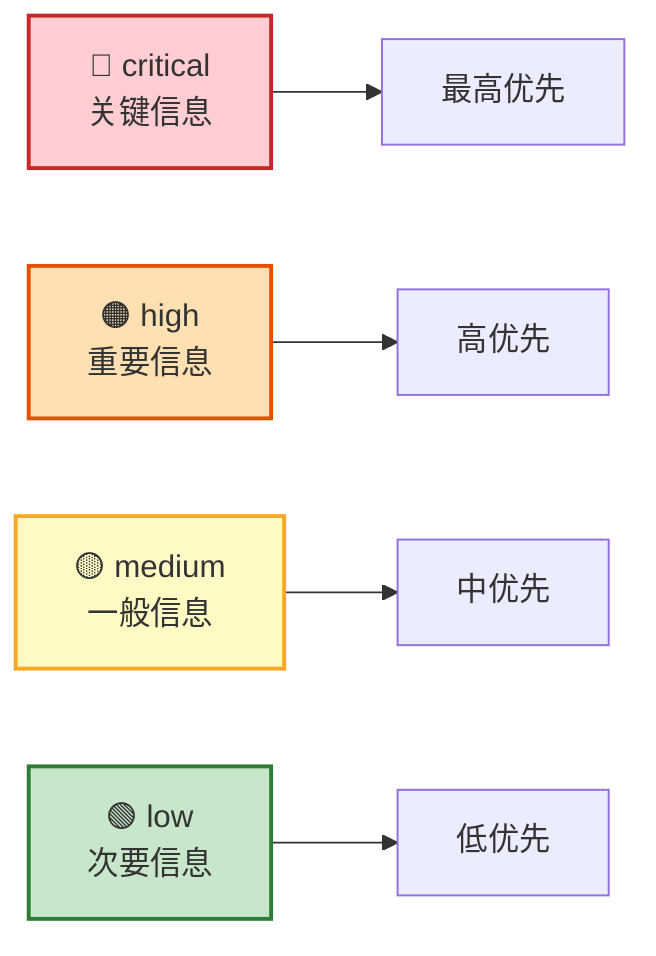
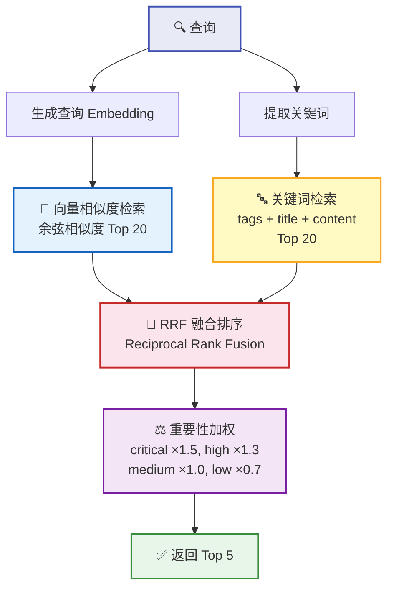
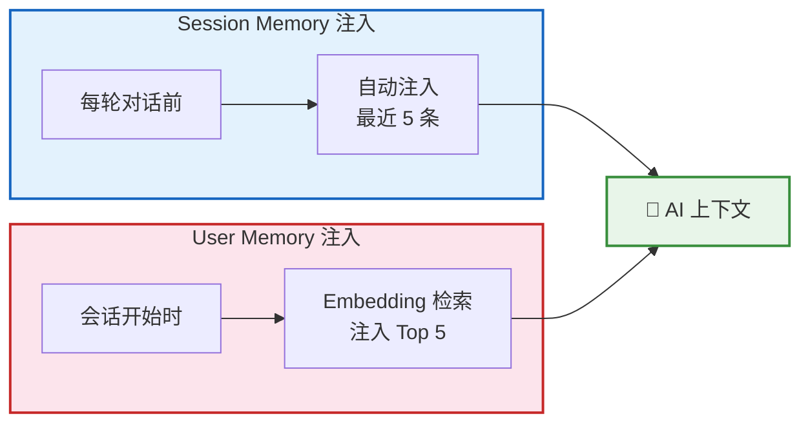
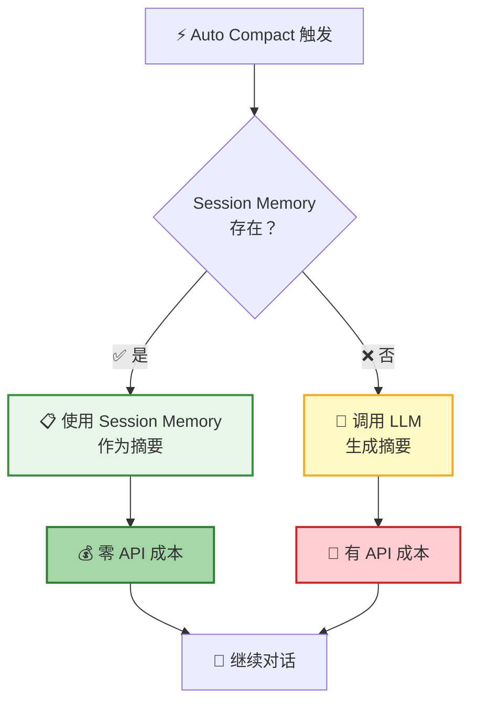

**记忆系统** 让 AI 拥有了"记忆力"。它不仅能在一次对话中持续追踪关键决策和进展，还能跨会话记住你的偏好、项目背景和工作习惯——越用越懂你。

## 双层架构

记忆系统分为两层，各司其职：



| | Session Memory | User Memory |
|---|---------------|-------------|
| **作用域** | 单个会话 | 跨所有会话 |
| **生命周期** | 会话期间 | 长期保留 |
| **核心用途** | 压缩摘要、跨轮次上下文 | 个性化、知识传承 |
| **提取方式** | 自动提取 + Agent 主动保存 | Agent 主动保存 |
| **容量上限** | 20 条，~12K tokens | 1,000 条 |

## Session Memory

### 五大分类

Session Memory 将持续对话中的关键信息归纳为 **5 个分类**：

| 分类 | 说明 | 示例 |
|:----:|------|------|
| 🎯 `decision` | 技术决策和设计选择 | "选择 PostgreSQL 作为数据库" |
| 📍 `context` | 当前任务上下文 | "正在实现用户登录功能" |
| 📊 `progress` | 任务进展和完成状态 | "已完成数据库 schema 设计" |
| 🚧 `issue` | 遇到的问题和解决方案 | "CORS 错误，通过配置中间件解决" |
| 💡 `learnings` | 学到的经验和教训 | "连接池可以显著提升性能" |

### 双轨提取

Session Memory 通过 **自动提取** 和 **Agent 主动保存** 两条路径持续积累：



**自动提取** 由后台 Agent 完成，触发条件：

| 条件 | 说明 |
|------|------|
| 初始化阈值 | 上下文 token >= 10,000 |
| 增长阈值 | token 增长 >= 5,000 |
| 工具调用 | tool call 数量 >= 3 |
| 对话断点 | token 满足 + 最后一轮无 tool call |

> 💡 后台 Agent 与主对话共享 prompt cache，硬限制最多 5 轮对话，几乎不影响主对话性能。

### 容量限制

| 限制项 | 值 | 说明 |
|--------|:--:|------|
| 最大条目数 | 20 条 | 单个会话 |
| 单条 token 上限 | ~2,000 | 超出会被裁剪 |
| 总 token 上限 | ~12,000 | 约等于 9 页文档 |
| 超出策略 | 删除最旧 | 保留最新信息 |

## User Memory

### 四大分类

User Memory 记录跨会话的长期知识，分为 **4 个分类**：

| 分类 | 说明 | 示例 |
|:----:|------|------|
| 👤 `user` | 用户角色、目标、偏好 | "10 年 Go 经验，React 新手" |
| 💬 `feedback` | 用户对工作方式的指导 | "不要在测试中 mock 数据库" |
| 📁 `project` | 项目进展、目标、决策背景 | "2026-03-05 起合并冻结" |
| 🔗 `reference` | 外部系统的指针 | "pipeline bug 在 Linear INGEST 项目" |

### 重要性级别

每条 User Memory 都有重要性标注，影响检索优先级：



`feedback` 和 `project` 类型的记忆还包含特殊结构：

```
规则/事实
Why: 用户给出的原因
How to apply: 这条指导何时/何地适用
```

> 📌 这种 **Why + How to apply** 结构帮助 AI 理解上下文，在正确的场景下应用正确的规则。

### 容量限制

| 限制项 | 值 | 说明 |
|--------|:--:|------|
| 最大条目数 | 1,000 条 | 单个用户 |
| 单条 token 上限 | ~1,000 | - |
| 超出策略 | 分级淘汰 | 优先删除 `low` → 最久未访问 → 最旧 |

## Embedding 检索

User Memory 采用 **混合检索** 策略，兼顾语义理解和精确匹配：



| 阶段 | 策略 | 说明 |
|------|------|------|
| 向量检索 | 余弦相似度 | 语义层面的匹配，Top 20 |
| 关键词检索 | 全文检索 + 标签匹配 | 精确关键词匹配，Top 20 |
| 融合排序 | RRF 算法 | `score = Σ 1/(60 + rank)`，合并两路结果 |
| 加权过滤 | 重要性 + 访问频率 + 时效性 | 重要且常用的记忆优先 |
| 最终输出 | Top 5 | 精选最相关的 5 条记忆 |

> 💡 超过 1 天的记忆会标注时效性提醒："注意：这条记忆是 N 天前创建的，可能已过时。"

## 注入策略

记忆通过精心设计的注入策略进入 AI 的上下文：



| 记忆类型 | 注入时机 | 注入数量 | 触发条件 |
|----------|----------|:--------:|----------|
| Session Memory | 每轮对话前 | 5 条 | 自动 |
| User Memory | 会话开始时 | 5 条 | 基于 Embedding 检索 |
| Session Memory（压缩时） | Auto Compact 触发 | 全部 | 作为压缩摘要 |

## Session Memory Compact

当上下文需要压缩时，Session Memory 可以 **零成本** 充当摘要：



| 方案 | 成本 | 摘要质量 | 速度 |
|------|------|----------|------|
| Session Memory Compact | 零 API 成本 | 更高（持续更新） | 更快 |
| 标准 Auto Compact | 一次 LLM 调用 | 一般（一次性生成） | 较慢 |

> 📌 Session Memory 是在对话过程中**持续积累**的，比压缩时一次性生成的摘要更完整、更准确。

## 未来规划


| 功能 | 说明 |
|------|------|
| 🌙 记忆整合（Dream Task） | 定期合并重复记忆、删除过时记忆、提取共性知识 |
| 👥 团队记忆 | 支持团队共享的偏好、规范和最佳实践 |
| 📊 记忆可视化 | 在 UI 中查看、编辑、搜索记忆，查看使用统计 |

## 下一步

- [上下文管理](/docs/features/context-management/) — 了解记忆系统如何与压缩系统协作
- [Remote Tool Calling](/docs/concepts/rtc/) — 了解 AI 如何在前端执行工具
- [会话管理](/docs/features/session/) — 了解记忆在会话中的上下文
