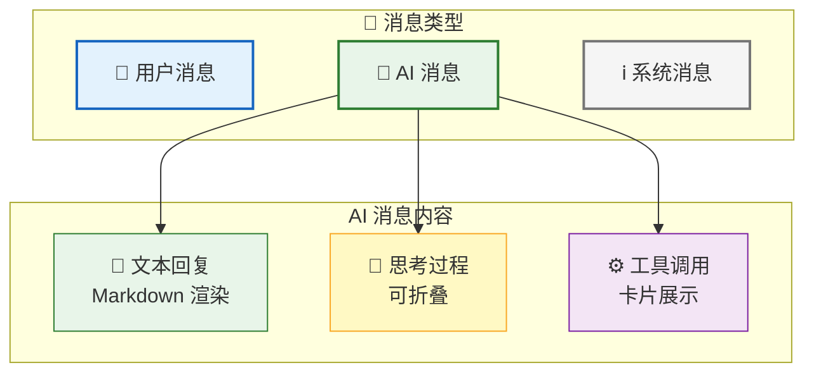
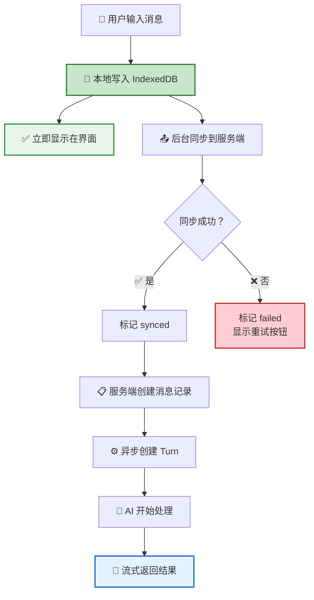
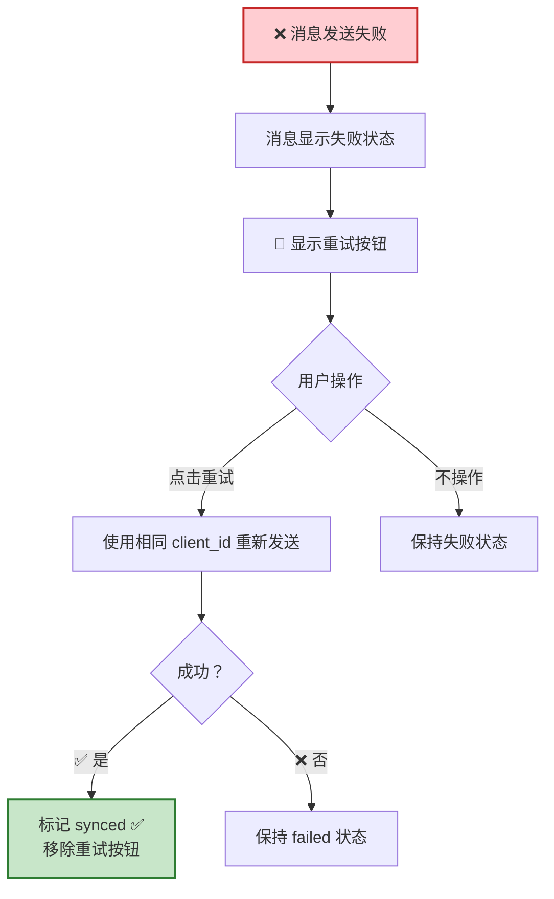
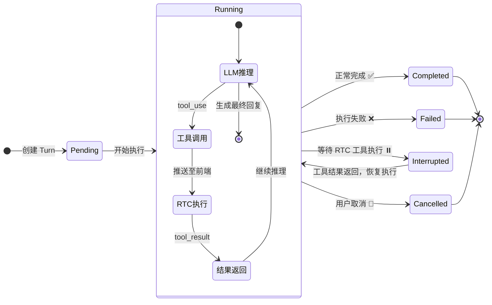
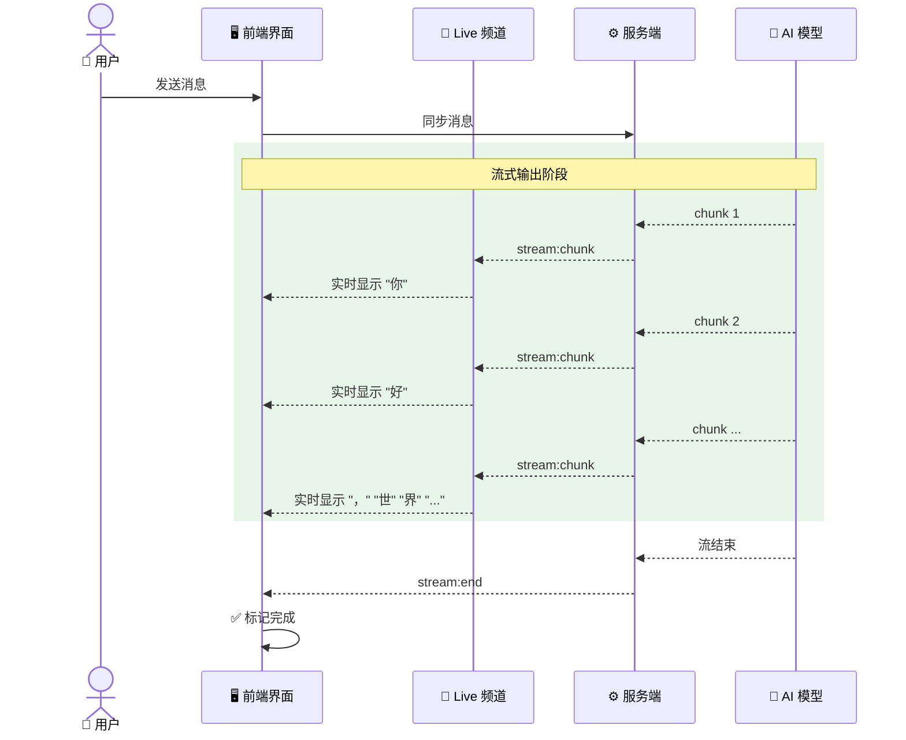
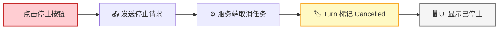
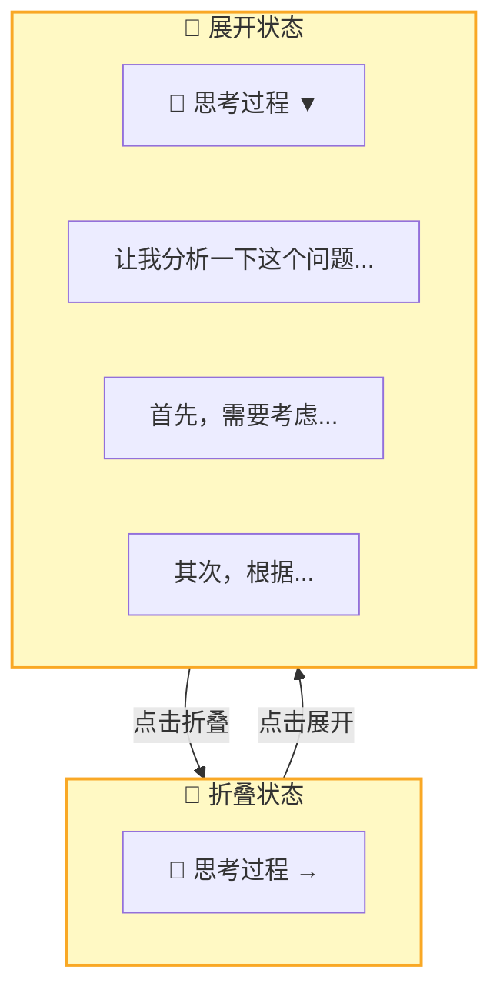
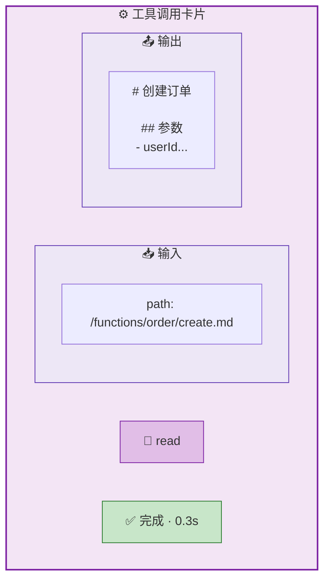

消息是用户与 AI 交互的载体。用户发送消息，AI **流式返回**回复，支持 Markdown 渲染、代码高亮、思考过程展示、工具调用卡片——整个过程实时可见。

## 消息类型

| 类型 | 说明 | 渲染方式 |
|------|------|----------|
| 💬 用户消息 | 用户输入的内容 | 纯文本 |
| 📝 AI 回复 | AI 生成的文本 | Markdown + 代码高亮 |
| 🧠 思考过程 | AI 的推理过程 | 可折叠，Markdown 渲染 |
| ⚙️ 工具调用 | AI 请求执行的工具 | 输入/输出卡片 |
| ℹ️ 系统消息 | 系统通知 | 纯文本 |

## 消息发送流程

消息采用**本地优先**策略：先存本地立即显示，后台异步同步。用户发消息后**零等待**即可看到消息出现在界面上。

## 发送失败处理

| 同步状态 | 用户看到的行为 |
|:--------:|---------------|
| `pending` | 消息显示发送中动画 |
| `synced` | 消息正常显示 |
| `failed` | 消息显示失败标记 + 🔄 重试按钮 |

> 💡 重试使用相同的 `client_id`，服务端**幂等去重**，不会产生重复消息。

## Turn 状态机

每次 AI 处理构成一个 **Turn**，它有明确的生命周期：

| 状态 | 含义 | 用户看到的行为 |
|:----:|------|---------------|
| `Pending` | 等待执行 | 消息显示"处理中" |
| `Running` | 正在执行 | AI 流式输出，工具卡片闪烁 |
| `Interrupted` | 等待工具执行 | 工具卡片显示"执行中" |
| `Completed` | 正常完成 | AI 回复完整显示 |
| `Failed` | 执行失败 | 错误提示 |
| `Cancelled` | 用户取消 | 已停止标记 |

## 流式消息

AI 的回复**逐字流式**到达，用户无需等待完整回复：

流式消息通过 **双频道** 传输：

| 频道 | 用途 | 特性 |
|------|------|------|
| **Topic 频道** | 首条 chunk + 最终完整消息 | 持久化，支持离线恢复 |
| **Live 频道** | 中间 chunk | 非持久化，低延迟，可容忍丢失 |

> 💡 最终完整消息通过 Topic 频道推送，即使中间 chunk 丢失，最终也能收到完整内容。

## 停止 Turn

用户可随时停止正在执行的 Turn：

## AI Thinking 展示

AI 的推理过程默认折叠，用户可选择展开查看：

| 特性 | 说明 |
|------|------|
| 默认折叠 | 节省界面空间 |
| 点击展开 | 查看完整推理过程 |
| 流式动画 | 生成时有脉冲动画效果 |
| Markdown 渲染 | 支持格式化显示 |

## 工具调用卡片

每次 RTC 工具调用以**卡片**形式展示，包含输入和输出两部分：

| 特性 | 说明 |
|------|------|
| 分区展示 | 输入参数和输出结果独立展示 |
| JSON 格式化 | 参数和结果自动美化 |
| 状态指示 | 运行中（🟠 橙色脉冲）/ 完成（🟢 绿色） |
| 复制按钮 | 一键复制输入/输出内容 |
| 耗时显示 | 展示工具执行耗时 |

## 消息列表

| 特性 | 说明 |
|------|------|
| 📊 排序 | 按发送时间升序（最早的在上） |
| 📑 分页 | 游标分页，从服务端加载历史消息 |
| 📜 自动滚动 | 新消息到达时自动滚动到底部 |
| 🔔 离开提示 | 用户滚动离开底部时显示"↓ 新消息"按钮 |

## 消息重试

| 场景 | 处理方式 |
|------|---------|
| 发送失败 | 标记 `failed`，显示重试按钮 |
| 幂等保证 | 使用 `client_id` 去重，重试不产生重复消息 |
| RTC 失败 | 指数退避重试（1s → 2s → 4s → ... → 30s 封顶） |

## 下一步

- [会话管理](/docs/features/session/) — 了解消息所在的会话容器
- [Remote Tool Calling](/docs/concepts/rtc/) — 了解工具调用卡片的背后机制
- [实时通信](/docs/features/realtime/) — 了解流式消息的双频道架构
