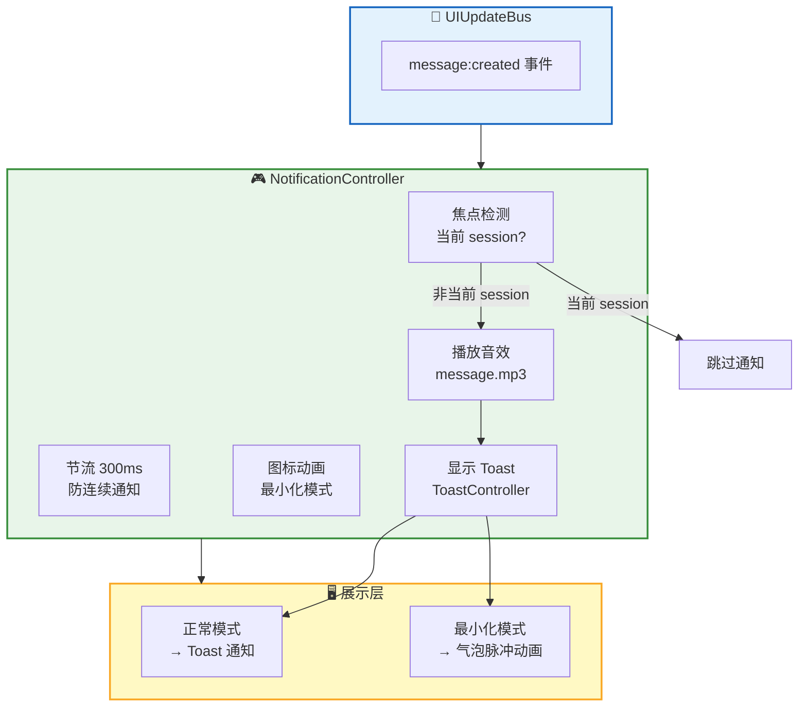
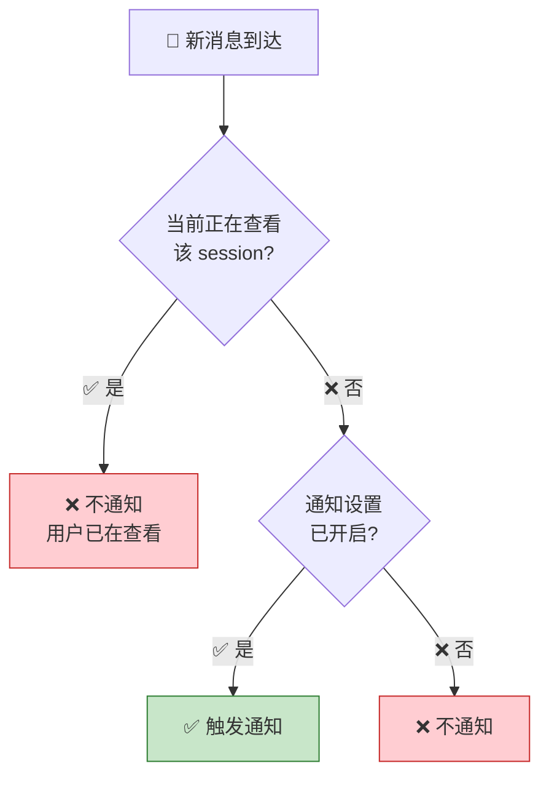
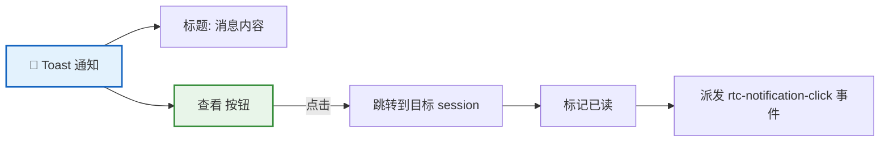
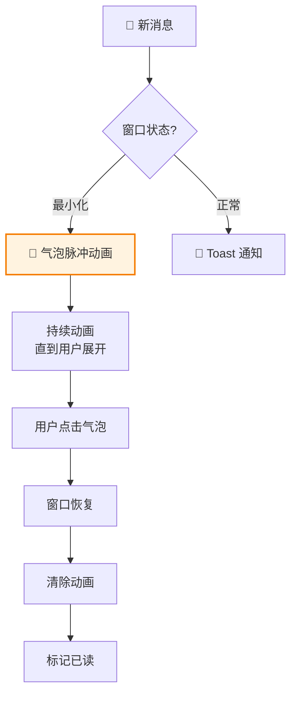

RTC Agent 内置轻量级通知系统，根据用户焦点和窗口状态智能触发声音提示、Toast 弹窗和图标动画。

## 架构概览



## NotificationController

`NotificationController` 是通知系统的核心，监听消息事件并根据焦点检测逻辑触发通知。

### 焦点检测



**规则**：

| 场景 | 是否通知 |
|:----:|:--------:|
| 用户在 session A，session B 收到消息 | ✅ 通知 |
| 用户在 session A，session A 收到消息 | ❌ 不通知 |
| 用户没在看任何 session | ✅ 通知 |
| 用户禁用通知 | ❌ 不通知 |

### 状态与操作

```ts
interface NotificationState {
  unreadCount: number;         // 未读通知计数
  lastNotificationAt: number | null;  // 上次通知时间戳
}

interface NotificationActions {
  markAsRead(): void;  // 标记所有通知为已读
  clearAll(): void;    // 清除所有通知状态
}
```

### Context 消费

通过 `NotificationContext` 获取通知状态：

```ts
import { consume } from '@lit/context';
import { NotificationContext, type NotificationContextValue } from '../contexts/notification.js';

@consume({ context: NotificationContext, subscribe: true })
@state()
private _notificationCtx: NotificationContextValue;

// 获取未读计数
const unread = this._notificationCtx.state.unreadCount;

// 标记已读
this._notificationCtx.actions.markAsRead();
```

## 音效通知

### 音效文件

| 音效 | 文件 | 触发时机 | 加载策略 |
|:----:|:----:|:--------:|:--------:|
| 消息提示 | `message.mp3` | 收到新消息 | 立即加载 |
| 任务完成 | `complete.mp3` | 任务执行完成 | 延迟加载 |
| 错误提示 | `error.mp3` | 发生错误 | 延迟加载 |

### 预加载机制

```ts
// NotificationController._preloadSounds()
// 关键音效（message）立即加载
const soundUrls = { message: messageSoundUrl };

// 非关键音效延迟加载（使用 requestIdleCallback）
const deferredSounds = {
  complete: completeSoundUrl,
  error: errorSoundUrl,
};
```

### 音效配置

通过设置面板控制音效开关：

```ts
// SettingsState.notifications.soundEnabled
interface NotificationSettings {
  soundEnabled: boolean;  // 是否启用音效
  toastEnabled: boolean;  // 是否启用 Toast
}
```

### 浏览器自动播放策略

浏览器要求用户首次交互后才能播放音频。如果音效被阻止，系统会降级处理：

```ts
sound.play().catch((error) => {
  if (error.name === 'NotAllowedError') {
    // 浏览器阻止自动播放，需要用户交互
    console.warn('[NotificationController] 音频播放被浏览器阻止');
  }
});
```

> 💡 音效加载失败不影响 Toast 和动画功能。

## Toast 通知

### ToastAction 按钮

Toast 通知支持操作按钮，允许用户快速跳转到消息来源：



**Toast 配置**：

```ts
// NotificationController._showToast()
this.toastController?.actions.show(
  `${title}: ${content}`,  // 通知内容
  'info',                   // 类型
  {
    label: msg('查看'),     // 按钮文本
    onClick: () => this._navigateToSession(sessionId),  // 点击回调
  }
);
```

### 跳转流程

点击 Toast 的"查看"按钮后：

1. 切换到目标 session（`sessionController.actions.switchSession()`）
2. 标记通知已读（`actions.markAsRead()`）
3. 派发 `rtc-notification-click` 事件（携带 `sessionId`）

## 最小化气泡动画

当窗口处于最小化模式时，新消息触发气泡图标动画：



### 动画实现

通过 CSS `data-notification` 属性控制动画：

```ts
// NotificationController._animateMinimizeIcon()
this.host.setAttribute('data-notification', 'active');
// 动画持续，直到用户展开窗口或点击气泡

// 清除动画
this.host.removeAttribute('data-notification');
```

### 视觉风格

| 属性 | 值 |
|:----:|:--:|
| 形状 | 圆角方形（border-radius: 23.2%） |
| 颜色 | 橙色 → 黄色脉冲 |
| 动画 | 持续脉冲，直到用户交互 |

### 从最小化恢复

从最小化恢复时，自动清除通知状态：

```ts
// RtcAgent._handleModeTransition()
if (this._appliedMode === 'minimized' && mode !== 'minimized') {
  this._notification.actions.markAsRead();
}
```

## 事件

### rtc-notification-click

当用户点击 Toast 的"查看"按钮时触发：

```ts
interface NotificationClickDetail {
  sessionId: string;  // 目标 session ID
}

agent.addEventListener('rtc-notification-click', (e: CustomEvent<NotificationClickDetail>) => {
  console.log('User navigated to session:', e.detail.sessionId);
});
```

## 键盘可达性

通知系统支持完整的键盘交互：

| 按键 | 行为 |
|:----:|:----:|
| `Tab` | 在 Toast 按钮间切换焦点 |
| `Enter` / `Space` | 激活 Toast 操作按钮 |
| `Esc` | 关闭当前 Toast |

Toast 组件使用 `role="alert"` 和 `aria-live="polite"` 确保屏幕阅读器正确播报。

## 节流机制

为防止快速连续消息导致 UI 卡顿，通知系统实施节流：

```ts
private static readonly NOTIFY_THROTTLE_MS = 300;

private async _handleNewMessage(event: UIUpdateEvent) {
  const now = Date.now();
  if (now - this._lastNotifyTime < NotificationController.NOTIFY_THROTTLE_MS) {
    return;  // 节流：跳过
  }
  this._lastNotifyTime = now;
  // ... 触发通知
}
```

**参数**：

| 参数 | 值 | 说明 |
|:----:|:--:|:----:|
| `NOTIFY_THROTTLE_MS` | 300ms | 两次通知之间的最小间隔 |

## 配置示例

### 完整配置

```ts
const agent = document.querySelector('rtc-agent');

agent.addEventListener('rtc-agent-ready', () => {
  // 通过 SettingsController 配置通知
  // 注意：设置通常由用户在设置面板中调整
  // 这里展示编程方式配置

  // 监听通知事件
  agent.addEventListener('rtc-notification-click', (e) => {
    console.log('Notification clicked:', e.detail.sessionId);
  });
});
```

### 禁用通知

```css
/* 通过 CSS 隐藏 Toast */
rtc-agent {
  --rtc-toast-display: none;
}
```

或在设置面板中关闭：

- 关闭"启用声音" → 禁用音效
- 关闭"启用 Toast" → 禁用 Toast 弹窗

## 下一步

- [设置系统](/docs/features/settings) — 了解全局设置系统
- [Component API](/docs/integration/component-api) — 了解完整的组件 API
