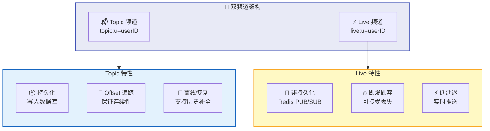
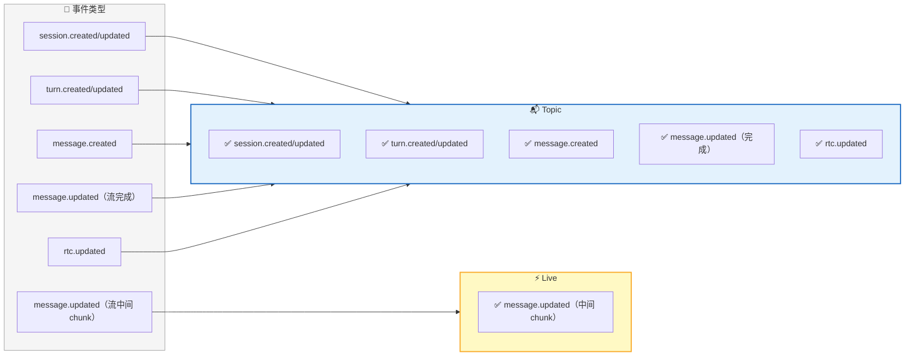
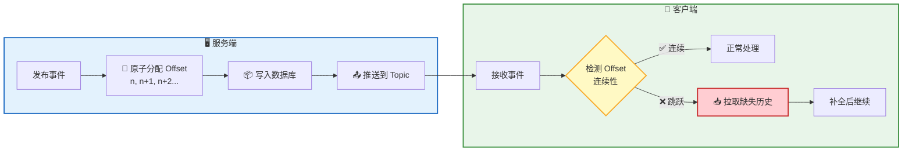
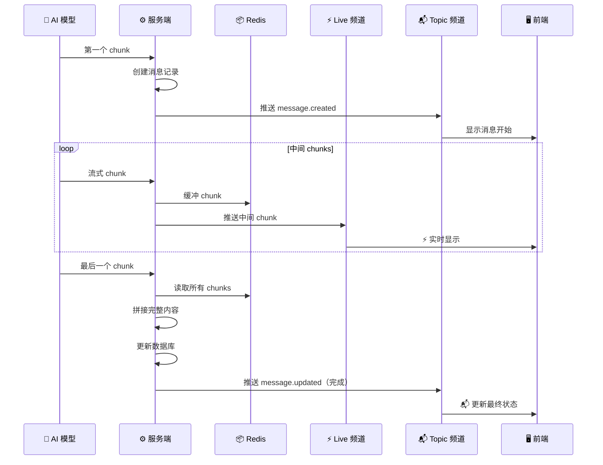
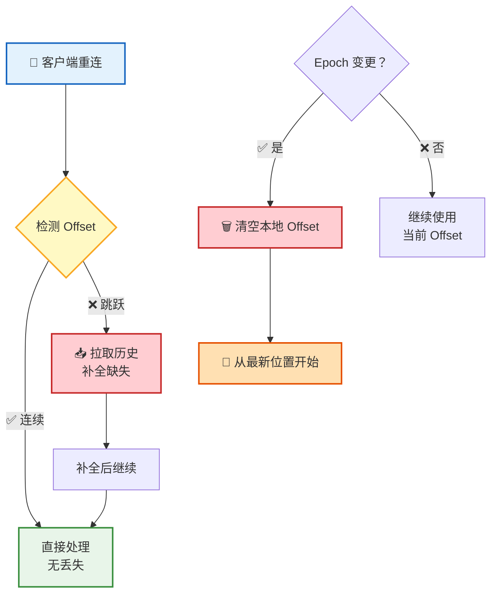
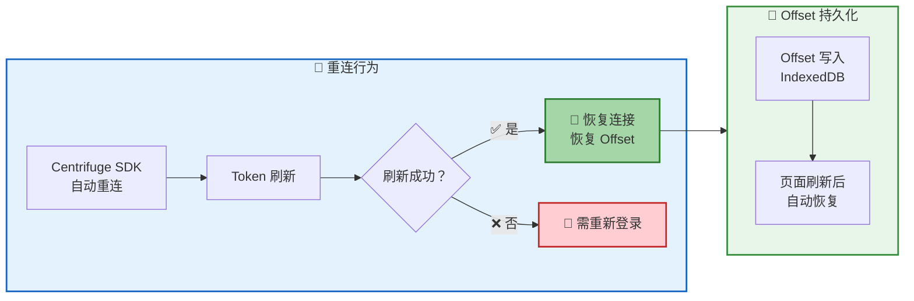
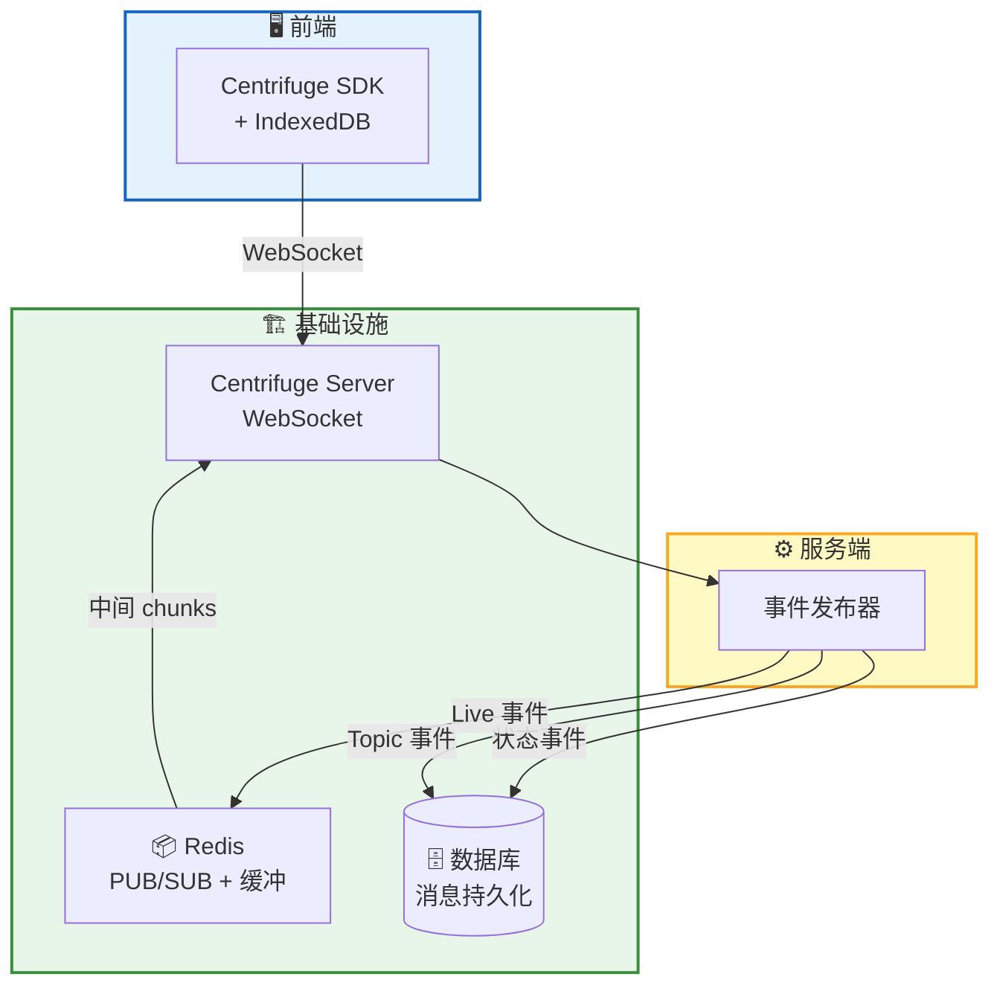

**实时通信** 是 RTC Agent 用户体验的基石。基于 Centrifuge WebSocket，系统采用 **双频道架构**：Topic 频道确保消息不丢失，Live 频道确保流式输出低延迟——可靠与速度，一个都不少。

## 双频道架构

| | Topic 频道 | Live 频道 |
|---|-----------|----------|
| **用途** | 状态变更事件 | 流式消息中间 chunks |
| **持久化** | ✅ 写入数据库 | ❌ Redis PUB/SUB |
| **Offset** | ✅ 严格递增 | ❌ 无 |
| **离线恢复** | ✅ 支持 | ❌ 不支持 |
| **延迟** | 较低（需持久化） | 极低（内存转发） |

> 💡 设计思路：**重要的事走 Topic，求快的事走 Live**。状态变更必须可靠送达，而流式输出的中间 chunk 丢一两个也无妨。

## 事件分布

不同类型的事件走不同的频道：

| 事件类型 | Topic | Live | 说明 |
|----------|:-----:|:----:|------|
| `session.created/updated` | ✅ | ❌ | 会话状态变更 |
| `turn.created/updated` | ✅ | ❌ | 轮次状态变更 |
| `message.created` | ✅ | ❌ | 新消息创建 |
| `message.updated`（流完成） | ✅ | ❌ | 流式输出完成后的最终状态 |
| `message.updated`（流中间 chunk） | ❌ | ✅ | 流式输出的中间片段 |
| `rtc.updated` | ✅ | ❌ | RTC 工具调用状态变更 |

## Offset 机制

Offset 是 Topic 频道可靠性的核心——每个事件分配一个 **严格递增** 的序号，客户端通过检测序号连续性来发现丢失的消息：

| 特性 | 说明 |
|------|------|
| **严格递增** | 每个 Topic 事件的 Offset 都大于前一个 |
| **Gap 检测** | 客户端发现 Offset 跳跃时，自动拉取缺失历史 |
| **不丢不重** | 保证消息不丢失、不重复 |

## 流式消息流程

AI 模型的流式输出是用户最常感知的实时功能。系统通过 **Topic + Live 协作** 实现既实时又可靠的流式推送：

| 阶段 | 频道 | 动作 |
|------|------|------|
| 第一个 chunk | Topic | 创建消息记录，推送 `message.created` |
| 中间 chunks | Live | 追加到 Redis 缓冲，推送到 Live 实时显示 |
| 最后一个 chunk | Topic | 拼接完整内容，更新数据库，推送最终状态 |

> 💡 **为什么分两步？** Live 频道让每个 chunk 即时到达前端，用户看到流畅的打字效果；最后通过 Topic 频道推送完整消息，确保即使 Live 丢失了某些 chunk，最终状态也是完整正确的。

## 离线恢复

网络不可能永远稳定。系统在断网恢复时提供不同策略：

| 场景 | 行为 | 用户感知 |
|------|------|----------|
| 🟢 短暂断网 | 重连后自动推送离线期间的消息 | 几乎无感知 |
| 🟡 长时间断网 | 检测 Offset 跳跃，主动拉取历史补全 | 看到补齐的消息 |
| 🔴 历史被清理 | Epoch 变更，清空本地 Offset，从最新位置开始 | 从当前状态继续 |

**Epoch** 是 Offset 的时间线标识。当服务端进行大规模清理或重建时，Epoch 会变更，客户端需要重置 Offset 从最新位置开始——因为旧历史已经不存在了。

## 重连机制

| 机制 | 说明 |
|------|------|
| **自动重连** | Centrifuge SDK 内置断线重连，指数退避 |
| **Token 刷新** | 连接恢复时自动刷新认证 Token |
| **Offset 持久化** | Offset 存储在 IndexedDB，页面刷新后恢复 |
| **降级策略** | Token 刷新失败时需要用户重新登录 |

> 📌 Offset 持久化到 IndexedDB 意味着：即使用户关闭了浏览器标签页再打开，也能从上次的位置继续接收消息，不会错过任何更新。

## 架构全景

## 下一步

- [Remote Tool Calling](/docs/concepts/rtc/) — 了解实时通信承载的核心协议
- [会话管理](/docs/features/session/) — 了解实时事件在会话中的组织方式
- [上下文管理](/docs/features/context-management/) — 了解消息如何被智能压缩
