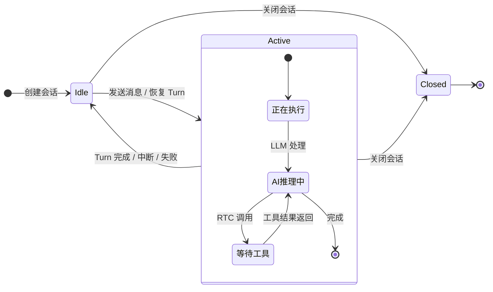
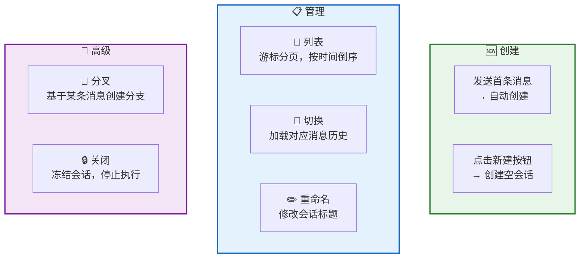
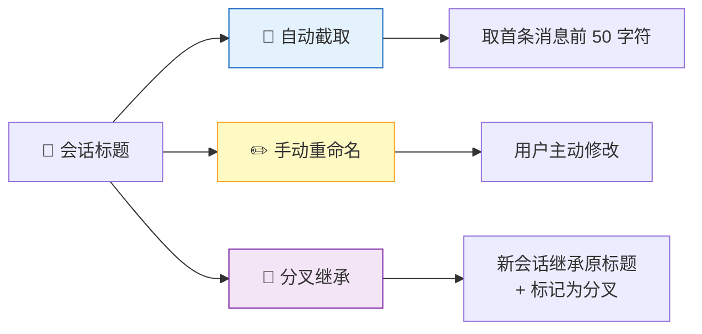
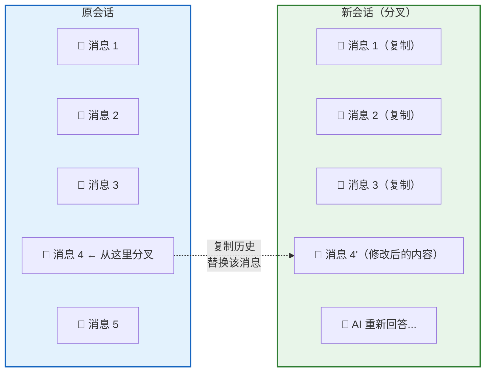
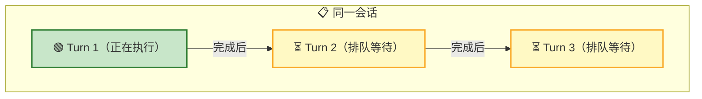
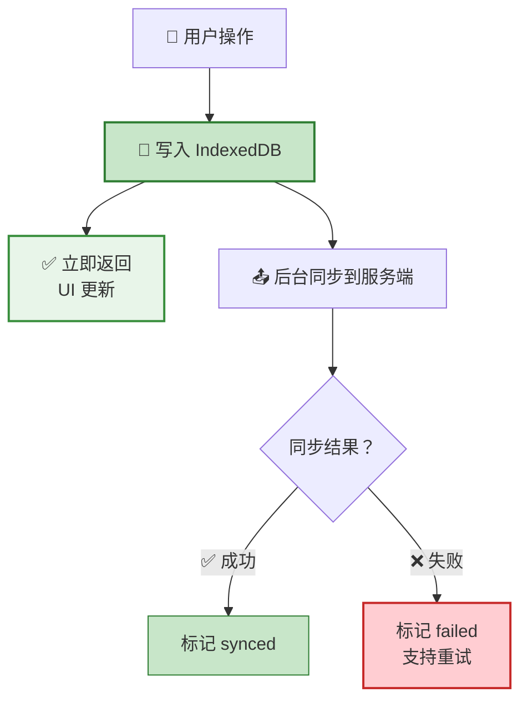
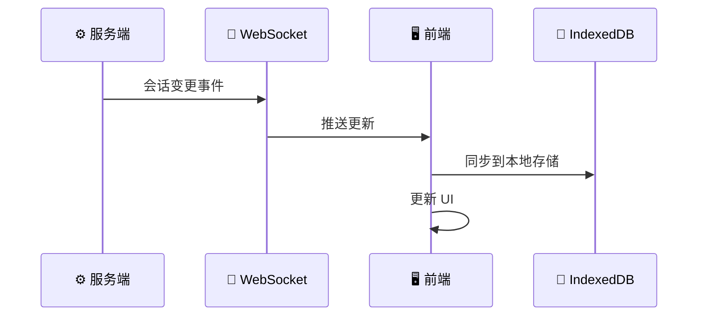

**会话（Session）** 是用户与 AI 对话的容器。每个会话独立管理自己的消息历史和执行状态。用户可以自由创建、切换、重命名会话，还能基于任意一条历史消息**分叉**出新会话。

## 会话状态

| 状态 | 含义 | 可执行操作 |
|:----:|------|-----------|
| 🟢 `Idle` | 空闲，可发送新消息 | 发送消息、关闭 |
| 🔵 `Active` | 正在执行 Turn | 停止 Turn、关闭 |
| ⚫ `Closed` | 已关闭，不可再写入 | 查看历史、分叉 |

## 会话操作

| 操作 | 说明 |
|------|------|
| **创建** | 发送首条消息时自动创建，无独立 RPC；也可点击新建按钮创建空会话（纯前端本地创建） |
| **列表** | 按创建时间倒序，游标分页加载 |
| **切换** | 纯前端行为，无 RPC——从本地 IndexedDB 加载对应消息历史 |
| **重命名** | 修改会话标题 |
| **分叉** | 基于某条消息复制历史，替换该消息内容，触发新的 AI 流程 |
| **关闭** | 标记为 `Closed`，停止正在执行的 Turn |

## 会话标题

## 会话分叉

分叉是 RTC Agent 的特色功能——**对之前的回答不满意？修改问题，重新生成。**

分叉流程：

| 步骤 | 说明 |
|------|------|
| 1. 选择消息 | 点击任意一条历史消息 |
| 2. 点击分叉 | 触发分叉操作 |
| 3. 复制历史 | 复制该消息之前的所有消息 |
| 4. 替换内容 | 用新内容替换选中的消息 |
| 5. 触发 AI | AI 基于新内容重新处理 |

## 并发约束

| 约束 | 说明 |
|------|------|
| **单 Turn 执行** | 同一会话同时只能有一个 Turn 在执行 |
| **归属隔离** | 用户只能操作自己的会话 |
| **关闭即冻结** | 已关闭的会话不可再发送消息 |

## 本地优先

RTC Agent 采用 **Local-First** 数据策略——所有操作先写入本地，再异步同步到服务端。

| 优势 | 说明 |
|------|------|
| ⚡ **即时响应** | 写入本地即返回，无网络等待 |
| 📴 **离线可用** | 断网时仍可操作，恢复后自动同步 |
| 🔄 **自动重试** | 同步失败标记 `failed`，支持手动重试 |

## 实时更新

服务端通过 WebSocket 推送会话变更，前端自动同步：

推送的变更类型：

| 事件 | 说明 |
|------|------|
| 创建 | 新会话被创建（如自动创建） |
| 更新 | 会话标题修改、状态变更 |
| 关闭 | 会话被关闭 |

## 下一步

- [消息与对话](/docs/features/messaging/) — 了解会话内的消息交互
- [Remote Tool Calling](/docs/concepts/rtc/) — 了解 Turn 中的工具调用
- [命令系统](/docs/features/commands/) — 了解会话级命令（/compact、/loop、/goal）
