**会话（Session）** 是用户与 AI 对话的容器。每个会话独立管理自己的消息历史和执行状态。用户可以自由创建、切换、重命名会话，还能基于任意一条历史消息**分叉**出新会话。

## 会话状态

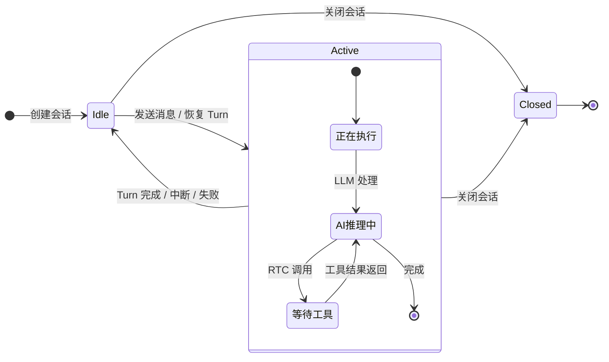

| 状态 | 含义 | 可执行操作 |
|:----:|------|-----------|
| 🟢 `Idle` | 空闲，可发送新消息 | 发送消息、关闭 |
| 🔵 `Active` | 正在执行 Turn | 停止 Turn、关闭 |
| ⚫ `Closed` | 已关闭，不可再写入 | 查看历史、分叉 |

## 会话操作

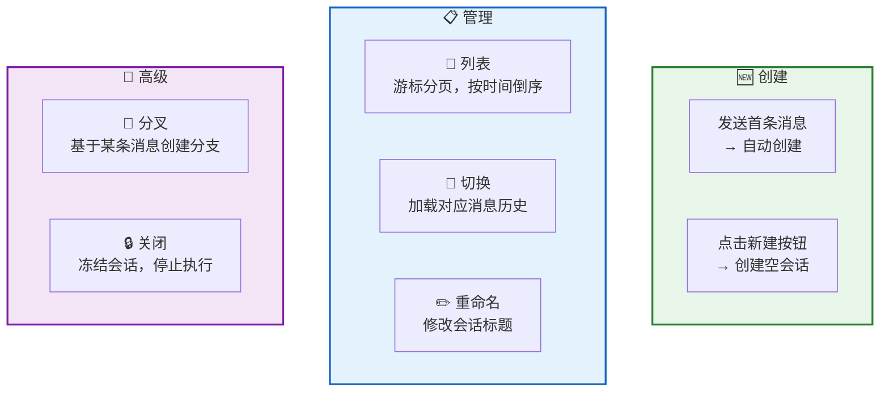

| 操作 | 说明 |
|------|------|
| **创建** | 发送首条消息时自动创建，无独立 RPC；也可点击新建按钮创建空会话（纯前端本地创建） |
| **列表** | 按创建时间倒序，游标分页加载 |
| **切换** | 纯前端行为，无 RPC——从本地 IndexedDB 加载对应消息历史 |
| **重命名** | 修改会话标题 |
| **分叉** | 基于某条消息复制历史，替换该消息内容，触发新的 AI 流程 |
| **关闭** | 标记为 `Closed`，停止正在执行的 Turn |

## 会话标题

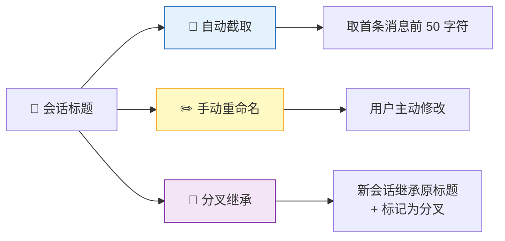

## 会话分叉

分叉是 RTC Agent 的特色功能——**对之前的回答不满意？修改问题，重新生成。**

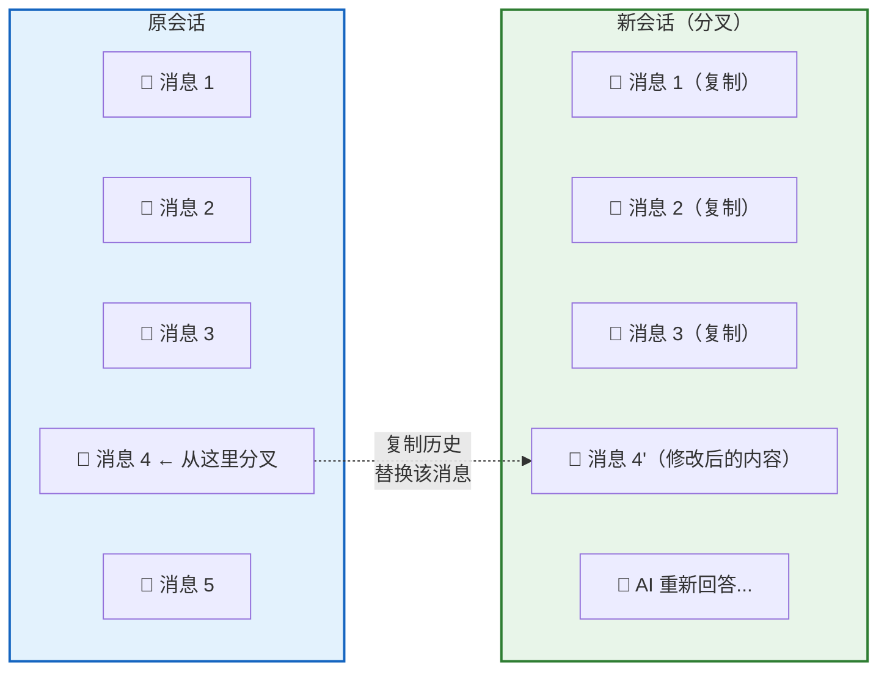

分叉流程：

| 步骤 | 说明 |
|------|------|
| 1. 选择消息 | 点击任意一条历史消息 |
| 2. 点击分叉 | 触发分叉操作 |
| 3. 复制历史 | 复制该消息之前的所有消息 |
| 4. 替换内容 | 用新内容替换选中的消息 |
| 5. 触发 AI | AI 基于新内容重新处理 |

## 并发约束

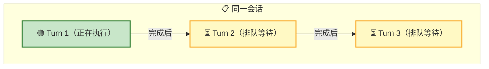

| 约束 | 说明 |
|------|------|
| **单 Turn 执行** | 同一会话同时只能有一个 Turn 在执行 |
| **归属隔离** | 用户只能操作自己的会话 |
| **关闭即冻结** | 已关闭的会话不可再发送消息 |

## 本地优先

RTC Agent 采用 **Local-First** 数据策略——所有操作先写入本地，再异步同步到服务端。

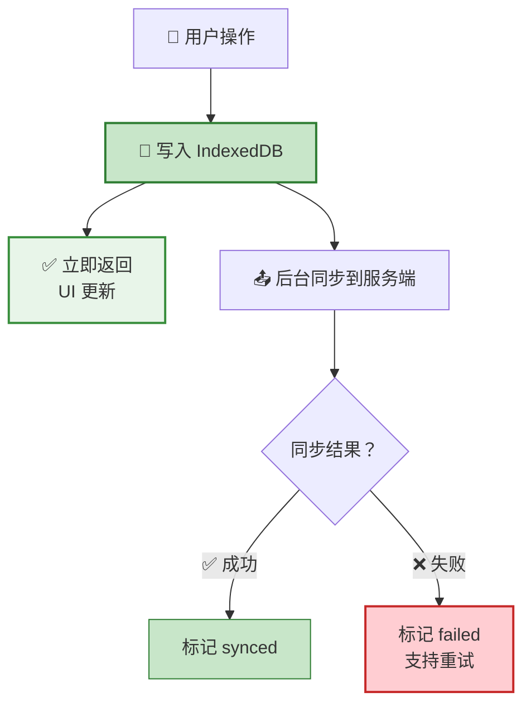

| 优势 | 说明 |
|------|------|
| ⚡ **即时响应** | 写入本地即返回，无网络等待 |
| 📴 **离线可用** | 断网时仍可操作，恢复后自动同步 |
| 🔄 **自动重试** | 同步失败标记 `failed`，支持手动重试 |

## 实时更新

服务端通过 WebSocket 推送会话变更，前端自动同步：

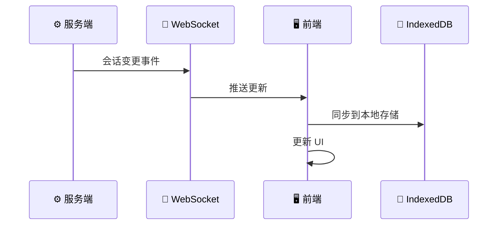

推送的变更类型：

| 事件 | 说明 |
|------|------|
| 创建 | 新会话被创建（如自动创建） |
| 更新 | 会话标题修改、状态变更 |
| 关闭 | 会话被关闭 |

## 会话树与会话导航

RTC Agent 提供两种会话导航方式：**会话树**（侧边栏）和**会话标签页**（顶部标签栏），分别适用于不同的使用场景。

### 会话树（Session Tree）

会话树是一个 VS Code 风格的树形结构，适合管理大量会话和查看会话层级关系。

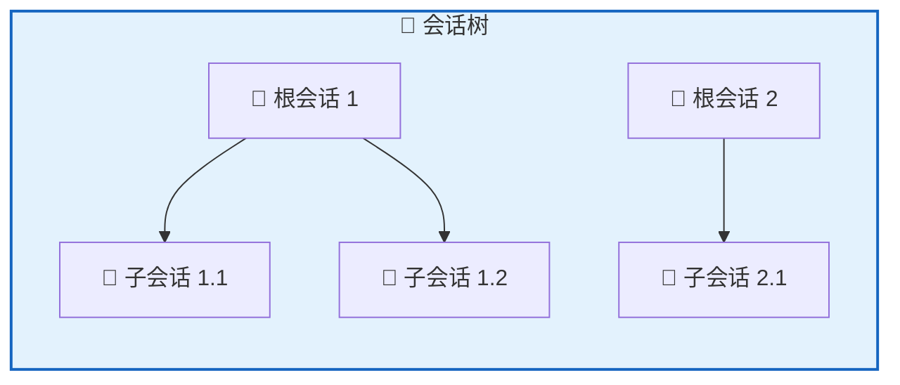

**组件**：
- `<rtc-session-tree>` — 会话树容器，提供刷新、新建、删除按钮
- `<rtc-session-tree-item>` — 单个树节点，支持递归渲染子节点

**特性**：
- 📂 **层级结构**：支持父子会话关系（通过 `rootClientSessionId` 关联）
- 🔽 **展开/折叠**：点击箭头图标展开或折叠子会话
- ⌨️ **键盘导航**：完整的 ARIA `role="tree"` 支持（方向键、Home、End、Enter）
- 🎯 **选中高亮**：当前选中的会话高亮显示

**事件**：

| 事件 | 说明 |
|------|------|
| `rtc-session-tree-select` | 用户点击或键盘激活会话节点 |
| `rtc-session-tree-toggle` | 用户点击展开/折叠箭头 |
| `rtc-session-tree-new` | 用户点击新建会话按钮 |
| `rtc-session-delete-requested` | 用户点击删除按钮 |

> ⚠️ **破坏性变更**：新会话创建事件从 `rtc-new-session` 更名为 `rtc-session-tree-new`，命名更符合组件规范。

### 会话标签页（Session Tab）

会话标签页是浏览器风格的标签栏，适合在多会话间快速切换。

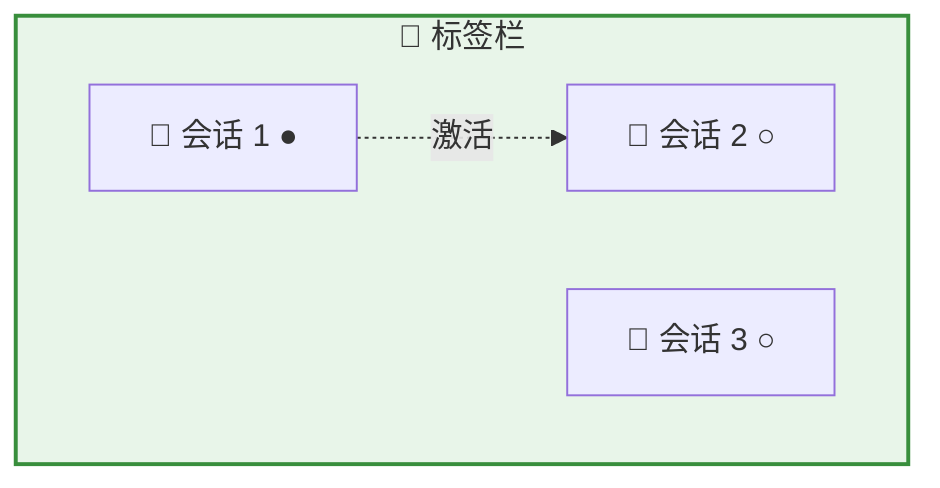

**组件**：
- `<rtc-session-tab-bar>` — 标签栏容器
- `<rtc-session-tab>` — 单个标签页

**特性**：
- 🔄 **快速切换**：点击标签即可切换会话
- ❌ **关闭标签**：点击标签上的关闭按钮
- 💾 **状态持久化**：标签顺序和激活状态保存到 localStorage
- 📝 **未保存草稿**：支持未持久化的临时会话标签

### Chat Layout（聊天布局）

`<rtc-chat-layout>` 是新的主聊天界面布局组件，整合了会话树和标签栏：

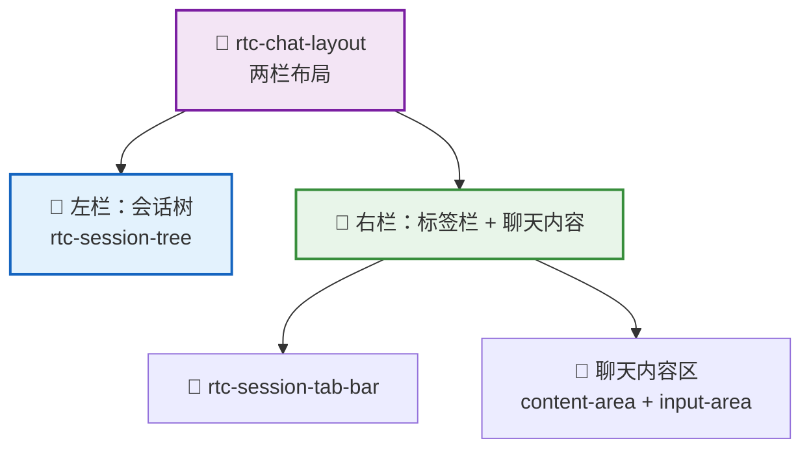

**属性**：

| 属性 | 类型 | 默认值 | 说明 |
|------|------|--------|------|
| `sessionTreeVisible` | `boolean` | `true` | 是否显示左侧会话树 |
| `theme` | `'light' \| 'dark' \| 'system'` | `'system'` | 主题模式 |

**使用示例**：

```html
<!-- 默认显示会话树 -->
<rtc-chat-layout></rtc-chat-layout>

<!-- 隐藏会话树（仅显示标签栏） -->
<rtc-chat-layout session-tree-visible="false"></rtc-chat-layout>
```

### Controller 协作

会话树和标签页由两个独立的 Controller 管理，通过事件协作：

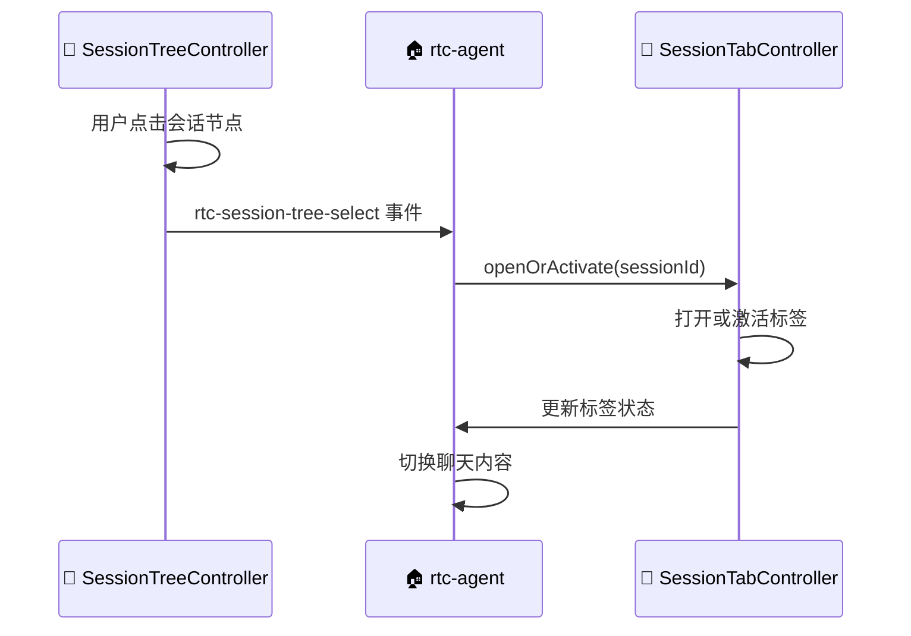

- **SessionTreeController**：管理树形结构和展开状态
- **SessionTabController**：管理标签页状态和持久化
- **协作方式**：事件驱动，根组件 `<rtc-agent>` 作为中枢编排

## Token 用量与成本统计

每个 Session 自动累计 LLM Token 消耗与成本，通过 `session.updated` 事件实时推送到前端。

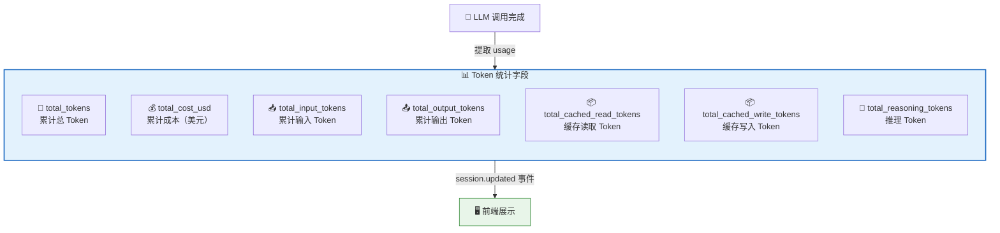

### Token 统计字段

| 字段 | 类型 | 说明 |
|------|------|------|
| `total_tokens` | int64 | 累计总 Token 数（包含所有类型） |
| `total_input_tokens` | int64 | 累计纯输入 Token 数（不含 cached read/write） |
| `total_output_tokens` | int64 | 累计输出 Token 数 |
| `total_cached_read_tokens` | int64 | 累计缓存读取 Token 数 |
| `total_cached_write_tokens` | int64 | 累计缓存写入 Token 数 |
| `total_reasoning_tokens` | int64 | 累计推理 Token 数 |
| `total_cost_usd` | float64 | 累计成本（美元） |
| `last_token_update_at` | time | 最后一次 Token 统计更新时间 |

### Token 预估字段

| 字段 | 类型 | 说明 |
|------|------|------|
| `estimated_next_round_tokens` | int64 | 基于 EWMA 的下一轮 Token 预估 |
| `compression_progress` | float64 | 压缩进度 (0-100)，实时计算 |
| `compression_threshold` | int64 | 压缩触发阈值 |
| `rounds_until_compression` | int | 距离压缩的轮次（-1 表示已超过阈值） |

### 成本计算

系统支持多维度成本计算，根据模型定价配置自动计算：

| 维度 | 说明 |
|------|------|
| 输入 Token | 非缓存的纯输入 Token 成本 |
| 输出 Token | 输出 Token 成本 |
| 缓存读取 | 缓存命中的 Token 成本（通常更低） |
| 缓存写入 | 缓存写入的 Token 成本 |
| 推理 Token | 推理过程（如 thinking）的 Token 成本 |

> 💡 Token 统计通过节流机制（Throttle）控制 `session.updated` 事件的推送频率，避免高频事件风暴。前端通过 `rtc-token-usage` 组件展示这些数据。

## 下一步

- [消息与对话](/docs/features/messaging/) — 了解会话内的消息交互
- [Remote Tool Calling](/docs/concepts/rtc/) — 了解 Turn 中的工具调用
- [命令系统](/docs/features/commands/) — 了解会话级命令（/compact、/loop、/goal）
