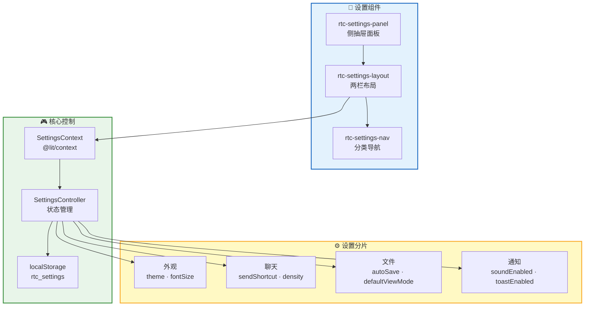
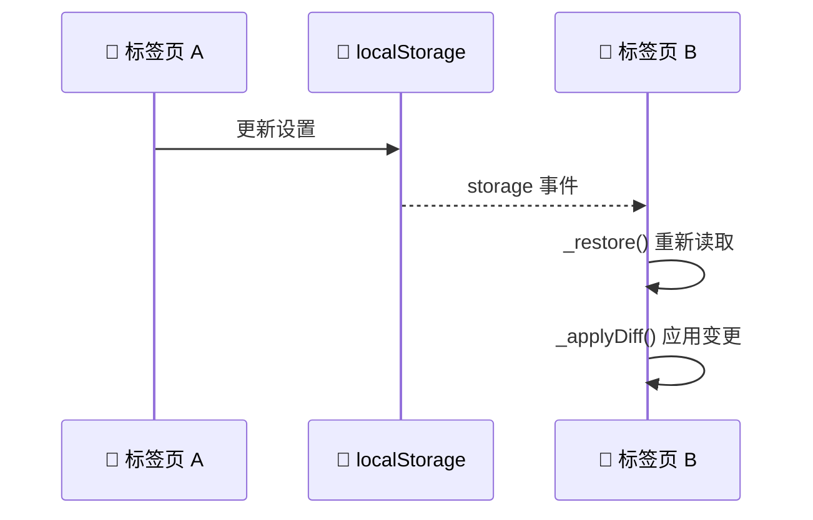
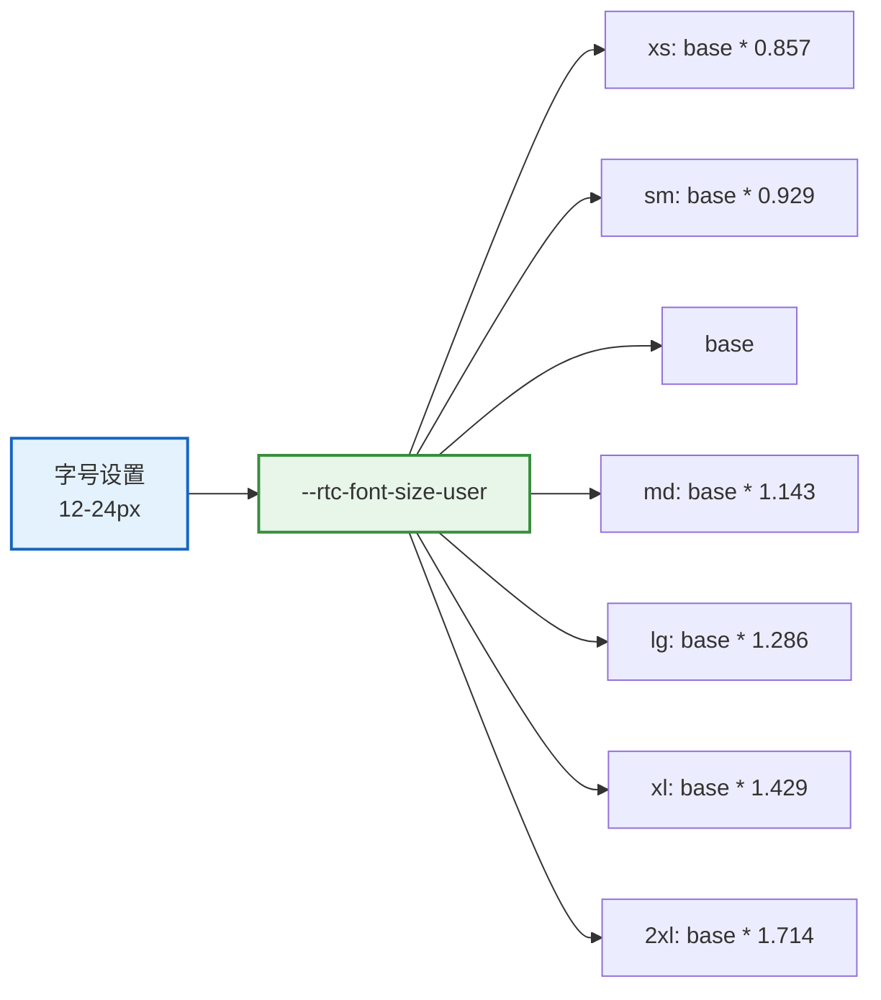

RTC Agent 提供完整的全局设置系统，支持外观、聊天、文件和通知四个分类的设置项，所有设置持久化到 `localStorage`，支持多标签页同步。

## 架构概览



## 组件

### rtc-settings-panel

侧抽屉面板，包裹 `rtc-settings-layout`，提供遮罩层和键盘导航：

```html
<rtc-settings-panel theme="system"></rtc-settings-panel>
```

**属性**：

| 属性 | 类型 | 默认值 | 说明 |
|:----:|:----:|:------:|:----:|
| `theme` | `'light' \| 'dark' \| 'system'` | `'system'` | 主题模式 |

**事件**：

| 事件 | 说明 |
|:----:|:----:|
| `close` | 面板关闭时触发 |

**键盘支持**：

| 按键 | 行为 |
|:----:|:----:|
| `Esc` | 关闭面板 |
| 点击遮罩 | 关闭面板 |

### rtc-settings-layout

两栏布局组件：左栏分类导航 + 右栏设置内容。

```html
<rtc-settings-layout theme="system"></rtc-settings-layout>
```

**属性**：

| 属性 | 类型 | 默认值 | 说明 |
|:----:|:----:|:------:|:----:|
| `theme` | `'light' \| 'dark' \| 'system'` | `'system'` | 主题模式 |

**无障碍**：

- 使用 `delegatesFocus: true` 支持键盘焦点委托
- 使用 `role="tabpanel"` 和 `aria-labelledby` 关联导航
- 使用 `aria-live="polite"` 提供屏幕阅读器实时反馈

### rtc-settings-nav

左侧分类导航组件：

```html
<rtc-settings-nav .active=${'appearance'}></rtc-settings-nav>
```

**属性**：

| 属性 | 类型 | 默认值 | 说明 |
|:----:|:----:|:------:|:----:|
| `active` | `SettingsCategory` | `'appearance'` | 当前选中的分类 |

**事件**：

| 事件 | Detail | 说明 |
|:----:|:------:|:----:|
| `settings-nav-change` | `{ category: SettingsCategory }` | 分类切换 |

**分类列表**：

| 分类 | 值 | 图标 |
|:----:|:--:|:----:|
| 外观 | `appearance` | 🎨 |
| 聊天 | `chat` | 💬 |
| 文件 | `files` | 📁 |
| 通知 | `notifications` | 🔔 |
| 账户 | `account` | 👤 |
| 关于 | `about` | ℹ️ |

## SettingsContext

### 类型定义

```ts
interface SettingsState {
  appearance: {
    theme: 'light' | 'dark' | 'system';
    fontSize: number;  // 12-24px
  };
  chat: {
    sendShortcut: 'Enter' | 'Ctrl+Enter';
    density: 'compact' | 'comfortable';
  };
  files: {
    autoSave: boolean;
    defaultViewMode: 'edit' | 'preview' | 'split';
  };
  notifications: {
    soundEnabled: boolean;
    toastEnabled: boolean;
  };
}

interface SettingsActions {
  updateAppearance(partial: Partial<SettingsState['appearance']>): void;
  updateChat(partial: Partial<SettingsState['chat']>): void;
  updateFiles(partial: Partial<SettingsState['files']>): void;
  updateNotifications(partial: Partial<SettingsState['notifications']>): void;
  resetAll(): void;
}

interface SettingsContextValue {
  state: SettingsState;
  actions: SettingsActions;
}
```

### 默认值

```ts
const DEFAULT_SETTINGS_STATE: SettingsState = {
  appearance: { theme: 'system', fontSize: 14 },
  chat: { sendShortcut: 'Enter', density: 'comfortable' },
  files: { autoSave: true, defaultViewMode: 'split' },
  notifications: { soundEnabled: true, toastEnabled: true },
};
```

### 消费 Context

```ts
import { consume } from '@lit/context';
import { SettingsContext, type SettingsContextValue } from '../contexts/settings.js';

@consume({ context: SettingsContext, subscribe: true })
@property({ attribute: false })
private _settingsCtx: SettingsContextValue;

// 读取设置
const theme = this._settingsCtx.state.appearance.theme;
const fontSize = this._settingsCtx.state.appearance.fontSize;

// 更新设置
this._settingsCtx.actions.updateAppearance({ fontSize: 16 });
this._settingsCtx.actions.updateChat({ sendShortcut: 'Ctrl+Enter' });
```

## SettingsController

### 持久化

设置保存到 `localStorage`，键名为 `rtc_settings`：

```ts
// 读取
const raw = localStorage.getItem(STORAGE_KEYS.settings);
const saved = JSON.parse(raw);

// 写入
localStorage.setItem(STORAGE_KEYS.settings, JSON.stringify(this._state));
```

### DOM 副作用

SettingsController 自动处理 DOM 副作用：

| 设置 | DOM 副作用 |
|:----:|:----------:|
| `appearance.theme` | 更新 `rtc-agent` 元素的 `theme` 属性 |
| `appearance.fontSize` | 设置 `document.documentElement` 的 `--rtc-font-size-user` CSS 变量 |

```ts
// _applyTheme()
const rtcAgent = this.host.closest('rtc-agent') || this.host;
if ('theme' in rtcAgent) {
  rtcAgent.theme = theme;
}

// _applyFontSize()
document.documentElement.style.setProperty(
  '--rtc-font-size-user',
  `${clamped}px`
);
```

### 多标签页同步

监听 `storage` 事件实现多标签页同步：



```ts
// SettingsController.hostConnected()
window.addEventListener('storage', this._storageListener);

// SettingsController._handleStorageChange()
private _handleStorageChange() {
  const oldState = this._state;
  this._restore();
  this._applyDiff(oldState, this._state);
  this.host.requestUpdate();
}
```

### 系统主题监听

监听系统主题变化，当设置 `theme: 'system'` 时自动跟随：

```ts
this._themeMediaQuery = window.matchMedia('(prefers-color-scheme: dark)');
this._themeMediaQuery.addEventListener('change', () => {
  if (this._state.appearance.theme === 'system') {
    this._applyTheme();
  }
});
```

## 设置项详解

### 外观设置

| 设置项 | 类型 | 默认值 | 说明 |
|:------:|:----:|:------:|:----:|
| `theme` | `'light' \| 'dark' \| 'system'` | `'system'` | 主题模式 |
| `fontSize` | `number` | `14` | 基础字号（12-24px） |



### 聊天设置

| 设置项 | 类型 | 默认值 | 说明 |
|:------:|:----:|:------:|:----:|
| `sendShortcut` | `'Enter' \| 'Ctrl+Enter'` | `'Enter'` | 发送消息快捷键 |
| `density` | `'compact' \| 'comfortable'` | `'comfortable'` | 消息密度 |

**sendShortcut**：

| 值 | 行为 |
|:--:|:----:|
| `Enter` | 按 Enter 发送，Shift+Enter 换行 |
| `Ctrl+Enter` | 按 Ctrl/Cmd+Enter 发送，Enter 换行 |

**density**：

| 值 | 消息间距 |
|:--:|:--------:|
| `compact` | 紧凑（较小间距） |
| `comfortable` | 舒适（默认间距） |

### 文件设置

| 设置项 | 类型 | 默认值 | 说明 |
|:------:|:----:|:------:|:----:|
| `autoSave` | `boolean` | `true` | 编辑时自动保存 |
| `defaultViewMode` | `'edit' \| 'preview' \| 'split'` | `'split'` | 默认视图模式 |

**defaultViewMode**：

| 值 | 说明 |
|:--:|:----:|
| `edit` | 仅编辑器 |
| `preview` | 仅预览 |
| `split` | 编辑 + 预览分屏 |

### 通知设置

| 设置项 | 类型 | 默认值 | 说明 |
|:------:|:----:|:------:|:----:|
| `soundEnabled` | `boolean` | `true` | 启用声音通知 |
| `toastEnabled` | `boolean` | `true` | 启用 Toast 通知 |

## 使用示例

### 编程方式配置

```ts
const agent = document.querySelector('rtc-agent');

agent.addEventListener('rtc-agent-ready', () => {
  // 获取 SettingsController（通过 Context）
  // 注意：通常由用户在设置面板中操作
  
  // 监听设置变化（通过订阅 Context）
});
```

### 在组件中使用

```ts
import { localized, msg } from '@lit/localize';
import { consume } from '@lit/context';
import { SettingsContext, type SettingsContextValue } from '../contexts/settings.js';

@localized()
@customElement('my-chat-component')
export class MyChatComponent extends LitElement {
  @consume({ context: SettingsContext, subscribe: true })
  @state()
  private _settingsCtx: SettingsContextValue;

  render() {
    const density = this._settingsCtx.state.chat.density;
    const shortcut = this._settingsCtx.state.chat.sendShortcut;

    return html`
      <div class="chat ${density}">
        <!-- 根据 density 调整消息间距 -->
        <p>发送快捷键: ${shortcut}</p>
      </div>
    `;
  }
}
```

### 重置所有设置

```ts
this._settingsCtx.actions.resetAll();
```

## 下一步

- [通知系统](/docs/features/notifications) — 了解通知系统如何消费设置
- [国际化集成](/docs/integration/i18n) — 了解字号体系详情
- [Component API](/docs/integration/component-api) — 了解完整的组件 API
