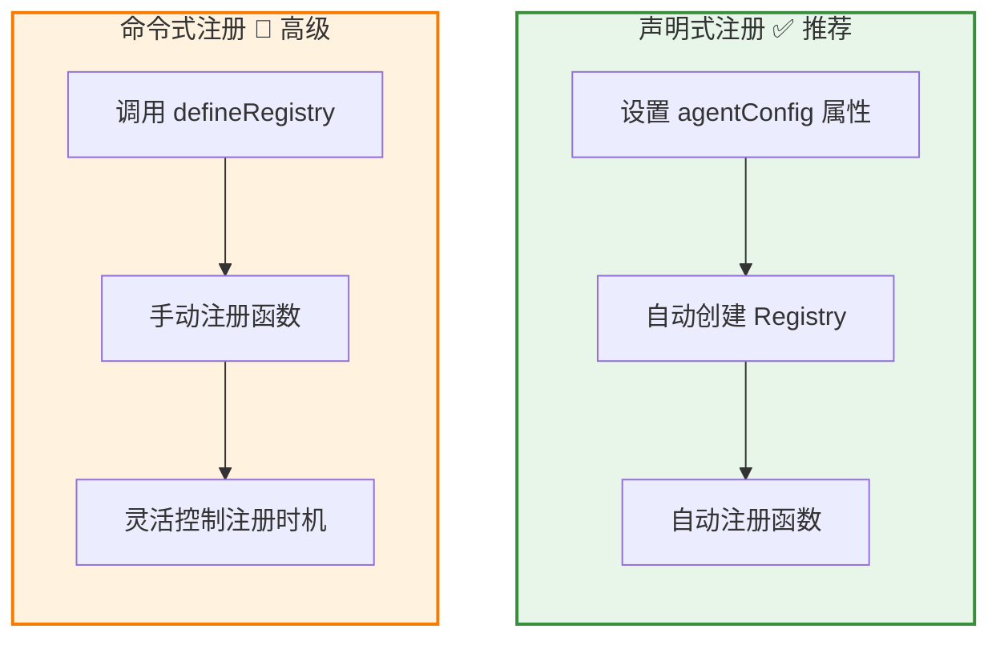
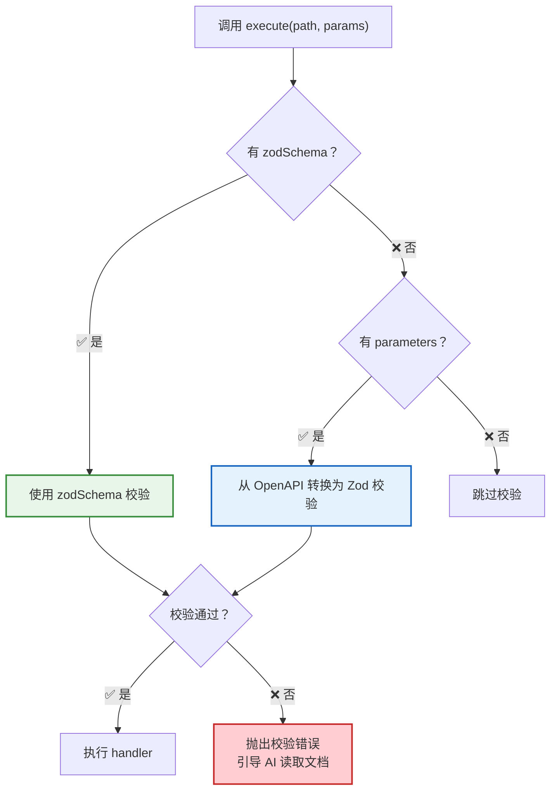
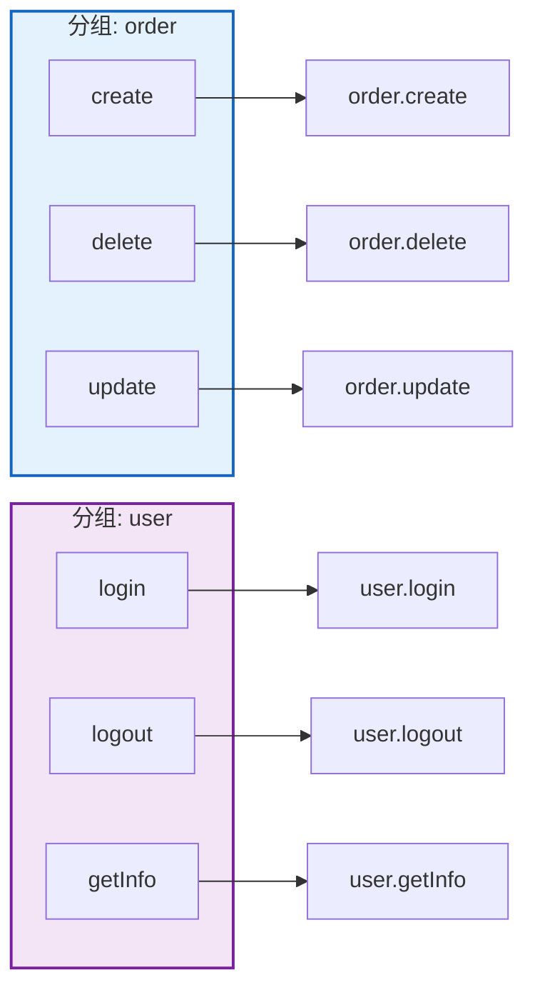
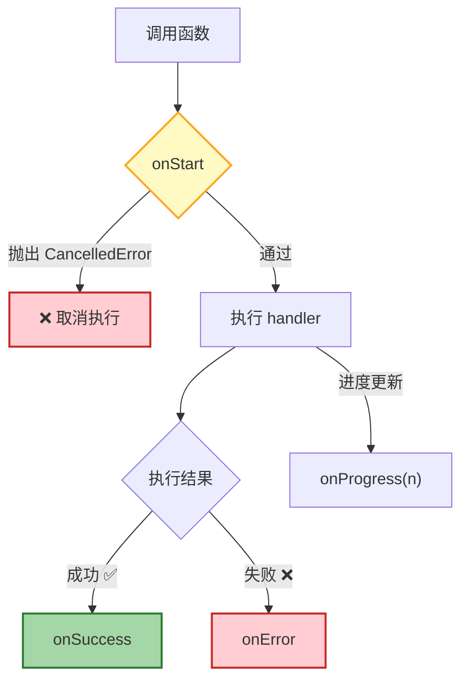
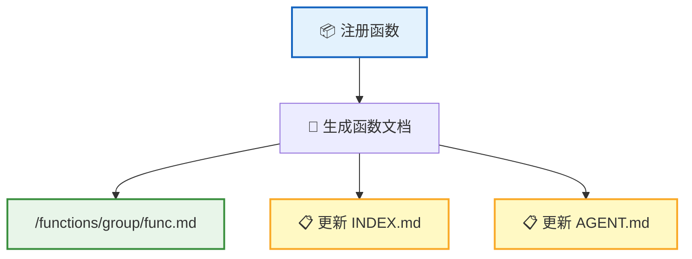
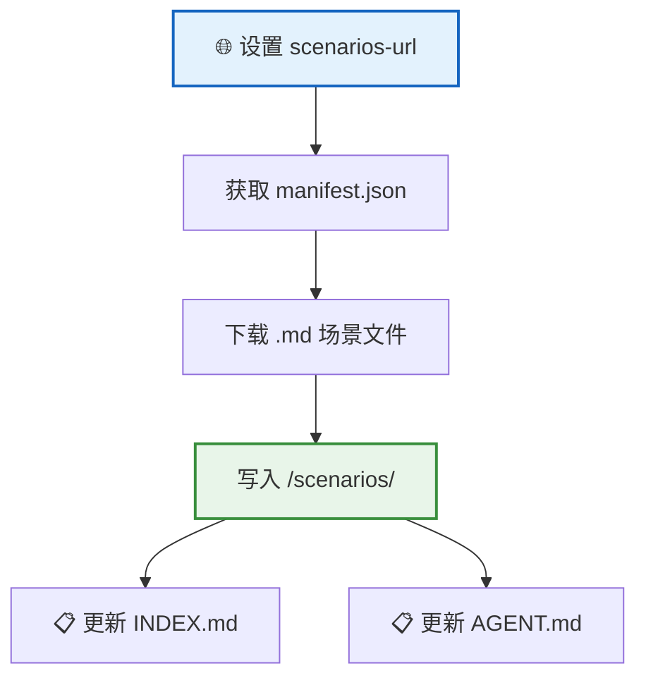

**Skill 系统** 让宿主应用可以将业务能力暴露给 AI。你只需注册函数，AI 就能通过脚本调用它们——无需额外适配，文档自动生成。

## 两种注册方式



| | 声明式（推荐） | 命令式（高级） |
|---|:----------:|:----------:|
| **注册方式** | 设置 `agentConfig` 属性 | 调用 `defineRegistry` |
| **上手难度** | 零配置，开箱即用 | 需要手动管理 |
| **适用场景** | 大多数场景 | 需要动态注册、条件注册 |

**声明式注册示例**：

```ts
agent.agentConfig = {
  name: 'MyApp',
  persona: '你是一个...助手',
  groups: [{
    name: 'editor',
    description: '编辑器操作',
    functions: [
      {
        name: 'getCode',
        description: '获取编辑器中的当前代码',
        handler: () => editor.getCode()
      }
    ]
  }]
};
```

> 💡 设置 `agentConfig` 后，系统自动创建 Registry 并完成函数注册——整个过程无需手动干预。

## 函数定义

每个函数由以下字段组成：

| 字段 | 类型 | 说明 |
|:----:|------|------|
| `name` | string | 函数名称 |
| `description` | string | 函数描述，会写入自动生成的文档 |
| `parameters` | ParameterDef[] | 参数定义数组（**ParameterDef[]** 格式） |
| `returns` | object | 返回值定义 |
| `handler` | function | 执行函数（支持异步） |
| `hooks` | object | UI 钩子（详见 [Hook 系统](#hook-系统)） |

`parameters` 使用 **ParameterDef[]** 数组格式描述参数，AI 据此生成正确的调用代码：

```ts
{
  name: 'createOrder',
  description: '创建新订单',
  parameters: [
    { name: 'productId', schema: { type: 'string', description: '商品 ID' }, required: true },
    { name: 'quantity', schema: { type: 'number', description: '数量' }, required: false }
  ],
  handler: async ({ productId, quantity }) => {
    return await api.createOrder(productId, quantity ?? 1);
  }
}
```

> 💡 每个参数由 `name`（参数名）、`schema`（OpenAPI Schema 格式的参数定义）和 `required`（是否必填）组成。

### 使用 Zod 定义参数（推荐）

除了手动编写 OpenAPI Schema，你还可以使用 **Zod schema** 定义函数参数——更简洁、类型安全，且自动获得运行时校验。

```ts
import { z } from 'zod';

{
  name: 'createOrder',
  description: '创建新订单',
  zodSchema: z.object({
    productId: z.string().describe('商品 ID'),
    quantity: z.number().int().min(1).default(1).describe('数量'),
  }),
  handler: async ({ productId, quantity }) => {
    return await api.createOrder(productId, quantity);
  }
}
```

> 💡 `zodSchema` 和 `parameters` 二选一。如果同时提供，`zodSchema` 优先。

**Zod 与 OpenAPI Schema 对比**：

| | Zod Schema | OpenAPI Schema (`parameters`) |
|---|---|---|
| **定义方式** | `z.object({...})`，链式 API | `ParameterDef[]` 数组，手动写 JSON Schema |
| **类型安全** | TypeScript 自动推断 handler 参数类型 | 需要手动确保类型一致 |
| **运行时校验** | 自动校验（类型、范围、格式等） | 通过内部转换为 Zod 实现校验 |
| **文档生成** | 自动转换为 OpenAPI 格式生成文档 | 直接使用 |
| **约束表达** | `.min()/.max()/.regex()/.enum()` 等 | `minimum/maximum/pattern/enum` 等字段 |
| **适用场景** | 推荐大多数场景 | 已有 OpenAPI 定义时可直接复用 |

**支持的 Zod 功能**：

| Zod 功能 | 转换结果 |
|---|---|
| `.describe('...')` | 参数描述 |
| `.optional()` | `required: false` |
| `.default(value)` | `default` 值 + `required: false` |
| `.min()` / `.max()` | `minimum` / `maximum` |
| `.minLength()` / `.maxLength()` | `minLength` / `maxLength` |
| `.regex()` | `pattern` |
| `.enum([...])` | `enum` |
| `z.array()` | `type: 'array'` + `items` |
| `z.number().int()` | `type: 'integer'` |

**添加示例值**：使用 `withMeta` 为 Zod schema 添加 OpenAPI 特有的示例值：

```ts
import { z } from 'zod';
import { withMeta } from '@rtc-agent/component';

zodSchema: z.object({
  name: withMeta(z.string(), { example: 'John Doe' }),
  age: withMeta(z.number().int(), { example: 30 }),
})
```

### 运行时参数校验

`FunctionRegistry.execute()` 在调用 handler 之前自动进行参数校验：



校验失败时，错误信息会引导 AI 读取 `/functions/INDEX.md` 获取正确的参数格式，提高自愈能力。

## 函数分组

函数通过 **分组（group）** 组织，分组名 + 函数名 = 完整调用路径：



分组让函数命名空间清晰有序，避免命名冲突。

## AI 调用方式

AI 通过 `script` 工具在沙箱中执行代码，使用 **Proxy 链式语法** 调用函数：


```ts
// Proxy 链式调用——自然的 API 风格
await rtcAgent.order.create({ productId: '123', quantity: 2 });

// 等价于直接调用
await rtcAgent.execute('order.create', { productId: '123', quantity: 2 });
```

> 💡 AI 阅读自动生成的函数文档后，就知道如何调用这些函数——无需额外配置。

## Hook 系统

Hook 让宿主在函数执行的各阶段插入自定义逻辑：



| Hook | 触发时机 | 说明 |
|:----:|:-------:|------|
| `onStart` | 执行前 | 可抛出 `CancelledError` **取消执行** |
| `onSuccess` | 成功后 | 异步执行，不阻塞返回 |
| `onError` | 失败后 | 异步执行，不阻塞返回 |
| `onProgress` | 进度更新 | handler 调用 `onProgress(n)` 时触发 |

`onStart` 是唯一能拦截执行的 Hook——适合用于确认弹窗、权限检查等场景。

## 文档自动生成

每次注册函数时，系统自动生成完整的文档：



| 生成内容 | 说明 |
|---------|------|
| **函数文档** | 包含描述、参数表格、返回值、调用示例 |
| **INDEX.md** | 函数索引，AI 据此发现可用函数 |
| **AGENT.md** | 更新 Agent 能力描述 |

> 📌 AI 通过阅读这些文档了解如何使用函数——文档的质量直接影响 AI 的调用准确性。

## Scenarios 场景机制

场景（Scenario）用于加载业务工作流文档，告诉 AI 如何处理特定业务：



| 特性 | 说明 |
|------|------|
| **场景文档** | 业务工作流说明，Markdown 格式 |
| **加载方式** | 通过 `<rtc-agent scenarios-url="...">` 属性指定 URL |
| **存储位置** | `/scenarios/{slug}.md` |
| **AI 使用** | AI 阅读场景文档了解业务流程和操作指南 |

例如，你可以编写"如何处理退款"、"如何创建订单"等场景文档，AI 就能按照你的业务规范执行操作。

## 下一步

- [RTC 协议](/docs/concepts/rtc/) — 了解 AI 调用前端工具的核心机制
- [虚拟文件系统](/docs/concepts/virtual-fs/) — 了解函数文档和场景文档的存储位置
- [命令系统](/docs/features/commands/) — 了解用户侧的命令交互能力
