**认证与授权** 是 RTC Agent 的安全基石。用户通过 OAuth2 授权码模式登录，系统使用双令牌（Access + Refresh）维持会话，支持多设备并行登录，令牌自动刷新——用户只需登录一次，即可长期使用。

## 登录流程

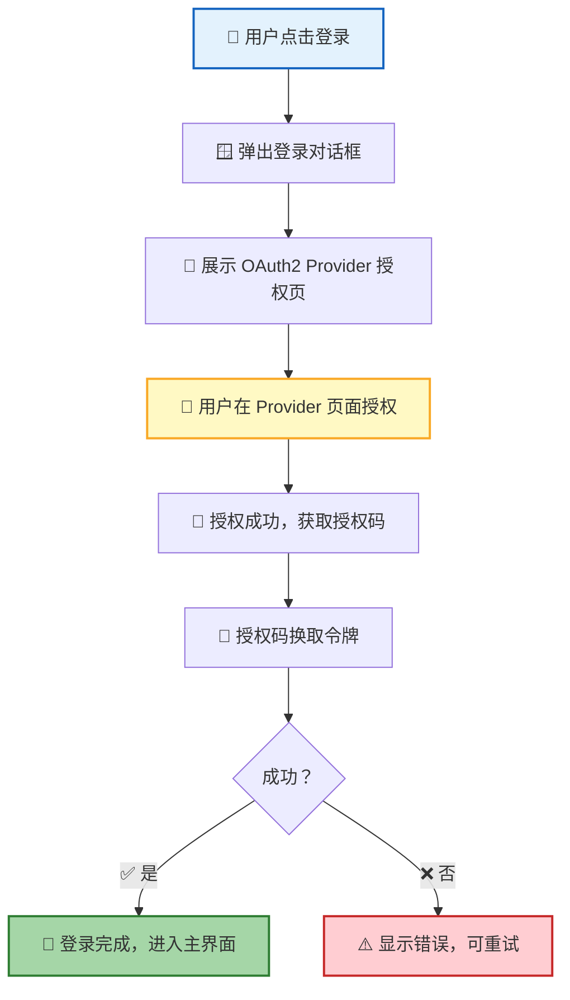

| 步骤 | 说明 |
|:----:|------|
| 1 | 用户点击登录按钮，弹出登录对话框 |
| 2 | 对话框弹出新窗口（popup window），加载 OAuth2 Provider 的授权页面 |
| 3 | 用户在 Provider 页面完成授权（如 GitHub、Google 等） |
| 4 | 授权成功后，系统获取授权码并换取令牌 |
| 5 | 令牌存储到浏览器本地，登录完成 |

> 💡 **设计原则**：登录流程完全委托给 OAuth2 Provider——RTC Agent 不接触用户密码，安全由 Provider 保障。

### Provider 选择界面

当 Server 配置了多个 OAuth2 Provider 时，前端登录页面会自动展示所有已启用的 Provider 供用户选择：

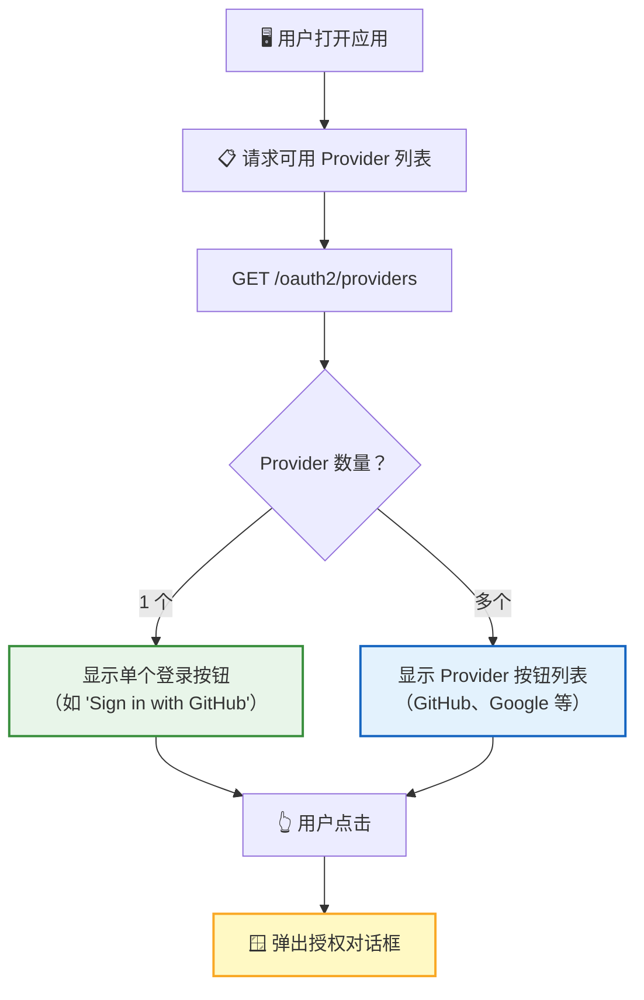

| 特性 | 说明 |
|:----:|------|
| 🔍 动态发现 | 前端通过 `GET /oauth2/providers` 获取可用 Provider 列表，不硬编码数量 |
| 🎨 品牌化样式 | GitHub、Google 等已知 Provider 有专属图标和品牌色 |
| 📱 自适应布局 | 单个 Provider 时显示大号主按钮，多个时显示按钮列表 |
| 🔄 失败回退 | Provider 列表加载失败时，回退显示 Mock Provider 按钮 |

### 弹窗授权流程

用户选择 Provider 后，授权流程在弹窗（popup window）中完成：

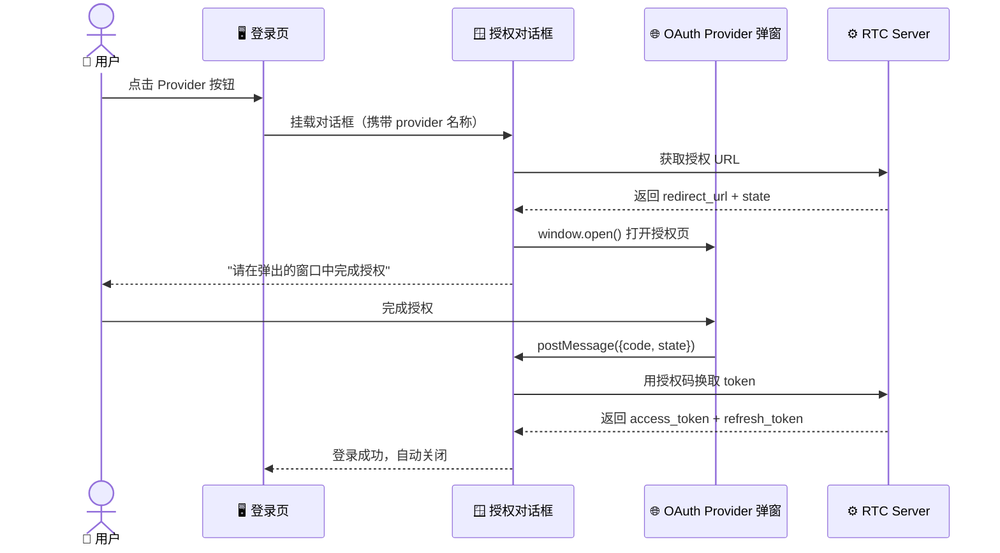

| 状态 | 用户看到的行为 |
|:----:|---------------|
| 准备中 | 加载动画 + "正在准备授权..." |
| 等待授权 | "请在弹出的窗口中完成授权" + "重新打开授权窗口"按钮 |
| 验证中 | 加载动画 + "正在验证身份..." |
| 成功 | "即将自动关闭..."，800ms 后自动关闭 |
| 失败 | 错误信息 + "重试"按钮 |

> 💡 弹窗被用户手动关闭但授权未完成时，对话框会显示"授权已取消"并允许重试。

## 双令牌机制

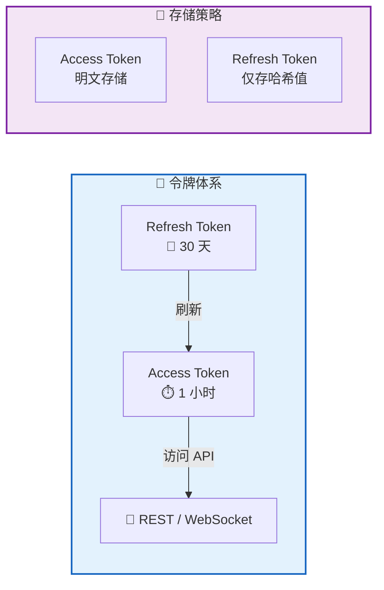

| 令牌 | 有效期 | 用途 | 存储方式 |
|:----:|:------:|:----:|:--------:|
| 🔑 Access Token | 1 小时 | 访问 API 和 WebSocket | 明文（短有效期，风险可控） |
| 🔄 Refresh Token | 30 天 | 刷新 Access Token | 仅存哈希值（明文一次性返回后丢弃） |

> 📌 **安全要点**：Refresh Token 的明文只在签发时返回一次，之后服务端仅保存哈希。即使浏览器存储被泄露，攻击者也无法长期冒充用户。

## 自动刷新

系统在多个时机自动刷新令牌，用户完全无感知：

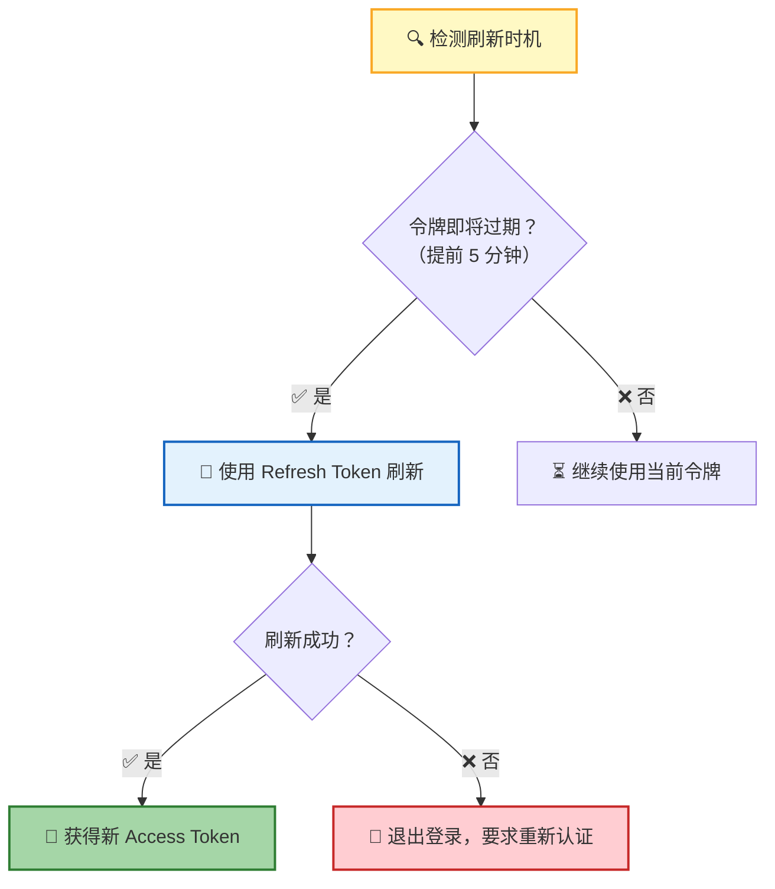

| 触发时机 | 说明 |
|:--------:|------|
| ⏱️ 令牌即将过期 | 到期前 5 分钟自动刷新，避免请求中断 |
| 📱 页面切回前台 | 从后台切回时检查令牌状态，过期则立即刷新 |
| 🔌 建立 WebSocket | 连接时按需刷新令牌，确保令牌有效 |

> 💡 刷新失败不会让用户停留在"半死不活"的状态——系统会直接退出登录，引导用户重新认证。

## 设备管理

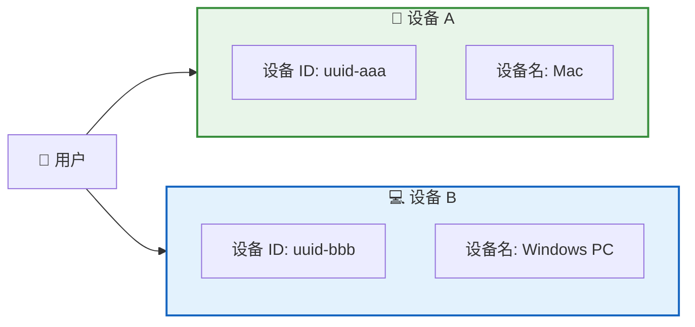

| 概念 | 说明 |
|------|------|
| 🔖 设备 ID | 浏览器唯一标识（UUID），首次访问时自动生成 |
| 📛 设备名 | 根据操作系统自动推断（如"Mac"、"Windows PC"、"Linux PC"） |
| 🔀 多设备 | 同一用户可在多个设备独立登录，互不影响 |

> 📌 每个设备的令牌相互独立——在设备 A 上退出登录不会影响设备 B 的会话。

## WebSocket 认证

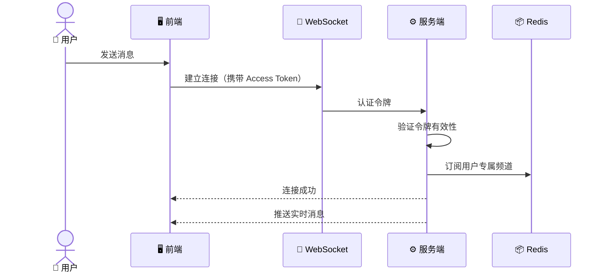

| 阶段 | 说明 |
|:----:|------|
| 🔗 建连 | WebSocket 连接时携带 Access Token 进行认证 |
| ✅ 验证 | 服务端校验令牌有效性，无效则拒绝连接 |
| 📡 订阅 | 认证通过后订阅用户专属频道，接收实时消息 |
| 🔁 断线 | 连接断开后需重新认证，确保安全性 |

> 💡 **频道隔离**：每个用户只能接收自己频道内的消息，无法访问他人数据。

## 安全约束

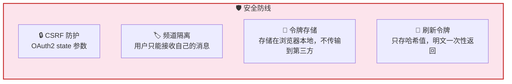

| 约束 | 机制 | 目的 |
|:----:|:----:|:----:|
| 🛡️ CSRF 防护 | OAuth2 授权时使用 `state` 参数 | 防止跨站请求伪造攻击 |
| 🏷️ 频道隔离 | 用户只能订阅自己的专属频道 | 防止数据泄露和越权访问 |
| 💾 令牌存储 | 令牌仅存储在浏览器本地 | 不传输到第三方，降低泄露风险 |
| 🔑 刷新令牌 | 明文一次性返回，服务端仅存哈希 | 即使存储泄露也无法长期使用 |

## 错误处理

| 场景 | 用户看到的行为 |
|:----:|:-------------:|
| ❌ 授权失败 | 登录对话框显示错误信息，可点击重试 |
| ⏱️ 令牌过期且刷新失败 | 自动退出登录，显示登录页面 |
| 🔌 WebSocket 认证失败 | 连接断开，提示用户重新登录 |

## 下一步

- [客户端认证模式](#-客户端认证模式) — 使用 StaticTokenAuth、DynamicTokenAuth 或 AuthProvider 将 RTC Agent 集成到你自己的认证系统
- [Web Component API](/docs/integration/component-api/) — 了解如何通过 `<rtc-agent>` 组件集成 RTC Agent
- [Function 注册指南](/docs/integration/function-registration/) — 注册自定义函数扩展 AI 能力
- [核心协议 RTC](/docs/concepts/rtc/) — 了解 Remote Tool Calling 的完整生命周期

---

## 🧩 客户端认证模式

内置的 OAuth2 流程适合独立应用，但许多开发者需要将 RTC Agent 集成到已有认证体系的产品中。从 **web-components v0.2.5** 起，`<rtc-agent>` 组件支持三种客户端认证模式——通过调用 `createRtcAgent()` 时 `RtcAgentConfig` 中的 `auth` 字段进行配置。这些模式让你可以自带令牌、自带刷新逻辑，甚至提供完整的认证 Provider，而无需依赖服务端 OAuth2 流程。

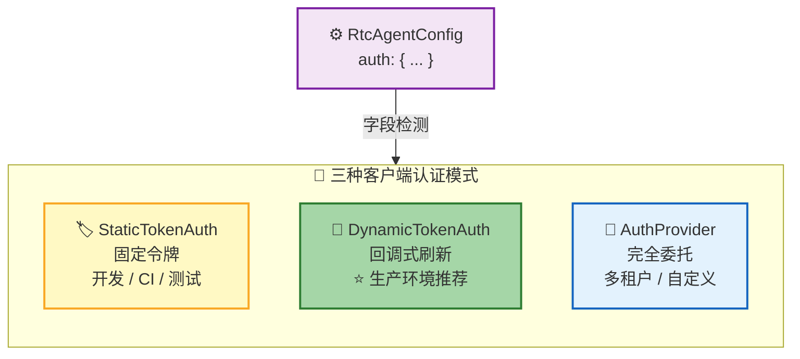

| 模式 | 检测方式 | 适用场景 | 复杂度 |
|:----:|:---------:|:--------:|:----------:|
| 🏷️ StaticTokenAuth | `'accessToken' in auth` | 开发、CI、测试 | ⭐ |
| 🔄 DynamicTokenAuth | `'getToken' in auth && !('isLoggedIn' in auth)` | 生产应用 | ⭐⭐ |
| 🧩 AuthProvider | `'isLoggedIn' in auth` | 多租户、自定义流程 | ⭐⭐⭐ |

> 💡 **模式检测方式**：组件通过检查 `auth` 对象中存在哪些字段来判断模式——无需显式 `type` 字段。检测顺序为：先检查 `accessToken`，再检查 `isLoggedIn`，其余情况归入 DynamicTokenAuth。

### 模式 1：StaticTokenAuth — 固定令牌

最简单的集成方式——提供一个固定的 Access Token（以及可选的 Refresh Token）。组件直接使用这些令牌，不包含刷新逻辑。适用于**本地开发、CI 流水线和自动化测试**。

```typescript
import { createRtcAgent } from '@anthropic/rtc-agent';

const agent = createRtcAgent({
  serverUrl: 'https://your-server.com',
  auth: {
    accessToken: 'your-jwt-token',
    refreshToken: 'optional-refresh-token',
    userId: 'user-123',
    expiresIn: 3600, // optional, seconds
  },
});
```

| 字段 | 必填 | 说明 |
|:-----:|:--------:|-------------|
| `accessToken` | ✅ | 有效的 JWT 令牌字符串 |
| `refreshToken` | 可选 | 用于延长会话的刷新令牌 |
| `userId` | ✅ | 唯一用户标识 |
| `expiresIn` | 可选 | 令牌有效期（秒）（默认：由服务端决定） |

> ⚠️ **不适合生产环境**：静态令牌会过期且无法自动刷新。令牌过期后，用户将被断开连接。生产部署请使用模式 2。

### 模式 2：DynamicTokenAuth — 回调式刷新（推荐）

**生产环境推荐模式**。你提供 `getToken()` 和 `refreshToken()` 回调——组件在需要令牌或当前令牌过期时调用它们。你的后端处理所有令牌逻辑，组件只消费结果。

```typescript
import { createRtcAgent } from '@anthropic/rtc-agent';

const agent = createRtcAgent({
  serverUrl: 'https://your-server.com',
  auth: {
    userId: 'user-123',
    getToken: async () => {
      // 从你的后端获取新令牌
      const res = await fetch('/api/auth/token');
      return res.json();
    },
    refreshToken: async () => {
      // 当前令牌过期时调用
      const res = await fetch('/api/auth/refresh', { method: 'POST' });
      return res.json();
    },
  },
});
```

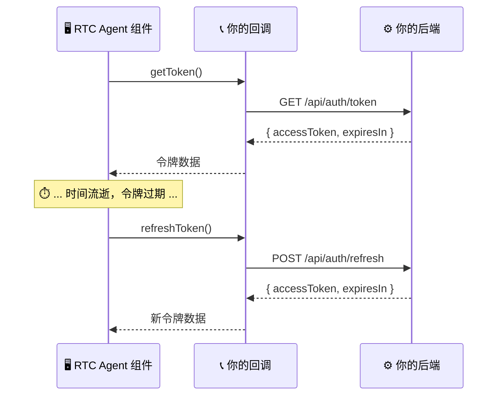

| 回调 | 调用时机 | 期望返回值 |
|:--------:|:-----------:|:---------------:|
| `getToken()` | 组件需要令牌时（初始连接、重连） | `{ accessToken: string, expiresIn?: number }` |
| `refreshToken()` | 当前令牌已过期或即将过期 | `{ accessToken: string, expiresIn?: number }` |

> 💡 **为什么推荐此模式**：你的后端完全控制令牌的签发和撤销。组件不存储长期凭证——按需获取新令牌。这与服务端 OAuth2 遵循相同的安全模型，但无需 OAuth2 Provider。

### 模式 3：AuthProvider — 完全委托（高级）

最灵活的模式——将**所有**认证关注点委托给你自己的 Provider。除了令牌管理，你还可以控制登录状态检查（`isLoggedIn`）和登出行为。适用于**多租户平台、SSO 集成或具有复杂认证需求的应用**。

```typescript
import { createRtcAgent } from '@anthropic/rtc-agent';

const agent = createRtcAgent({
  serverUrl: 'https://your-server.com',
  auth: {
    getToken: async () => {
      // 你的自定义令牌获取逻辑
      return myAuthStore.getToken();
    },
    refreshToken: async () => {
      // 你的自定义刷新逻辑
      return myAuthStore.refresh();
    },
    isLoggedIn: () => {
      // 同步检查——用户当前是否已认证？
      return myAuthStore.isAuthenticated();
    },
    logout: async () => {
      // 可选：清理会话、重定向到登录页等
      await myAuthStore.clearSession();
      window.location.href = '/login';
    },
  },
});
```

| 方法 | 必填 | 说明 |
|:------:|:--------:|-------------|
| `getToken()` | ✅ | 异步——返回当前认证令牌 |
| `refreshToken()` | ✅ | 异步——令牌过期时刷新 |
| `isLoggedIn()` | ✅ | **同步**——返回 `boolean`，表示用户是否已认证 |
| `logout()` | 可选 | 异步——组件需要终止会话时调用 |

> 📌 **与模式 2 的关键区别**：`isLoggedIn` 字段是模式 3 的标志。它使组件能够主动检查认证状态（例如，在尝试连接之前），而不是在请求过程中才发现令牌已过期。

### 选择合适的模式

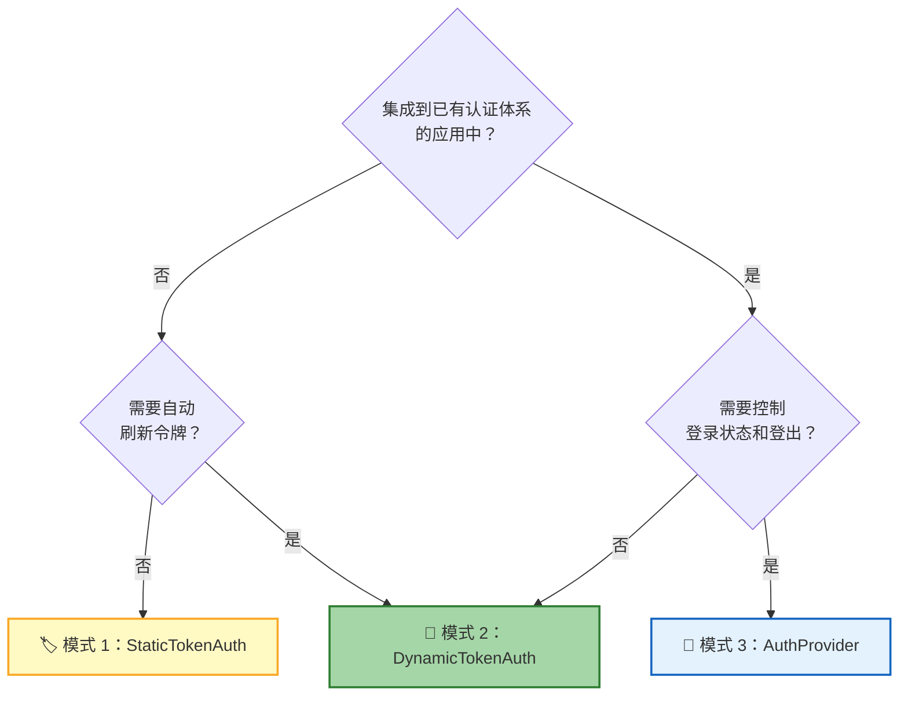

| 场景 | 推荐模式 |
|:---------|:----------------:|
| 本地开发或 CI/CD 测试 | 🏷️ 模式 1 |
| 有令牌签发后端的生产应用 | 🔄 模式 2 |
| 使用 SSO / 自定义会话管理的多租户 SaaS | 🧩 模式 3 |
| 快速原型或演示 | 🏷️ 模式 1 |

> 💡 你可以先用模式 1 做原型，之后随时迁移到模式 2 或 3——只需修改 `auth` 字段即可。

---

## 开发者接入指南

RTC Agent Server 本身是 OAuth2 **消费方**——它需要连接一个 OAuth2 **提供方**来完成用户认证。开发环境内置了 `mock-oauth2` 作为示例提供方；生产部署时，你需要提供自己的 OAuth2 服务。

### 架构关系

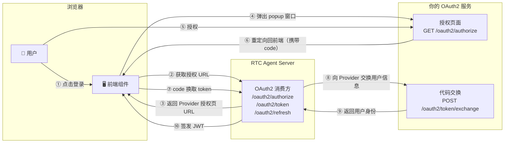

> 💡 RTC Agent Server 负责签发 JWT 令牌和管理设备；你的 OAuth2 服务只负责**验证用户身份**并返回用户信息。

### 需要实现的接口

你的 OAuth2 服务只需实现 **2 个端点**：

#### 端点 1：授权页面 — `GET /oauth2/authorize`

浏览器通过新窗口（popup window）打开，用于展示登录/授权 UI。

**请求**（RTC Agent Server 拼接后由浏览器访问）：

```http
GET /oauth2/authorize?state=<hex>&client_id=<id>&redirect_uri=<uri>
```

| 参数 | 说明 |
| --- | --- |
| `state` | 防 CSRF 随机串，必须原样传回 |
| `client_id` | 客户端标识 |
| `redirect_uri` | 授权成功后的回调地址 |

**行为要求**：

1. 展示登录/授权页面（可以是你的现有登录系统）
2. 用户授权成功后，生成一个**短期、一次性**的授权码（code）
3. HTTP 302 重定向到 `redirect_uri`，query string 中携带 `code` 和 `state`：

```http
Location: <redirect_uri>?code=<code>&state=<state>
```

**页面约束**：

- 页面会在 popup window 中打开，不再受 `X-Frame-Options` 或 `Content-Security-Policy: frame-ancestors` 的限制
- Content-Type 为 `text/html; charset=utf-8`

#### 端点 2：代码交换 — `POST /oauth2/token/exchange`

RTC Agent Server 服务端直接调用（server-to-server），用授权码换取用户身份信息。

**请求**：

```http
POST /oauth2/token/exchange
Content-Type: application/x-www-form-urlencoded
Accept: application/json

client_id=<id>&client_secret=<secret>&code=<code>&redirect_uri=<uri>
```

**成功响应**（200）：

```json
{
  "provider_user_id": "user-12345",
  "username": "张三",
  "email": "zhangsan@example.com",
  "avatar_url": "https://example.com/avatar.png"
}
```

| 字段 | 必填 | 说明 |
| --- | :---: | --- |
| `provider_user_id` | ✅ | 用户在你系统中的**稳定唯一标识**，同一用户必须始终返回相同值 |
| `username` | 可选 | 显示名称 |
| `email` | 可选 | 邮箱 |
| `avatar_url` | 可选 | 头像 URL |

**错误响应**：

```json
{
  "error": "invalid_client",
  "error_description": "client_id 或 client_secret 错误"
}
```

| HTTP 状态码 | `error` 值 | 含义 |
| :---: | --- | --- |
| 400 | `invalid_request` | 缺少或非法参数 |
| 400 | `invalid_grant` | 授权码无效、已使用或已过期 |
| 401 | `invalid_client` | 客户端凭证错误 |
| 500 | `server_error` | 服务端内部错误 |

### 授权码语义

| 约束 | 说明 |
| --- | --- |
| 一次性 | 同一 code 只能交换一次 |
| 短期有效 | 建议 10 分钟内过期 |
| 绑定用户 | code 必须关联到已认证的用户身份 |

### 不需要实现的部分

- ❌ 不需要签发 access_token / refresh_token — RTC Agent Server 自己签发 JWT
- ❌ 不需要实现标准 OAuth2 的 `/token` 端点 — `/oauth2/token/exchange` 本质是用户信息接口
- ❌ 不需要支持 scope、PKCE 等扩展

### 配置 RTC Agent Server

实现好你的 OAuth2 服务后，在 Server 配置中指向它：

```yaml
providers:
  mock:
    enabled: true
    url: "https://your-oauth-server.com"   # 你的 OAuth2 服务地址
    client_id: "your-client-id"            # 与你的服务约定的 client_id
    client_secret: "your-client-secret"    # 与你的服务约定的 client_secret
```

> ⚠️ `providers.mock` 的 `mock` 是 provider 名称（不是"测试用"的意思）。Server 会将 `{url}/oauth2/authorize` 和 `{url}/oauth2/token/exchange` 拼接为两个端点地址。如果你的服务路径不同，需要扩展 `BuildProviderClients` 或保持路径一致。

#### 内置 Provider 配置

除了自定义 mock provider，Server 还内置了 GitHub 和 Google OAuth2 provider 支持：

```yaml
providers:
  github:
    enabled: true
    client_id: "your-github-client-id"
    client_secret: "your-github-client-secret"
    scope: "read:user user:email"         # 可选，默认值

  google:
    enabled: true
    client_id: "your-google-client-id"
    client_secret: "your-google-client-secret"
    scope: "openid email profile"         # 可选，默认值
```

> 💡 可以同时启用多个 provider，前端登录界面会显示所有已启用的 provider 供用户选择。Server 启动时会校验至少启用一个 provider。

#### 前端 `redirect-uri` 属性

`<rtc-agent>` 组件支持 `redirect-uri` 属性，用于自定义 OAuth2 授权完成后的回调地址：

```html
<rtc-agent
  server-url="https://your-server.com"
  redirect-uri="https://your-app.com/auth/callback.html"
></rtc-agent>
```

| 特性 | 说明 |
|------|------|
| 默认值 | `window.location.origin + '/auth/callback.html'` |
| 相对路径 | 以 `/` 开头时，自动拼接当前 origin（如 `/auth/callback.html` → `https://your-app.com/auth/callback.html`） |
| 绝对路径 | 完整 URL，适用于回调端点部署在不同 origin 的场景 |

> 💡 当 `<rtc-agent>` 嵌入在与你服务器不同 origin 的页面中时，需要通过 `redirect-uri` 显式指定回调地址，确保 OAuth2 授权码能正确返回。
