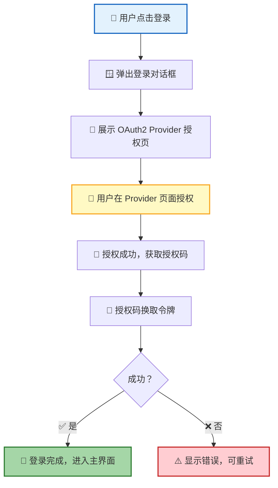
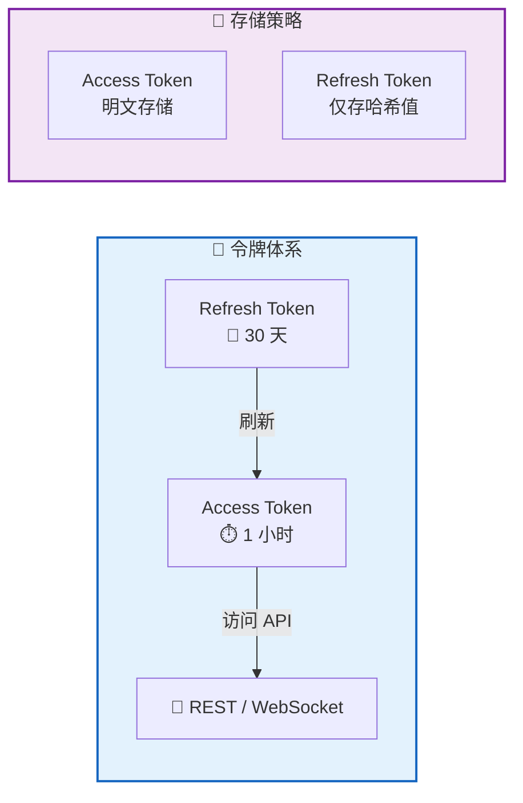
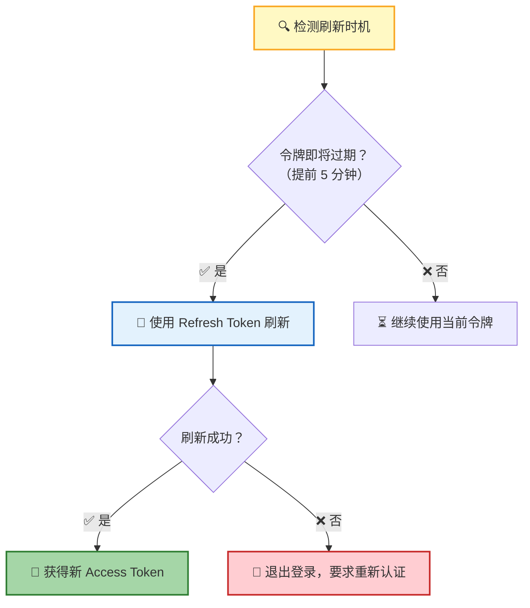
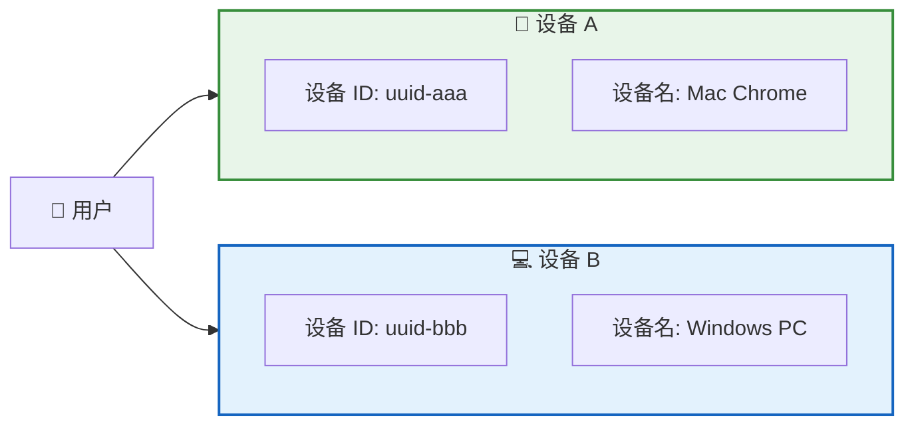
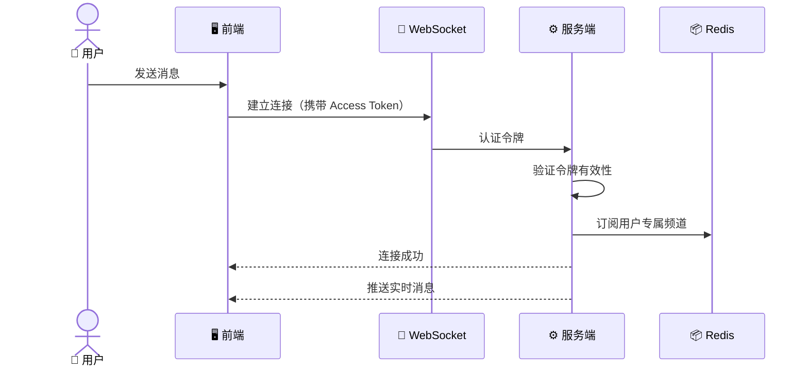
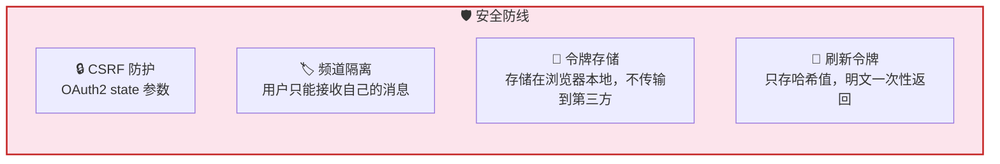

**认证与授权** 是 RTC Agent 的安全基石。用户通过 OAuth2 授权码模式登录，系统使用双令牌（Access + Refresh）维持会话，支持多设备并行登录，令牌自动刷新——用户只需登录一次，即可长期使用。

## 登录流程

| 步骤 | 说明 |
|:----:|------|
| 1 | 用户点击登录按钮，弹出登录对话框 |
| 2 | 对话框通过 iframe 展示 OAuth2 Provider 的授权页面 |
| 3 | 用户在 Provider 页面完成授权（如 GitHub、Google 等） |
| 4 | 授权成功后，系统获取授权码并换取令牌 |
| 5 | 令牌存储到浏览器本地，登录完成 |

> 💡 **设计原则**：登录流程完全委托给 OAuth2 Provider——RTC Agent 不接触用户密码，安全由 Provider 保障。

## 双令牌机制

| 令牌 | 有效期 | 用途 | 存储方式 |
|:----:|:------:|:----:|:--------:|
| 🔑 Access Token | 1 小时 | 访问 API 和 WebSocket | 明文（短有效期，风险可控） |
| 🔄 Refresh Token | 30 天 | 刷新 Access Token | 仅存哈希值（明文一次性返回后丢弃） |

> 📌 **安全要点**：Refresh Token 的明文只在签发时返回一次，之后服务端仅保存哈希。即使浏览器存储被泄露，攻击者也无法长期冒充用户。

## 自动刷新

系统在多个时机自动刷新令牌，用户完全无感知：

| 触发时机 | 说明 |
|:--------:|------|
| ⏱️ 令牌即将过期 | 到期前 5 分钟自动刷新，避免请求中断 |
| 📱 页面切回前台 | 从后台切回时检查令牌状态，过期则立即刷新 |
| 🔌 建立 WebSocket | 连接前确保令牌有效 |

> 💡 刷新失败不会让用户停留在"半死不活"的状态——系统会直接退出登录，引导用户重新认证。

## 设备管理

| 概念 | 说明 |
|------|------|
| 🔖 设备 ID | 浏览器唯一标识（UUID），首次访问时自动生成 |
| 📛 设备名 | 根据浏览器类型和操作系统自动推断（如"Mac Chrome"、"Windows PC"） |
| 🔀 多设备 | 同一用户可在多个设备独立登录，互不影响 |

> 📌 每个设备的令牌相互独立——在设备 A 上退出登录不会影响设备 B 的会话。

## WebSocket 认证

| 阶段 | 说明 |
|:----:|------|
| 🔗 建连 | WebSocket 连接时携带 Access Token 进行认证 |
| ✅ 验证 | 服务端校验令牌有效性，无效则拒绝连接 |
| 📡 订阅 | 认证通过后订阅用户专属频道，接收实时消息 |
| 🔁 断线 | 连接断开后需重新认证，确保安全性 |

> 💡 **频道隔离**：每个用户只能接收自己频道内的消息，无法访问他人数据。

## 安全约束

| 约束 | 机制 | 目的 |
|:----:|:----:|:----:|
| 🛡️ CSRF 防护 | OAuth2 授权时使用 `state` 参数 | 防止跨站请求伪造攻击 |
| 🏷️ 频道隔离 | 用户只能订阅自己的专属频道 | 防止数据泄露和越权访问 |
| 💾 令牌存储 | 令牌仅存储在浏览器本地 | 不传输到第三方，降低泄露风险 |
| 🔑 刷新令牌 | 明文一次性返回，服务端仅存哈希 | 即使存储泄露也无法长期使用 |

## 错误处理

| 场景 | 用户看到的行为 |
|:----:|:-------------:|
| ❌ 授权失败 | 登录对话框显示错误信息，可点击重试 |
| ⏱️ 令牌过期且刷新失败 | 自动退出登录，显示登录页面 |
| 🔌 WebSocket 认证失败 | 连接断开，提示用户重新登录 |

## 下一步

- [Web Component API](/docs/integration/component-api/) — 了解如何通过 `<rtc-agent>` 组件集成 RTC Agent
- [Function 注册指南](/docs/integration/function-registration/) — 注册自定义函数扩展 AI 能力
- [核心协议 RTC](/docs/concepts/rtc/) — 了解 Remote Tool Calling 的完整生命周期
