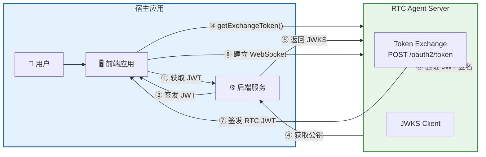
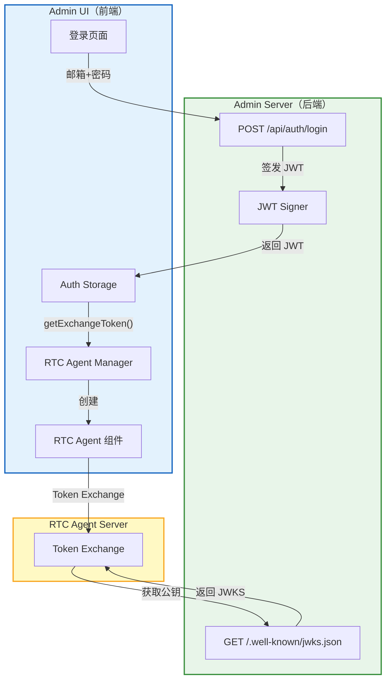

**认证与授权**是 RTC Agent 的安全基石。RTC Agent 支持多种认证方式，其中 **Token Exchange（RFC 8693）** 是推荐给企业集成场景的首选方案——它允许你将 RTC Agent 无缝集成到已有的认证系统中，无需实现完整的 OAuth2 流程。

## 为什么选择 Token Exchange？

Token Exchange 是 OAuth2 扩展标准（RFC 8693），专为跨系统信任设计。相比传统 OAuth2 授权码模式，它更适合企业集成场景：

| 特性 | Token Exchange | OAuth2 授权码模式 |
|------|----------------|-------------------|
| **适用场景** | 已有认证系统的企业应用 | 独立应用，需要完整登录流程 |
| **集成复杂度** | ✅ 低——只需签发可验证的 JWT | ❌ 高——需实现授权页面、回调处理等 |
| **用户体验** | ✅ 无缝——用户无需重复登录 | ⚠️ 需要跳转到登录页 |
| **安全性** | ✅ 高——基于 JWKS 的非对称签名 | ✅ 高——基于授权码 + PKCE |
| **多租户支持** | ✅ 天然支持——JWT 包含用户信息 | ⚠️ 需要额外处理 |

**核心优势**：
- 🚀 **快速集成**：3 分钟即可完成集成
- 🔒 **零密码接触**：RTC Agent 不接触用户密码，安全由你的系统保障
- 🌐 **跨域友好**：无需处理复杂的 OAuth2 回调和重定向
- 📱 **多端同步**：JWT 天然支持多设备、多标签页

> 💡 **设计原则**：Token Exchange 模式下，你的系统负责签发 JWT，RTC Agent 负责验证并换取内部访问令牌。整个过程无需用户交互，完全自动化。

## 快速开始（3 分钟集成）

本指南将带你完成最简单的 Token Exchange 集成。假设你已经有：
- 一个能够签发 JWT 的后端服务
- 一个使用 RTC Agent 的前端应用

### 步骤 1：配置主服务器信任你的 JWT 签发方

在 RTC Agent Server 的 `config.yaml` 中添加：

```yaml
token_exchange:
  external_issuers:
    - name: "your-app"                          # 人类可读的标识
      issuer: "https://your-app.com"            # 你的 JWT 签发方标识（必须与 JWT 中的 iss 一致）
      jwks_uri: "https://your-app.com/.well-known/jwks.json"  # JWKS 端点
      allowed_algorithms: ["RS256"]             # 允许的签名算法
      cache_ttl: 3600                           # JWKS 缓存时间（秒）
      claims_mapping:                           # JWT claims 映射（可选）
        sub: "sub"                              # 用户唯一标识
        email: "email"                          # 用户邮箱
        name: "name"                            # 用户显示名称
        avatar_url: "picture"                   # 用户头像
```

### 步骤 2：前端配置 AuthProvider

在你的前端应用中配置 RTC Agent：

```typescript
import { createRtcAgent } from '@rtc-agent/component';

const agent = createRtcAgent({
  server: { url: 'https://rtc-agent.your-app.com' },
  auth: {
    type: 'token-exchange',
    
    // 返回你的系统签发的 JWT
    getExchangeToken: async () => {
      return await yourAuthStore.getAccessToken();
    },
    
    // 检查用户是否已登录
    isLoggedIn: () => {
      return yourAuthStore.isAuthenticated();
    },
    
    // 登出处理
    logout: async () => {
      await yourAuthStore.clearSession();
    },
    
    // 返回当前用户唯一标识（用于 IndexedDB 隔离）
    getUserId: () => {
      return yourAuthStore.getUserId();
    },
    
    // 设备唯一标识（UUID，持久化到 localStorage）
    deviceId: crypto.randomUUID(),
  },
});

document.body.appendChild(agent);
```

### 步骤 3：验证集成

完成配置后，打开浏览器控制台检查：
1. ✅ 没有 CORS 错误
2. ✅ 没有 JWT 验证失败的错误
3. ✅ WebSocket 连接成功建立
4. ✅ 能够正常发送消息和调用工具

> 🎉 **恭喜！** 如果以上步骤都成功，你的 RTC Agent 已经通过 Token Exchange 集成到你的认证系统中了。

---

## Token Exchange 完整集成指南

本节提供 Token Exchange 的完整技术细节，帮助你构建生产级集成。

### 架构概览


```mermaid
flowchart LR
    subgraph HostApp["宿主应用"]
        User["👤 用户"]
        Frontend["🖥️ 前端应用"]
        Backend["⚙️ 后端服务"]
    end
    
    subgraph RTCServer["RTC Agent Server"]
        TokenExchange["Token Exchange<br/>POST /oauth2/token"]
        JWKSClient["JWKS Client"]
    end
    
    User --> Frontend
    Frontend -->|"① 获取 JWT"| Backend
    Backend -->|"② 签发 JWT"| Frontend
    Frontend -->|"③ getExchangeToken()"| RTCServer
    RTCServer -->|"④ 获取公钥"| Backend
    Backend -->|"⑤ 返回 JWKS"| RTCServer
    RTCServer -->|"⑥ 验证 JWT 签名"| TokenExchange
    TokenExchange -->|"⑦ 签发 RTC JWT"| Frontend
    Frontend -->|"⑧ 建立 WebSocket"| RTCServer
    
    style HostApp fill:#e3f2fd,stroke:#1565c0,stroke-width:2px
    style RTCServer fill:#e8f5e9,stroke:#388e3c,stroke-width:2px
```

**流程说明**：
1. 用户登录宿主应用
2. 宿主应用后端签发 JWT（包含用户信息）
3. 前端通过 `getExchangeToken()` 提供 JWT
4. RTC Agent 组件调用 Token Exchange 端点
5. RTC Agent Server 从 JWKS 端点获取公钥
6. 验证 JWT 签名和 claims
7. 签发 RTC Agent 内部 JWT
8. 使用 RTC JWT 建立 WebSocket 连接

### Server 端：签发 JWT

你的后端服务需要实现 JWT 签发逻辑。以下是关键要求：

#### JWT Claims 要求

**必须包含的 Claims**：

| Claim | 类型 | 说明 | 示例 |
|-------|------|------|------|
| `iss` | string | JWT 签发方标识，必须与 `config.yaml` 中的 `issuer` 一致 | `"https://your-app.com"` |
| `sub` | string | 用户唯一标识（在你的系统中） | `"user-123"` |
| `exp` | number | 过期时间（Unix 时间戳，秒） | `1699999999` |
| `iat` | number | 签发时间（Unix 时间戳，秒） | `1699996399` |

**推荐包含的 Claims**：

| Claim | 类型 | 说明 | 示例 |
|-------|------|------|------|
| `email` | string | 用户邮箱 | `"user@example.com"` |
| `name` | string | 用户显示名称 | `"张三"` |
| `picture` | string | 用户头像 URL | `"https://example.com/avatar.png"` |
| `aud` | string[] | 受众（RTC Agent Server 标识） | `["https://rtc-agent.your-app.com"]` |
| `jti` | string | JWT ID（唯一标识，防止重放攻击） | `"uuid-string"` |

#### 签名算法

RTC Agent 支持以下非对称签名算法：

| 算法 | 说明 | 推荐度 |
|------|------|--------|
| **RS256** | RSA + SHA-256 | ⭐⭐⭐⭐⭐ 默认推荐 |
| RS384 | RSA + SHA-384 | ⭐⭐⭐⭐ |
| RS512 | RSA + SHA-512 | ⭐⭐⭐⭐ |
| ES256 | ECDSA + SHA-256 | ⭐⭐⭐⭐⭐ 性能更好 |
| ES384 | ECDSA + SHA-384 | ⭐⭐⭐⭐ |
| ES512 | ECDSA + SHA-512 | ⭐⭐⭐⭐ |
| EdDSA | Ed25519 | ⭐⭐⭐⭐⭐ 最新标准 |

> 💡 **推荐**：生产环境使用 RS256 或 ES256。ES256 性能更好，但 RS256 兼容性更广。

#### 密钥管理

**生成密钥对**（以 RS256 为例）：

```bash
# 生成 RSA 私钥（2048 位）
openssl genpkey -algorithm RSA -out private.pem -pkeyopt rsa_keygen_bits:2048

# 从私钥提取公钥
openssl rsa -pubout -in private.pem -out public.pem
```

**存储密钥**：
- 私钥：仅后端服务可访问，权限 `0600`
- 公钥：可通过 JWKS 端点公开访问，权限 `0644`

#### 示例代码

**Go 语言示例**（使用 `golang-jwt`）：

```go
package main

import (
    "crypto/rsa"
    "os"
    "time"
    
    "github.com/golang-jwt/jwt/v5"
)

// 加载私钥
func loadPrivateKey(path string) (*rsa.PrivateKey, error) {
    data, err := os.ReadFile(path)
    if err != nil {
        return nil, err
    }
    return jwt.ParseRSAPrivateKeyFromPEM(data)
}

// 签发 JWT
func signJWT(userID, email, name string, privateKey *rsa.PrivateKey) (string, error) {
    now := time.Now()
    claims := jwt.MapClaims{
        "iss":   "https://your-app.com",           // 签发方
        "sub":   userID,                            // 用户 ID
        "email": email,                             // 邮箱
        "name":  name,                              // 显示名称
        "iat":   now.Unix(),                        // 签发时间
        "exp":   now.Add(1 * time.Hour).Unix(),     // 过期时间（1 小时）
        "jti":   uuid.NewString(),                  // JWT ID
    }
    
    token := jwt.NewWithClaims(jwt.SigningMethodRS256, claims)
    token.Header["kid"] = "your-key-id"  // 密钥 ID
    
    return token.SignedString(privateKey)
}
```

**Node.js 示例**（使用 `jose`）：

```javascript
import { SignJWT, importPKCS8 } from 'jose';
import { readFileSync } from 'fs';

// 加载私钥
const privateKeyPem = readFileSync('./private.pem', 'utf8');
const privateKey = await importPKCS8(privateKeyPem, 'RS256');

// 签发 JWT
async function signJWT(userID, email, name) {
    const now = Math.floor(Date.now() / 1000);
    
    const token = await new SignJWT({
        sub: userID,
        email: email,
        name: name,
    })
        .setProtectedHeader({ alg: 'RS256', kid: 'your-key-id' })
        .setIssuedAt(now)
        .setExpirationTime(now + 3600)  // 1 小时
        .setIssuer('https://your-app.com')
        .sign(privateKey);
    
    return token;
}
```

**Python 示例**（使用 `PyJWT`）：

```python
import jwt
import uuid
from datetime import datetime, timedelta
from cryptography.hazmat.primitives import serialization

# 加载私钥
with open('./private.pem', 'rb') as f:
    private_key = serialization.load_pem_private_key(f.read(), password=None)

# 签发 JWT
def sign_jwt(user_id: str, email: str, name: str) -> str:
    now = datetime.utcnow()
    claims = {
        'iss': 'https://your-app.com',
        'sub': user_id,
        'email': email,
        'name': name,
        'iat': now,
        'exp': now + timedelta(hours=1),
        'jti': str(uuid.uuid4()),
    }
    
    headers = {
        'kid': 'your-key-id',
        'alg': 'RS256',
    }
    
    return jwt.encode(claims, private_key, algorithm='RS256', headers=headers)
```

### Server 端：暴露 JWKS 端点

JWKS（JSON Web Key Set）端点允许 RTC Agent Server 获取公钥来验证 JWT 签名。

#### JWKS 响应格式

```json
{
  "keys": [
    {
      "kty": "RSA",
      "kid": "your-key-id",
      "use": "sig",
      "alg": "RS256",
      "n": "0vx7agoebGcQSuuPiLJXZptN9nndrQmbXEps2aiAFbWhM78LhWx...",
      "e": "AQAB"
    }
  ]
}
```

**字段说明**：

| 字段 | 说明 |
|------|------|
| `kty` | 密钥类型（RSA / EC / OKP） |
| `kid` | 密钥 ID（与 JWT header 中的 `kid` 一致） |
| `use` | 密钥用途（`sig` = 签名） |
| `alg` | 算法（RS256 / ES256 等） |
| `n`, `e` | RSA 公钥参数（模数和指数） |

#### 实现示例

**Go 语言**（使用 `go-jose`）：

```go
package main

import (
    "crypto/rsa"
    "encoding/json"
    "net/http"
    
    "github.com/go-jose/go-jose/v3"
)

func jwksHandler(publicKey *rsa.PublicKey, keyID string) http.HandlerFunc {
    return func(w http.ResponseWriter, r *http.Request) {
        jwk := jose.JSONWebKey{
            Key:       publicKey,
            KeyID:     keyID,
            Algorithm: "RS256",
            Use:       "sig",
        }
        
        jwks := jose.JSONWebKeySet{
            Keys: []jose.JSONWebKey{jwk},
        }
        
        w.Header().Set("Content-Type", "application/json")
        json.NewEncoder(w).Encode(jwks)
    }
}

// 注册路由
http.HandleFunc("/.well-known/jwks.json", jwksHandler(publicKey, "your-key-id"))
```

**Node.js**（使用 `jose`）：

```javascript
import { exportJWK } from 'jose';
import express from 'express';

const app = express();

app.get('/.well-known/jwks.json', async (req, res) => {
    const jwk = await exportJWK(publicKey);
    jwk.kid = 'your-key-id';
    jwk.alg = 'RS256';
    jwk.use = 'sig';
    
    res.json({
        keys: [jwk],
    });
});
```

**Python**（使用 `jwcrypto`）：

```python
from flask import Flask, jsonify
from jwcrypto import jwk
import json

app = Flask(__name__)

@app.route('/.well-known/jwks.json')
def jwks():
    with open('./public.pem', 'rb') as f:
        key = jwk.JWK.from_pem(f.read())
    
    key['kid'] = 'your-key-id'
    key['alg'] = 'RS256'
    key['use'] = 'sig'
    
    return jsonify(keys=[json.loads(key.export_public())])
```

#### 缓存策略

JWKS 端点应该设置合适的缓存头：

```http
Cache-Control: public, max-age=3600
```

RTC Agent Server 会在内部缓存 JWKS（默认 1 小时），减少对你的服务器的请求。

### Client 端：配置 AuthProvider

前端通过 `createRtcAgent()` 的 `auth` 字段配置 Token Exchange 模式。

#### AuthProvider 接口

```typescript
interface AuthProvider {
  // 认证模式：固定为 'token-exchange'
  type: 'token-exchange';
  
  // 返回外部 JWT（你的系统签发的 JWT）
  getExchangeToken(): Promise<string>;
  
  // 检查用户是否已登录（同步）
  isLoggedIn(): boolean;
  
  // 登出处理（异步）
  logout?(): Promise<void>;
  
  // 返回当前用户唯一标识（同步，强烈建议提供）
  getUserId?(): string;
  
  // 设备唯一标识（必填）
  deviceId: string;
}
```

#### 完整示例

```typescript
import { createRtcAgent } from '@rtc-agent/component';

// 假设你的认证存储
class YourAuthStore {
  getAccessToken(): string | null {
    return localStorage.getItem('access_token');
  }
  
  isAuthenticated(): boolean {
    const token = this.getAccessToken();
    if (!token) return false;
    
    // 检查是否过期
    const expiry = localStorage.getItem('token_expiry');
    if (!expiry) return false;
    
    return Date.now() < parseInt(expiry);
  }
  
  getUserId(): string {
    const userInfo = JSON.parse(localStorage.getItem('user_info') || '{}');
    return userInfo.id || '';
  }
  
  async clearSession(): Promise<void> {
    localStorage.removeItem('access_token');
    localStorage.removeItem('refresh_token');
    localStorage.removeItem('user_info');
    localStorage.removeItem('token_expiry');
  }
}

const authStore = new YourAuthStore();

// 生成或获取 Device ID（持久化）
function getDeviceId(): string {
  let deviceId = localStorage.getItem('device_id');
  if (!deviceId) {
    deviceId = crypto.randomUUID();
    localStorage.setItem('device_id', deviceId);
  }
  return deviceId;
}

// 创建 RTC Agent
const agent = createRtcAgent({
  server: { url: 'https://rtc-agent.your-app.com' },
  auth: {
    type: 'token-exchange',
    
    getExchangeToken: async () => {
      const token = authStore.getAccessToken();
      if (!token) {
        throw new Error('No access token available');
      }
      return token;
    },
    
    isLoggedIn: () => authStore.isAuthenticated(),
    
    logout: async () => {
      await authStore.clearSession();
    },
    
    getUserId: () => authStore.getUserId(),
    
    deviceId: getDeviceId(),
  },
});

// 添加到 DOM
document.body.appendChild(agent);
```

#### Token 刷新策略

RTC Agent 组件会在以下时机调用 `getExchangeToken()`：
1. **初次连接**：建立 WebSocket 时
2. **令牌即将过期**：到期前 5 分钟自动刷新
3. **页面切回前台**：从后台切回时检查
4. **WebSocket 断开重连**：重新建立连接时

建议在 `getExchangeToken()` 中实现自动刷新逻辑：

```typescript
getExchangeToken: async () => {
  // 检查是否即将过期（提前 5 分钟）
  if (isTokenExpiringSoon()) {
    // 刷新 token
    const newToken = await refreshToken();
    saveToken(newToken);
    return newToken;
  }
  
  return getAccessToken();
}
```

### 配置 RTC Agent Server

在主服务器的 `config.yaml` 中配置信任的外部 JWT 签发方：

```yaml
token_exchange:
  external_issuers:
    - name: "your-app"                          # 人类可读的标识
      issuer: "https://your-app.com"            # JWT iss claim 的期望值
      jwks_uri: "https://your-app.com/.well-known/jwks.json"
      allowed_algorithms: ["RS256", "ES256"]    # 允许的签名算法
      cache_ttl: 3600                           # JWKS 缓存时间（秒）
      claims_mapping:                           # JWT claims 映射
        sub: "sub"                              # 用户唯一标识
        email: "email"                          # 用户邮箱
        name: "name"                            # 用户显示名称
        avatar_url: "picture"                   # 用户头像
```

**配置说明**：

| 字段 | 必填 | 说明 |
|------|:----:|------|
| `name` | ✅ | 人类可读的标识符 |
| `issuer` | ✅ | JWT `iss` claim 的期望值（必须与 JWT 中的 `iss` 一致） |
| `jwks_uri` | ✅ | JWKS 端点 URL |
| `allowed_algorithms` | ✅ | 允许的签名算法列表 |
| `cache_ttl` | ❌ | JWKS 缓存时间（秒），默认 3600 |
| `claims_mapping` | ❌ | JWT claims 映射关系 |

**多个签发方**：可以配置多个外部签发方，支持多租户场景：

```yaml
token_exchange:
  external_issuers:
    - name: "admin-server"
      issuer: "http://admin-server:8081"
      jwks_uri: "http://admin-server:8081/.well-known/jwks.json"
      # ...
    
    - name: "customer-a"
      issuer: "https://customer-a.com"
      jwks_uri: "https://customer-a.com/.well-known/jwks.json"
      # ...
    
    - name: "customer-b"
      issuer: "https://customer-b.com"
      jwks_uri: "https://customer-b.com/.well-known/jwks.json"
      # ...
```

### JWT Claims 参考

#### 必须包含的 Claims

| Claim | 类型 | 说明 | 验证规则 |
|-------|------|------|----------|
| `iss` | string | 签发方标识 | 必须与 `config.yaml` 中的 `issuer` 一致 |
| `sub` | string | 用户唯一标识 | 在你的系统中必须唯一且稳定 |
| `exp` | number | 过期时间（Unix 时间戳） | 必须大于当前时间 |
| `iat` | number | 签发时间（Unix 时间戳） | 必须小于等于当前时间 |

#### 推荐包含的 Claims

| Claim | 类型 | 说明 | 映射配置 |
|-------|------|------|----------|
| `email` | string | 用户邮箱 | `claims_mapping.email: "email"` |
| `name` | string | 用户显示名称 | `claims_mapping.name: "name"` |
| `picture` | string | 用户头像 URL | `claims_mapping.avatar_url: "picture"` |
| `aud` | string[] | 受众 | 可选，用于限制 JWT 的使用范围 |
| `jti` | string | JWT ID | 可选，用于防止重放攻击 |

#### Claims 映射

`claims_mapping` 允许你将 JWT 中的自定义 claim 映射到 RTC Agent 的标准字段：

```yaml
claims_mapping:
  sub: "user_id"              # 将 JWT 的 user_id 映射到 sub
  email: "email_address"      # 将 JWT 的 email_address 映射到 email
  name: "display_name"        # 将 JWT 的 display_name 映射到 name
  avatar_url: "avatar"        # 将 JWT 的 avatar 映射到 avatar_url
```

---

## 安全最佳实践

### 1. 密钥管理

- ✅ **私钥安全**：私钥仅后端服务可访问，权限设置为 `0600`
- ✅ **定期轮换**：定期更换密钥对（建议每年）
- ✅ **密钥备份**：妥善备份私钥，防止丢失
- ❌ **禁止共享**：永远不要共享私钥或通过不安全渠道传输

### 2. JWT 签名

- ✅ **使用非对称算法**：RS256 / ES256 / EdDSA，不要使用 HS256（对称算法）
- ✅ **设置合理的过期时间**：建议 1 小时，最长不超过 24 小时
- ✅ **包含 jti claim**：防止 JWT 重放攻击
- ✅ **验证 audience**：如果 JWT 有 `aud` claim，确保它包含 RTC Agent Server

### 3. JWKS 端点

- ✅ **使用 HTTPS**：生产环境必须使用 HTTPS（localhost 除外）
- ✅ **设置缓存头**：`Cache-Control: public, max-age=3600`
- ✅ **限制响应大小**：防止恶意请求导致资源耗尽
- ✅ **监控访问日志**：检测异常请求模式

### 4. 客户端安全

- ✅ **Token 存储**：使用 `localStorage` 存储 JWT，设置适当的过期时间
- ✅ **XSS 防护**：确保应用没有 XSS 漏洞
- ✅ **CSRF 防护**：对于敏感操作，使用 CSRF token
- ✅ **自动刷新**：实现 token 自动刷新，避免用户频繁重新登录

---

## 故障排查

### 常见问题

#### 1. JWT 验证失败

**错误信息**：`token_exchange.exchange_rejected: invalid_signature`

**可能原因**：
- ❌ JWT 签名算法与配置不匹配
- ❌ 公钥未正确部署到 JWKS 端点
- ❌ JWT 被篡改

**解决方案**：
1. 检查 `config.yaml` 中的 `allowed_algorithms` 是否包含 JWT 使用的算法
2. 访问 JWKS 端点，确认返回的公钥正确
3. 使用 JWT 调试工具（如 [jwt.io](https://jwt.io)）验证签名

#### 2. Issuer 不匹配

**错误信息**：`token_exchange.exchange_rejected: invalid_issuer`

**可能原因**：
- ❌ JWT 的 `iss` claim 与 `config.yaml` 中的 `issuer` 不一致

**解决方案**：
- 确保 JWT 的 `iss` 与配置完全一致（包括协议和端口）

#### 3. JWKS 获取失败

**错误信息**：`token_exchange.internal_error: failed to fetch JWKS`

**可能原因**：
- ❌ JWKS 端点不可访问
- ❌ JWKS 端点返回非 JSON 响应
- ❌ 网络问题

**解决方案**：
1. 检查 JWKS 端点是否可访问
2. 确认响应格式正确（`Content-Type: application/json`）
3. 检查 RTC Agent Server 的日志获取详细错误信息

#### 4. Device ID 不匹配

**症状**：RTC 脚本执行被过滤，无法正常运行

**可能原因**：
- ❌ 前端传递的 `deviceId` 与 JWT 中的不一致

**解决方案**：
- 确保 `AuthProvider.deviceId` 持久化到 localStorage，刷新页面后保持一致
- 参考 admin-ui 的实现：`getOrCreateDeviceId()`

---

## 完整示例：Admin UI 集成

RTC Agent 自带的 Admin UI 是一个完整的 Token Exchange 集成示例。它展示了如何将 RTC Agent 集成到已有的认证系统中。

### 架构


```mermaid
flowchart TB
    subgraph AdminUI["Admin UI（前端）"]
        Login["登录页面"]
        AuthStore["Auth Storage"]
        RTCManager["RTC Agent Manager"]
        RTCComponent["RTC Agent 组件"]
    end
    
    subgraph AdminServer["Admin Server（后端）"]
        LoginAPI["POST /api/auth/login"]
        JWSEndpoint["GET /.well-known/jwks.json"]
        JWTSigner["JWT Signer"]
    end
    
    subgraph RTCServer["RTC Agent Server"]
        TokenExchange["Token Exchange"]
    end
    
    Login -->|"邮箱+密码"| LoginAPI
    LoginAPI -->|"签发 JWT"| JWTSigner
    JWTSigner -->|"返回 JWT"| AuthStore
    AuthStore -->|"getExchangeToken()"| RTCManager
    RTCManager -->|"创建"| RTCComponent
    RTCComponent -->|"Token Exchange"| TokenExchange
    TokenExchange -->|"获取公钥"| JWSEndpoint
    JWSEndpoint -->|"返回 JWKS"| TokenExchange
    
    style AdminUI fill:#e3f2fd,stroke:#1565c0,stroke-width:2px
    style AdminServer fill:#e8f5e9,stroke:#388e3c,stroke-width:2px
    style RTCServer fill:#fff9c4,stroke:#f9a825,stroke-width:2px
```

### 关键代码

**Server 端配置**（`admin.yaml`）：

```yaml
jwt:
  algorithm: "RS256"
  issuer: "http://admin-server:8081"
  audience: "http://server-1:8888"
  private_key_path: "/app/etc/keys/admin-private.pem"
  public_key_path: "/app/etc/keys/admin-public.pem"
  access_token_ttl: 3600      # 1 小时
  refresh_token_ttl: 604800   # 7 天
```

**Client 端配置**（`rtc-auth-provider.ts`）：

```typescript
export function createAdminAuthProvider(): AuthProvider {
  return {
    type: 'token-exchange',
    
    getExchangeToken: async (): Promise<string> => {
      // 检查是否需要刷新（提前 5 分钟）
      if (isTokenExpiringSoon()) {
        const refreshToken = getRefreshToken();
        if (refreshToken) {
          // 刷新 token
          const result = await apiRefreshToken({ refresh_token: refreshToken });
          setTokens(result.access_token, result.refresh_token, result.expires_in || 3600);
          return result.access_token;
        }
      }
      
      const token = getAccessToken();
      if (!token) {
        throw new Error('No admin access token available');
      }
      return token;
    },
    
    isLoggedIn: (): boolean => {
      return isAuthenticated();
    },
    
    logout: async (): Promise<void> => {
      const refreshToken = getRefreshToken();
      if (refreshToken) {
        try {
          await apiLogout({ refresh_token: refreshToken });
        } catch (error) {
          console.warn('Failed to revoke refresh token:', error);
        }
      }
      clearAuth();
    },
    
    getUserId: (): string => {
      const userInfo = getUserInfo();
      return userInfo?.id ?? '';
    },
    
    deviceId: getOrCreateDeviceId(),
  };
}
```

完整代码请参考：
- Server 端：[server/cmd/admin/serve.go](https://github.com/rtc-agent/server/blob/main/cmd/admin/serve.go)
- Client 端：[web-components/packages/admin-ui/src/utils/rtc-auth-provider.ts](https://github.com/rtc-agent/web-components/blob/main/packages/admin-ui/src/utils/rtc-auth-provider.ts)

---

## 下一步

- [Web Component API](/docs/integration/component-api/) — 了解 `<rtc-agent>` 组件的完整 API
- [HTTP API - Token Exchange](/docs/protocol/http-api/#token-exchange) — Token Exchange 端点的详细协议
- [Function 注册指南](/docs/integration/function-registration/) — 注册自定义函数扩展 AI 能力
- [核心协议 RTC](/docs/concepts/rtc/) — 了解 Remote Tool Calling 的完整生命周期

---

## OAuth2 集成（备选方案）

对于独立应用或需要完整 OAuth2 流程的场景，RTC Agent 也支持传统的 OAuth2 授权码模式。详见 [OAuth2 集成指南](/docs/integration/oauth2/)。

> 💡 **提示**：如果你的应用已经有自己的认证系统，强烈推荐使用 Token Exchange 而非 OAuth2。Token Exchange 集成更简单、用户体验更好、且更适合企业场景。
