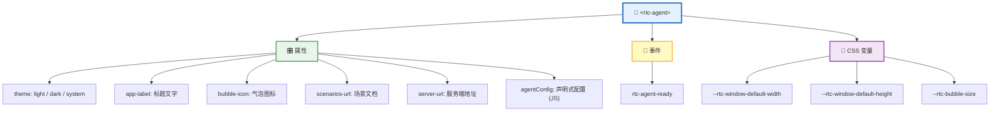
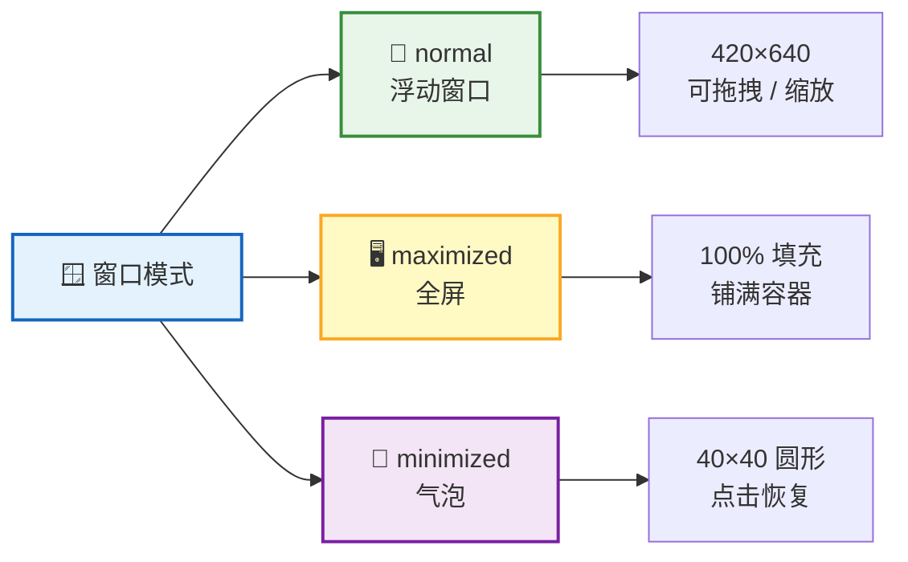
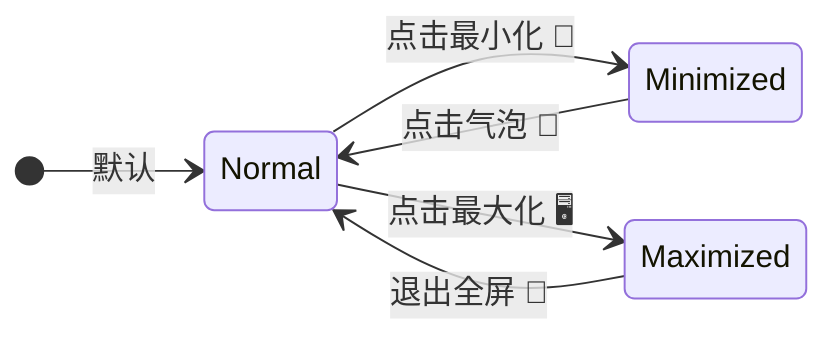
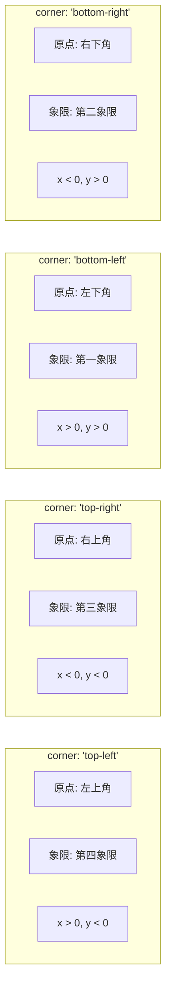
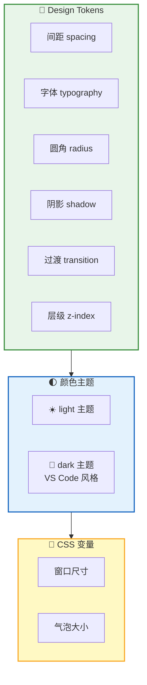

**`<rtc-agent>`** 是 RTC Agent 对外暴露的**唯一组件**。它基于 Lit 构建，内部包含 38 个子组件和 20 个 Controller，但对外只呈现一个简洁的 Web Component 接口——属性配置、事件监听、CSS 变量定制。



## 属性

| 属性 | 类型 | 默认值 | 说明 |
|:----:|:----:|:------:|:----:|
| 🎨 `theme` | `"light"` \| `"dark"` \| `"system"` | `"system"` | 主题模式。`system` 跟随操作系统设置 |
| 📛 `app-label` | `string` | `"RTC Agent"` | 标题栏文字 + 最小化气泡的 tooltip |
| 🖼️ `bubble-icon` | `string` | 默认图标 | 最小化气泡内显示的 SVG / HTML 内容 |
| 📄 `scenarios-url` | `string` | — | 场景文档的 URL，指向 `manifest.json` |
| 🔗 `server-url` | `string` | `""` | 服务端地址。为空时使用当前页面域名 |

**JS 属性**（仅通过 JavaScript 设置，非 HTML attribute）：

| 属性 | 类型 | 默认值 | 说明 |
|:----:|:----:|:------:|:----:|
| ⚙️ `agentConfig` | `object` | `null` | 声明式函数注册（推荐方式） |
| 📦 `registry` | `FunctionRegistry` | `null` | 命令式函数注册（通过 `defineRegistry` 创建） |
| 🪟 `windowConfig` | `WindowConfig` | `null` | 窗口行为配置（模式、尺寸、交互限制） |
| 🎛️ `activityBarConfig` | `ActivityBarConfig` | `null` | Activity Bar 按钮显隐配置 |

### 快速接入

```html
<!-- 最简接入 -->
<rtc-agent></rtc-agent>

<!-- 自定义主题和标题 -->
<rtc-agent theme="dark" app-label="我的 AI 助手"></rtc-agent>

<!-- 带场景文档和函数注册 -->
<rtc-agent
  app-label="订单助手"
  scenarios-url="https://example.com/scenarios"
  .agentConfig=${{
    name: 'OrderApp',
    persona: '你是一个订单管理助手',
    groups: [{ /* ... */ }]
  }}
></rtc-agent>
```

```ts
// 窗口配置（JS 属性，在 rtc-agent-ready 后设置）
const agent = document.querySelector('rtc-agent');

agent.addEventListener('rtc-agent-ready', () => {
  // 嵌入式面板：禁用拖拽/缩放/按钮，默认最大化
  agent.windowConfig = { embedded: true };

  // 只保留 chat 功能，隐藏 files/settings 按钮
  agent.activityBarConfig = {
    disabledActivities: ['files', 'settings'],
  };
});
```

## 事件

| 事件 | 触发时机 | 用途 |
|:----:|:--------:|:----:|
| 🟢 `rtc-agent-ready` | 组件完成初始化 | 此时可安全访问组件实例、设置属性 |

```ts
const agent = document.querySelector('rtc-agent');

agent.addEventListener('rtc-agent-ready', () => {
  // 组件已就绪，可以安全操作
  agent.theme = 'dark';
  agent.appLabel = '自定义标题';
});
```

> 💡 **最佳实践**：始终在 `rtc-agent-ready` 事件触发后再操作组件，避免组件尚未初始化导致的错误。

## 窗口系统

`<rtc-agent>` 内置三种窗口模式，支持浮动、全屏和最小化气泡：





| 交互 | 说明 |
|:----:|------|
| 🖱️ 拖拽 | 标题栏（title-bar）作为拖拽手柄 |
| ↔️ 缩放 | 支持 8 个方向的 resize 操作 |
| ⌨️ 键盘 | 方向键移动窗口，Shift 加速 |
| 📏 视口约束 | 窗口始终保持在可视区域内，不会被拖出屏幕 |

### 窗口配置

通过 `windowConfig` 属性可以控制窗口的默认行为和交互限制：

```ts
agent.windowConfig = {
  // 默认窗口模式
  defaultMode: 'maximized',  // 'normal' | 'maximized' | 'minimized'

  // 嵌入式模式（快捷方式）
  // 等同于: defaultMode: 'maximized' + draggable: false + resizable: false
  //         + showMinimize: false + showMaximize: false
  embedded: true,

  // 细粒度控制
  draggable: false,       // 是否可拖拽
  resizable: false,       // 是否可缩放
  showMinimize: false,    // 是否显示最小化按钮
  showMaximize: false,    // 是否显示最大化按钮
  showClose: false,       // 是否显示关闭按钮

  // 尺寸和位置
  initialSize: { width: 420, height: 640 },
  initialPosition: { x: 100, y: 100 },
  minWidth: 350,
  minHeight: 520,
  maxWidth: Infinity,
  maxHeight: Infinity,

  // 最小化气泡位置
  bubblePosition: {
    corner: 'bottom-right',  // 坐标系原点所在角
    offset: { x: -20, y: 20 },  // 数学笛卡尔坐标偏移
  },
};
```

#### Bubble 位置配置

`bubblePosition` 使用**数学笛卡尔坐标系**控制最小化气泡的位置：



| 字段 | 类型 | 说明 |
|:----:|:----:|:----:|
| `corner` | `'top-left'` \| `'top-right'` \| `'bottom-left'` \| `'bottom-right'` | 坐标系原点在宿主应用的哪个角 |
| `offset.x` | `number` | 水平偏移（右正左负） |
| `offset.y` | `number` | 垂直偏移（上正下负，数学坐标系） |

**示例**：

```ts
// 右下角，向内偏移 20px（默认）
bubblePosition: { corner: 'bottom-right', offset: { x: -20, y: 20 } }

// 左上角，向右下偏移 20px
bubblePosition: { corner: 'top-left', offset: { x: 20, y: -20 } }

// 左下角，向右上偏移 30px
bubblePosition: { corner: 'bottom-left', offset: { x: 30, y: 30 } }
```

> 💡 **展开方向**：首次从最小化恢复时，窗口会根据 `corner` 配置决定展开方向。例如 `corner: 'bottom-right'` 时，窗口的右下角对齐气泡位置，向左上方向展开。后续的最小化/恢复循环使用记忆的位置。

**典型场景**：

| 场景 | 配置 |
|:----:|------|
| 嵌入式面板 | `{ embedded: true }` |
| 固定位置窗口 | `{ draggable: false, resizable: false }` |
| 无最小化按钮 | `{ showMinimize: false, defaultMode: 'maximized' }` |
| 浮动聊天窗 | `null`（使用默认值） |

### Activity Bar 配置

通过 `activityBarConfig` 属性可以控制 Activity Bar 中各按钮的显隐：

```ts
agent.activityBarConfig = {
  // 要隐藏的活动按钮（chat 始终显示，不可隐藏）
  disabledActivities: ['files', 'settings'],

  // 默认激活的活动
  defaultActivity: 'chat',  // 'chat' | 'files' | 'settings'
};
```

| 活动 | 说明 | 可隐藏 |
|:----:|:----:|:------:|
| 💬 `chat` | 聊天界面 | ❌ 始终显示 |
| 📁 `files` | 文件管理 | ✅ |
| ⚙️ `settings` | 设置面板 | ✅ |

## 状态管理

```mermaid
flowchart TD
    ROOT["🧩 &lt;rtc-agent&gt;<br/>中枢编排"] --> CORE["📦 9 个核心 Controller"]
    ROOT --> UI["🎨 11 个 UI Controller"]

    CORE --> C1["🪟 WindowState"]
    CORE --> C2["🔐 Auth"]
    CORE --> C3["💬 Session"]
    CORE --> C4["📨 Message"]
    CORE --> C5["🔧 Mode"]
    CORE --> C6["⚡ ToolCall"]
    CORE --> C7["💾 Persistence"]
    CORE --> C8["📚 Skill"]
    CORE --> C9["🖱️ WindowInteraction"]

    UI --> U1["Activity"]
    UI --> U2["EditorArea / Editor"]
    UI --> U3["FileExplorer"]
    UI --> U4["Fork"]
    UI --> U5["Notification / Toast"]
    UI --> U6["SessionTab / SessionTree"]
    UI --> U7["Settings / StatusBar"]

    style ROOT fill:#e3f2fd,stroke:#1565c0,stroke-width:3px
    style C1 fill:#e8f5e9,stroke:#388e3c
    style C2 fill:#e8f5e9,stroke:#388e3c
    style C3 fill:#e8f5e9,stroke:#388e3c
    style C4 fill:#e8f5e9,stroke:#388e3c
    style C5 fill:#e8f5e9,stroke:#388e3c
    style C6 fill:#e8f5e9,stroke:#388e3c
    style C7 fill:#e8f5e9,stroke:#388e3c
    style C8 fill:#e8f5e9,stroke:#388e3c
    style C9 fill:#e8f5e9,stroke:#388e3c
```

组件内部使用 20 个 **Controller** 管理状态。其中 9 个核心状态 Controller 负责业务逻辑，11 个 UI 辅助 Controller 负责界面交互。Controller 之间不直接引用，由根组件 `<rtc-agent>` 作为中枢编排跨 Controller 通信：



> 💡 **设计原则**：Controller 之间解耦，所有跨 Controller 通信都经过根组件中转。子组件通过 `@lit/context` 获取状态，不直接持有 Controller 引用。

## CSS 变量

通过 CSS 变量可以定制组件的外观尺寸，无需修改源码：

```css
rtc-agent {
  /* 窗口默认尺寸 */
  --rtc-window-default-width: 420px;
  --rtc-window-default-height: 640px;

  /* 最小化气泡大小 */
  --rtc-bubble-size: 40px;
}
```

| 变量 | 默认值 | 说明 |
|:----:|:------:|:----:|
| `--rtc-window-default-width` | `420px` | 浮动窗口默认宽度 |
| `--rtc-window-default-height` | `640px` | 浮动窗口默认高度 |
| `--rtc-bubble-size` | `40px` | 最小化气泡的直径 |

## 样式系统

组件采用三层样式架构，从底层 Token 到顶层变量层层递进：



| 层级 | 内容 | 说明 |
|:----:|:----:|:----:|
| 🏗️ Design Tokens | 间距、字体、圆角、阴影、过渡、z-index | 基础设计常量，保证视觉一致性 |
| 🌓 颜色主题 | light / dark（VS Code 风格） | 两套完整色彩方案，自动适配 |
| 🔧 CSS 变量 | 组件级自定义（窗口尺寸、气泡大小） | 宿主应用可覆盖，实现个性化 |

## 关键交互

| 区域 | 行为 |
|:----:|:----:|
| ⌨️ **输入区** | textarea + 底部工具栏；Enter 提交，Shift+Enter 换行；工具栏包含附件、工具、模式切换、发送/停止 |
| 📨 **消息列表** | 自动滚动到底部；用户滚动离开时显示"新消息"按钮；支持 Markdown 渲染和代码高亮 |
| ⚡ **工具确认弹窗** | 显示工具名和参数；Yes / No 按钮；点击背景等同于拒绝 |

## 下一步

- [认证与授权](/docs/integration/auth/) — 了解登录流程和令牌机制
- [Function 注册指南](/docs/integration/function-registration/) — 通过 `agentConfig` 注册自定义函数
- [Scenario 编写指南](/docs/integration/scenario-authoring/) — 编写场景文档引导 AI 行为
