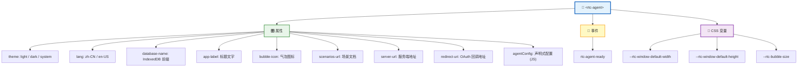
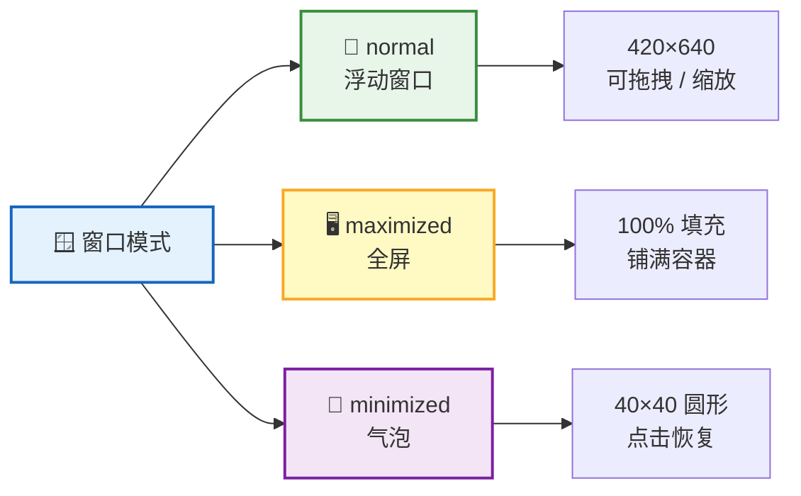
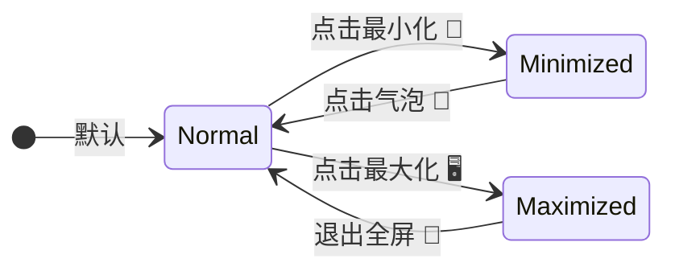
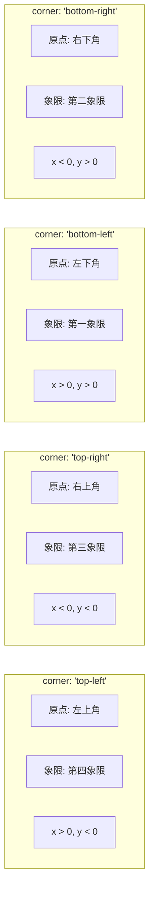
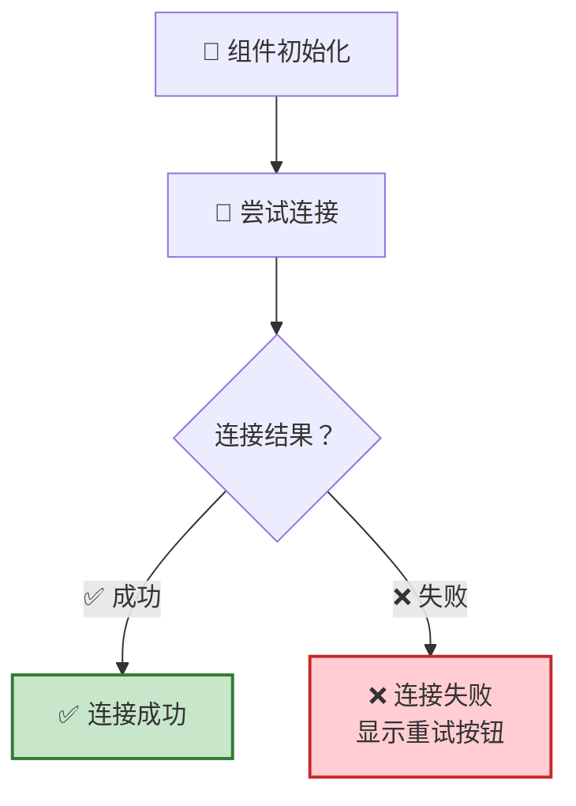
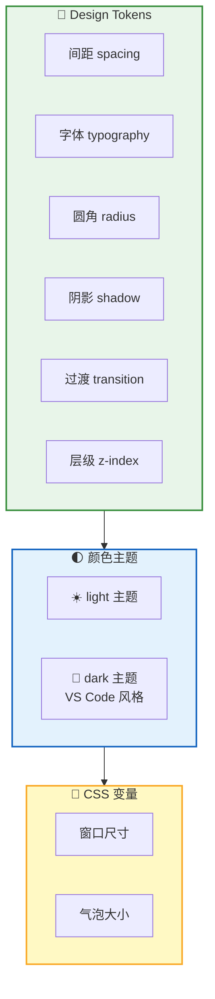

**`<rtc-agent>`** 是 RTC Agent 对外暴露的**唯一组件**。它基于 Lit 构建，内部包含 47 个子组件和 19 个 Controller，但对外只呈现一个简洁的 Web Component 接口——属性配置、事件监听、CSS 变量定制。



## 属性

| 属性 | 类型 | 默认值 | 说明 |
|:----:|:----:|:------:|:----:|
| 🎨 `theme` | `"light"` \| `"dark"` \| `"system"` | `"system"` | 主题模式。`system` 跟随操作系统设置。可通过 JS 动态设置：`agent.theme = 'dark'` |
| 🌐 `lang` | `"zh-CN"` \| `"en-US"` | `"zh-CN"` | 界面语言。优先级：HTML attribute > localStorage > 浏览器语言 > 默认值 (zh-CN)。可通过 JS 动态设置：`agent.lang = 'en-US'` |
| 💾 `database-name` | `string` | `"rtc-agent"` | IndexedDB 名称前缀。最终 DB 名为 `{prefix}-{userId}`。例如 `<rtc-agent database-name="my-app-rtc">` 生成 `my-app-rtc-{userId}` |
| 📛 `app-label` | `string` | `"RTC Agent"` | 标题栏文字 + 最小化气泡的 tooltip |
| 🖼️ `bubble-icon` | `string` | 默认图标 | 最小化气泡内显示的 SVG / HTML 内容 |
| 📄 `scenarios-url` | `string` | — | 场景文档的 URL，指向 `manifest.json` |
| 🔗 `server-url` | `string` | `""` | 服务端地址。为空时使用当前页面域名 |
| 🔁 `redirect-uri` | `string` | `window.location.origin + '/auth/callback.html'` | OAuth 回调地址。支持绝对路径和相对路径 |

**JS 属性**（仅通过 JavaScript 设置，非 HTML attribute）：

| 属性 | 类型 | 默认值 | 说明 |
|:----:|:----:|:------:|:----:|
| ⚙️ `agentConfig` | `object` | `null` | 声明式函数注册（推荐方式） |
| 📦 `registry` | `FunctionRegistry` | `null` | 命令式函数注册（通过 `defineRegistry` 创建） |
| 🪟 `windowConfig` | `WindowConfig` | `null` | 窗口行为配置（模式、尺寸、交互限制） |
| 🎛️ `activityBarConfig` | `ActivityBarConfig` | `null` | Activity Bar 按钮显隐配置 |

### 快速接入

```html
<!-- 最简接入 -->
<rtc-agent></rtc-agent>

<!-- 自定义主题和标题 -->
<rtc-agent theme="dark" app-label="我的 AI 助手"></rtc-agent>

<!-- 自定义数据库名前缀和语言 -->
<rtc-agent database-name="my-app-rtc" lang="en-US"></rtc-agent>

<!-- 带场景文档和函数注册 -->
<rtc-agent
  app-label="订单助手"
  scenarios-url="https://example.com/scenarios"
  .agentConfig=${{
    name: 'OrderApp',
    persona: '你是一个订单管理助手',
    groups: [{ /* ... */ }]
  }}
></rtc-agent>
```

```ts
// 窗口配置（JS 属性，在 rtc-agent-ready 后设置）
const agent = document.querySelector('rtc-agent');

agent.addEventListener('rtc-agent-ready', () => {
  // 嵌入式面板：禁用拖拽/缩放/按钮，默认最大化
  agent.windowConfig = { embedded: true };

  // 只保留 chat 功能，隐藏 files/settings 按钮
  agent.activityBarConfig = {
    disabledActivities: ['files', 'settings'],
  };
});
```

## 事件

| 事件 | 触发时机 | 用途 |
|:----:|:--------:|:----:|
| 🟢 `rtc-agent-ready` | 组件完成初始化 | 此时可安全访问组件实例、设置属性 |

```ts
const agent = document.querySelector('rtc-agent');

agent.addEventListener('rtc-agent-ready', () => {
  // 组件已就绪，可以安全操作
  agent.theme = 'dark';
  agent.lang = 'en-US';
  agent.appLabel = '自定义标题';
});
```

> 💡 **最佳实践**：始终在 `rtc-agent-ready` 事件触发后再操作组件，避免组件尚未初始化导致的错误。

## 窗口系统

`<rtc-agent>` 内置三种窗口模式，支持浮动、全屏和最小化气泡：





| 交互 | 说明 |
|:----:|------|
| 🖱️ 拖拽 | 标题栏（title-bar）作为拖拽手柄 |
| ↔️ 缩放 | 支持 8 个方向的 resize 操作 |
| ⌨️ 键盘 | 方向键移动窗口，Shift 加速 |
| 📏 视口约束 | 窗口始终保持在可视区域内，不会被拖出屏幕 |

### 窗口配置

通过 `windowConfig` 属性可以控制窗口的默认行为和交互限制：

```ts
agent.windowConfig = {
  // 默认窗口模式
  defaultMode: 'maximized',  // 'normal' | 'maximized' | 'minimized'

  // 嵌入式模式（快捷方式）
  // 等同于: defaultMode: 'maximized' + draggable: false + resizable: false
  //         + showMinimize: false + showMaximize: false
  embedded: true,

  // 细粒度控制
  draggable: false,       // 是否可拖拽
  resizable: false,       // 是否可缩放
  showMinimize: false,    // 是否显示最小化按钮
  showMaximize: false,    // 是否显示最大化按钮
  showClose: false,       // 是否显示关闭按钮

  // 尺寸和位置
  initialSize: { width: 420, height: 640 },
  initialPosition: { x: 100, y: 100 },
  minWidth: 350,
  minHeight: 520,
  maxWidth: Infinity,
  maxHeight: Infinity,

  // 最小化气泡位置
  bubblePosition: {
    corner: 'bottom-right',  // 坐标系原点所在角
    offset: { x: -20, y: 20 },  // 数学笛卡尔坐标偏移
  },
};
```

#### Bubble 位置配置

`bubblePosition` 使用**数学笛卡尔坐标系**控制最小化气泡的位置：



| 字段 | 类型 | 说明 |
|:----:|:----:|:----:|
| `corner` | `'top-left'` \| `'top-right'` \| `'bottom-left'` \| `'bottom-right'` | 坐标系原点在宿主应用的哪个角 |
| `offset.x` | `number` | 水平偏移（右正左负） |
| `offset.y` | `number` | 垂直偏移（上正下负，数学坐标系） |

**示例**：

```ts
// 右下角，向内偏移 20px（默认）
bubblePosition: { corner: 'bottom-right', offset: { x: -20, y: 20 } }

// 左上角，向右下偏移 20px
bubblePosition: { corner: 'top-left', offset: { x: 20, y: -20 } }

// 左下角，向右上偏移 30px
bubblePosition: { corner: 'bottom-left', offset: { x: 30, y: 30 } }
```

> 💡 **展开方向**：首次从最小化恢复时，窗口会根据 `corner` 配置决定展开方向。例如 `corner: 'bottom-right'` 时，窗口的右下角对齐气泡位置，向左上方向展开。后续的最小化/恢复循环使用记忆的位置。

**典型场景**：

| 场景 | 配置 |
|:----:|------|
| 嵌入式面板 | `{ embedded: true }` |
| 固定位置窗口 | `{ draggable: false, resizable: false }` |
| 无最小化按钮 | `{ showMinimize: false, defaultMode: 'maximized' }` |
| 浮动聊天窗 | `null`（使用默认值） |

### Activity Bar 配置

通过 `activityBarConfig` 属性可以控制 Activity Bar 中各按钮的显隐：

```ts
agent.activityBarConfig = {
  // 要隐藏的活动按钮（chat 始终显示，不可隐藏）
  disabledActivities: ['files', 'settings'],

  // 默认激活的活动
  defaultActivity: 'chat',  // 'chat' | 'files' | 'settings'
};
```

| 活动 | 说明 | 可隐藏 |
|:----:|:----:|:------:|
| 💬 `chat` | 聊天界面 | ❌ 始终显示 |
| 📁 `files` | 文件管理 | ✅ |
| ⚙️ `settings` | 设置面板 | ✅ |

## 状态管理

```mermaid
flowchart TD
    ROOT["🧩 &lt;rtc-agent&gt;<br/>中枢编排"] --> CORE["📦 9 个核心 Controller"]
    ROOT --> UI["🎨 10 个 UI Controller"]

    CORE --> C1["🪟 WindowState"]
    CORE --> C2["🔐 Auth"]
    CORE --> C3["💬 Session"]
    CORE --> C4["📨 Message"]
    CORE --> C5["🔧 Mode"]
    CORE --> C6["⚡ ToolCall"]
    CORE --> C7["💾 Persistence"]
    CORE --> C8["📚 Skill"]
    CORE --> C9["🖱️ WindowInteraction"]

    UI --> U1["Activity"]
    UI --> U2["EditorArea / Editor"]
    UI --> U3["FileExplorer"]
    UI --> U4["Fork"]
    UI --> U5["Notification / Toast"]
    UI --> U6["SessionTab / SessionTree"]
    UI --> U7["Settings / StatusBar"]

    style ROOT fill:#e3f2fd,stroke:#1565c0,stroke-width:3px
    style C1 fill:#e8f5e9,stroke:#388e3c
    style C2 fill:#e8f5e9,stroke:#388e3c
    style C3 fill:#e8f5e9,stroke:#388e3c
    style C4 fill:#e8f5e9,stroke:#388e3c
    style C5 fill:#e8f5e9,stroke:#388e3c
    style C6 fill:#e8f5e9,stroke:#388e3c
    style C7 fill:#e8f5e9,stroke:#388e3c
    style C8 fill:#e8f5e9,stroke:#388e3c
    style C9 fill:#e8f5e9,stroke:#388e3c
```

组件内部使用 19 个 **Controller** 管理状态。其中 9 个核心状态 Controller 负责业务逻辑，10 个 UI 辅助 Controller 负责界面交互。Controller 之间不直接引用，由根组件 `<rtc-agent>` 作为中枢编排跨 Controller 通信：



> 💡 **设计原则**：Controller 之间解耦，所有跨 Controller 通信都经过根组件中转。子组件通过 `@lit/context` 获取状态，不直接持有 Controller 引用。

## 国际化（i18n）

RTC Agent 内置完整的国际化支持，基于 `@lit/localize` 实现运行时语言切换。

### 支持的语言

| 语言代码 | 语言 | 说明 |
|:--------:|:----:|:----:|
| `zh-CN` | 简体中文 | 默认语言（源语言） |
| `en-US` | English | 目标语言 |

### 切换语言

通过 `switchLocale()` API 切换界面语言：

```ts
import { switchLocale } from '@rtc-agent/component/core/i18n.js';

// 切换到英文
await switchLocale('en-US');

// 切换到中文
await switchLocale('zh-CN');
```

### 语言持久化

语言选择自动保存到 `localStorage`（键：`rtc-agent-locale`），刷新页面后保持不变。

### 在组件中使用

组件中使用 `@localized()` 装饰器和 `msg()` 函数：

```ts
import { localized, msg } from '@lit/localize';
import { consume } from '@lit/context';
import { localeContext } from '@rtc-agent/component/core/i18n.js';

@localized()
@customElement('my-component')
export class MyComponent extends LitElement {
  @consume({ context: localeContext, subscribe: true })
  private _localeCtx!: LocaleContextValue;

  render() {
    // 响应 locale 变化
    void this._localeCtx.locale;
    
    return html`
      <div>${msg('欢迎使用 RTC Agent')}</div>
    `;
  }
}
```

### 添加翻译

1. **标记文本**：在组件中使用 `msg()` 包裹需要翻译的文本
2. **提取翻译**：运行 `npm run localize:extract` 生成 XLIFF 文件
3. **翻译文本**：编辑 `xliff/en-US.xlf` 文件
4. **构建翻译**：运行 `npm run localize:build` 生成语言包

详细指南见 [国际化集成指南](/docs/integration/i18n)。

## CSS 变量

通过 CSS 变量可以定制组件的外观尺寸，无需修改源码：

```css
rtc-agent {
  /* 窗口默认尺寸 */
  --rtc-window-default-width: 420px;
  --rtc-window-default-height: 640px;

  /* 最小化气泡大小 */
  --rtc-bubble-size: 40px;

  /* 用户自定义字号（影响所有文本） */
  --rtc-font-size-user: 16px;

  /* 品牌色 */
  --rtc-color-primary-rgb: 39 65 254;  /* Light: #2741FE */
  --rtc-color-accent: #2741FE;
}
```

| 变量 | 默认值 | 说明 |
|:----:|:------:|:----:|
| `--rtc-window-default-width` | `420px` | 浮动窗口默认宽度 |
| `--rtc-window-default-height` | `640px` | 浮动窗口默认高度 |
| `--rtc-bubble-size` | `40px` | 最小化气泡的直径 |
| `--rtc-font-size-user` | `14px` | 用户自定义基础字号（12-24px） |
| `--rtc-color-primary-rgb` | Light: `39 65 254`<br/>Dark: `26 122 176` | 主色 RGB 值（用于透明度计算） |
| `--rtc-color-accent` | Light: `#2741FE`<br/>Dark: `#1A7AB0` | 强调色（链接、按钮等） |

### 字号体系

设置 `--rtc-font-size-user` 后，所有字号按等比缩放：

| Token | 计算公式 | 示例（base=14px） |
|:-----:|:--------:|:-----------------:|
| `--rtc-font-size-xs` | `base * 0.857` | 12px |
| `--rtc-font-size-sm` | `base * 0.929` | 13px |
| `--rtc-font-size-base` | `base` | 14px |
| `--rtc-font-size-md` | `base * 1.143` | 16px |
| `--rtc-font-size-lg` | `base * 1.286` | 18px |
| `--rtc-font-size-xl` | `base * 1.429` | 20px |
| `--rtc-font-size-2xl` | `base * 1.714` | 24px |

## Logo 定制

RTC Agent 提供品牌 Logo 的 Lit 渲染辅助，支持亮色和暗色两个版本。

### 使用 renderLogo()

```ts
import { renderLogo, renderBubbleLogo } from '@rtc-agent/component/icons/logo.js';

@customElement('my-component')
export class MyComponent extends LitElement {
  @property({ type: String })
  theme: 'light' | 'dark' | 'system' = 'system';

  render() {
    const isDark = this.theme === 'dark';
    
    return html`
      <div class="header">
        <!-- 完整 Logo（用于登录页、空状态等） -->
        <div class="logo">${renderLogo(isDark)}</div>
        
        <!-- 气泡 Logo（用于最小化气泡） -->
        <div class="bubble-logo">${renderBubbleLogo(isDark)}</div>
      </div>
    `;
  }
}
```

### Logo 文件

| 文件 | 说明 | 使用场景 |
|:----:|:----:|:--------:|
| `logo.svg` | 蓝天版 Logo | 亮色主题 |
| `logo-dark.svg` | 夜空版 Logo | 暗色主题 |

### 定制 Logo

如需替换品牌 Logo，可以：

1. **替换 SVG 文件**：修改 `src/assets/logo.svg` 和 `src/assets/logo-dark.svg`
2. **使用自定义渲染**：在组件中直接渲染自定义 Logo

## 连接与重试

RTC Agent 在组件初始化时自动尝试建立连接。连接状态通过内部状态机管理，前端实时反映连接进展。

### 连接流程



> 💡 **设计原则**：连接失败不会自动重试，而是将控制权交给用户。用户可以检查网络状况后手动触发重连，避免在网络故障时重复尝试消耗资源。

### 手动重连

连接失败时，用户可以通过以下方式手动重连：

#### 方式一：点击标题栏重试按钮

连接失败后，标题栏会显示红色重试按钮，点击即可触发重连。

#### 方式二：调用 reconnect() 方法

```ts
const agent = document.querySelector('rtc-agent');

// 手动触发重连
await agent.reconnect();
```

### 连接状态查询

通过以下只读属性可以获取连接状态信息：

| 属性 | 类型 | 说明 |
|:-----|:-----|:-----|
| `connectionFailed` | `boolean` | 连接是否失败 |
| `connectionError` | `string` | 连接失败时的错误信息 |

```ts
// 检查连接状态
agent.addEventListener('rtc-agent-ready', () => {
  console.log('Connection failed:', agent.connectionFailed);
  console.log('Connection error:', agent.connectionError);

  if (agent.connectionFailed) {
    console.error('连接失败:', agent.connectionError);
  }
});
```

> **注意**：连接状态的详细信息（如 `disconnected`、`connecting`、`connected`、`reconnecting`）由组件内部管理，不对外暴露。外部只能通过 `connectionFailed` 和 `connectionError` 判断连接是否成功。

### 标题栏状态显示

标题栏根据连接状态显示不同的视觉反馈：

| 状态 | 状态点颜色 | 文字 | 重试按钮 |
|:----:|:----------:|:----:|:--------:|
| `connected` | 🟢 绿色 | "已连接" | ❌ 隐藏 |
| `connecting` | 🟡 黄色脉冲 | "连接中" | ❌ 隐藏 |
| `reconnecting` | 🟡 黄色脉冲 | "重新连接中" | ❌ 隐藏 |
| `disconnected` | 🔴 红色 | "未连接" | ❌ 隐藏 |
| 连接失败 | 🔴 红色闪烁 | "连接失败: ..." | ✅ 显示 |

## 样式系统

组件采用三层样式架构，从底层 Token 到顶层变量层层递进：



| 层级 | 内容 | 说明 |
|:----:|:----:|:----:|
| 🏗️ Design Tokens | 间距、字体、圆角、阴影、过渡、z-index | 基础设计常量，保证视觉一致性 |
| 🌓 颜色主题 | light / dark（VS Code 风格） | 两套完整色彩方案，自动适配 |
| 🔧 CSS 变量 | 组件级自定义（窗口尺寸、气泡大小） | 宿主应用可覆盖，实现个性化 |

## Debug API

`<rtc-agent>` 在所有构建（dev + prod）中暴露 `window.rtcAgentDebug` 对象，提供 40+ 个方法用于 E2E 测试、调试和自动化操作。

```ts
const debug = window.rtcAgentDebug;
```

### 方法分类

| 域 | 方法 | 说明 |
|:--:|------|------|
| **State** | `getState()`, `clearData()`, `seedData()` | 状态访问和数据管理 |
| **Auth** | `loginAs(userId, tokens?)`, `logout()` | 认证模拟 |
| **VirtualFS** | `listFiles(path?)`, `readFile(path)`, `writeFile(path, content)`, `deleteFile(path)` | 虚拟文件系统操作 |
| **Session** | `createSession()`, `switchSession(id)`, `deleteSession(id)`, `renameSession(id, title)`, `getSessions()`, `getCurrentSessionId()` | 会话管理 |
| **Message** | `sendMessage(content)`, `getMessages()`, `addDemoMessage(content, role?)`, `clearMessages()` | 消息操作 |
| **Tool Call** | `getToolCalls()`, `addPendingToolCall(call)`, `approveToolCall(id)`, `denyToolCall(id)`, `approveAllToolCalls(toolName)` | 工具调用模拟 |
| **UI Control** | `click(selector)`, `scrollIntoView(selector)`, `typeText(selector, text)` | UI 交互模拟 |
| **Toast** | `showToast(message, type?)`, `getToasts()` | Toast 通知 |
| **Settings** | `getSettings()`, `updateSettings(section, patch)` | 设置管理 |
| **Activity** | `setActivity(activity)`, `getActivity()` | Activity Bar 控制 |
| **Network** | `simulateOffline()`, `restoreNetwork()`, `isOffline` | 网络状态模拟 |
| **Event** | `triggerEvent(name, detail?)` | 自定义事件模拟 |
| **Metrics** | `getMetrics()` | 性能指标采集 |
| **Component** | `element`, `waitForReady(timeout?)`, `waitForConnected(timeout?)` | 组件引用和等待 |
| **Logs** | `logs`, `clearLogs()` | 日志访问 |

### 使用示例

```ts
const debug = window.rtcAgentDebug;

// 等待组件就绪
const agent = await debug.waitForReady(5000);

// 等待连接建立
await debug.waitForConnected(10000);

// 创建会话并发送消息
const sessionId = debug.createSession();
debug.switchSession(sessionId);
await debug.sendMessage('你好，帮我写一个 Hello World');

// 模拟离线状态
debug.simulateOffline();
console.log('Is offline:', debug.isOffline);

// 恢复网络
debug.restoreNetwork();

// 获取所有消息
const messages = debug.getMessages();
console.log('Message count:', messages.length);

// 获取当前状态
const state = debug.getState();
console.log('Current session:', debug.getCurrentSessionId());
```

### E2E 测试最佳实践

```ts
// Playwright 示例
test('send message and get response', async ({ page }) => {
  await page.goto('/');
  
  // 等待组件就绪
  await page.waitForFunction(() => window.rtcAgentDebug?.waitForReady);
  await page.evaluate(() => window.rtcAgentDebug.waitForReady(5000));
  
  // 发送消息
  await page.evaluate(() => window.rtcAgentDebug.sendMessage('Hello'));
  
  // 等待 AI 响应
  await page.waitForFunction(() => {
    const msgs = window.rtcAgentDebug.getMessages();
    return msgs.some(m => m.role === 'assistant');
  }, { timeout: 30000 });
  
  // 验证响应
  const messages = await page.evaluate(() => window.rtcAgentDebug.getMessages());
  expect(messages.length).toBeGreaterThan(1);
});
```

> 💡 Debug API 在生产环境中同样可用，方便线上问题排查。但建议仅在开发和测试环境中使用 `seedData()` 和 `clearData()` 等数据修改方法。

## 关键交互

| 区域 | 行为 |
|:----:|:----:|
| ⌨️ **输入区** | textarea + 底部工具栏；Enter 提交，Shift+Enter 换行；工具栏包含附件、工具、模式切换、发送/停止；当配置了 `scenarios-url` 时，工具栏显示 scenario 选择按钮，点击后弹出 `rtc-scenario-panel` 组件供用户选择场景 |
| 📨 **消息列表** | 自动滚动到底部；用户滚动离开时显示"新消息"按钮；支持 Markdown 渲染和代码高亮 |
| ⚡ **工具确认弹窗** | 显示工具名和参数；Yes / No 按钮；点击背景等同于拒绝 |
| 🔄 **连接失败重试** | 连接断开时显示重试按钮，也可通过 JS 调用 `agent.reconnect()` 方法手动重连 |

## 下一步

- [认证与授权](/docs/integration/auth/) — 了解登录流程和令牌机制
- [Function 注册指南](/docs/integration/function-registration/) — 通过 `agentConfig` 注册自定义函数
- [Scenario 编写指南](/docs/integration/scenario-authoring/) — 编写场景文档引导 AI 行为
