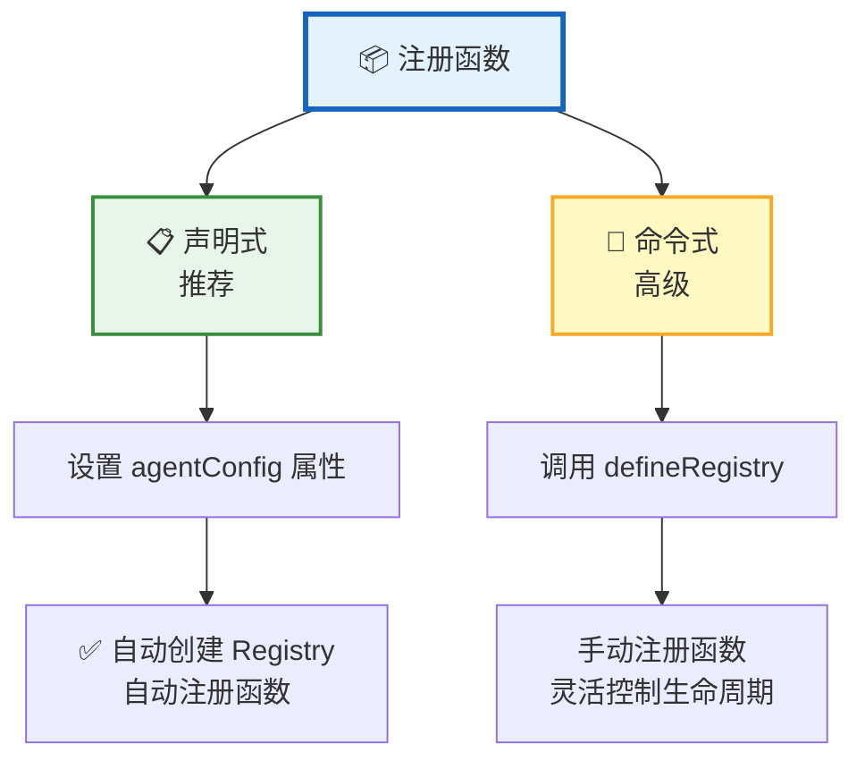
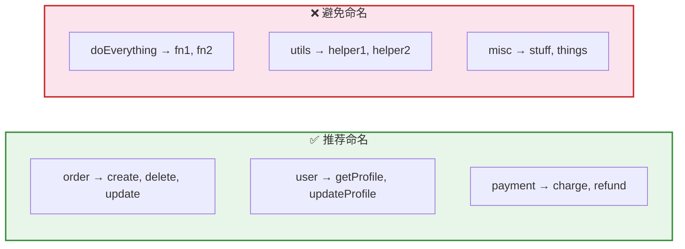
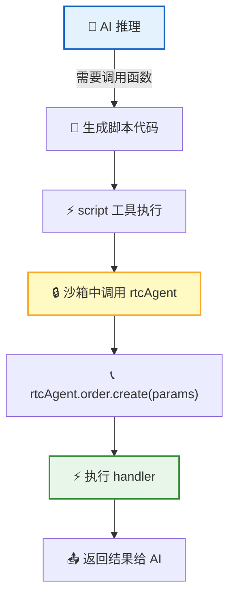
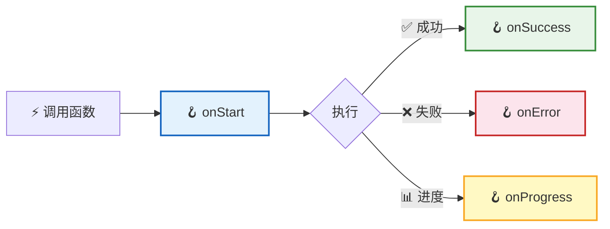
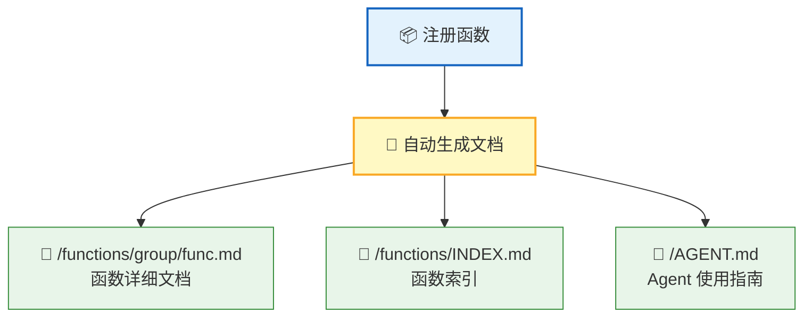

**Function 注册** 是让 AI 调用你业务能力的桥梁。注册后的函数会自动生成文档，AI 可以直接阅读并学会使用——无需手写提示词，无需额外的集成代码。

## 两种注册方式



| 方式 | 适用场景 | 优点 |
|:----:|:--------:|:----:|
| 📋 **声明式** | 大多数场景（推荐） | 零配置，设置 `agentConfig` 即可 |
| 🔧 **命令式** | 需要精细控制（多 Registry、动态注册） | 灵活，可手动管理生命周期 |

## 声明式注册（推荐）

最简单的方式——只需设置 `agentConfig` 属性：

```ts
const agent = document.querySelector('rtc-agent');

agent.agentConfig = {
  name: 'OrderApp',
  persona: '你是一个订单管理助手，帮助用户创建、查询和处理订单。',
  groups: [
    {
      name: 'order',
      description: '订单管理操作',
      functions: [
        {
          name: 'create',
          description: '创建一个新订单',
          parameters: [
            { name: 'productId', schema: { type: 'string' }, required: true, description: '商品 ID' },
            { name: 'quantity', schema: { type: 'number' }, description: '购买数量' }
          ],
          returns: { schema: { type: 'object' }, description: '订单信息，包含 orderId' },
          handler: async (params) => {
            const res = await api.createOrder(params.productId, params.quantity);
            return { orderId: res.id, status: res.status };
          }
        }
      ]
    }
  ]
};
```

> 💡 设置 `agentConfig` 后，系统会自动创建 Registry、注册函数、生成文档——完全零配置。

## 命令式注册（高级）

需要精细控制时，可以使用 `defineRegistry` 手动注册：

```ts
import { defineRegistry } from '@rtc-agent/component';

const registry = defineRegistry({
  name: 'OrderApp',
  description: '订单管理应用',
  persona: '你是一个订单管理助手。'
});

const orderGroup = registry.createGroup({
  name: 'order',
  description: '订单管理操作'
});

orderGroup.register({
  name: 'create',
  description: '创建一个新订单',
  handler: async (params) => {
    return await api.createOrder(params.productId, params.quantity);
  }
});
```

## 函数定义字段

每个函数由以下字段组成：

| 字段 | 类型 | 必填 | 说明 |
|:----:|:----:|:----:|:----:|
| 📛 `name` | `string` | ✅ | 函数名称，与分组名组合成完整路径（如 `order.create`） |
| 📝 `description` | `string` | ✅ | 函数描述，**写入自动生成的文档**，AI 据此决定何时调用 |
| 📐 `parameters` | `ParameterDef[]` | — | 参数定义数组，每项含 `{name, schema, required?, description?}`，`schema` 为 OpenAPI Schema |
| 🔙 `returns` | `ReturnDef` | — | 返回值定义 `{schema, description?}`，帮助 AI 理解输出 |
| ⚡ `handler` | `function` | ✅ | 执行函数，支持 `async`，接收 `params` 参数 |
| 🪝 `hooks` | `object` | — | UI 钩子（`onStart` / `onSuccess` / `onError` / `onProgress`） |

### 完整函数示例

```ts
{
  name: 'refund',
  description: '对指定订单发起退款，支持全额和部分退款',
  parameters: [
    { name: 'orderId', schema: { type: 'string' }, required: true, description: '订单 ID' },
    { name: 'amount', schema: { type: 'number' }, description: '退款金额（留空则全额退款）' },
    { name: 'reason', schema: { type: 'string' }, required: true, description: '退款原因' }
  ],
  returns: { schema: { type: 'object' }, description: '退款结果，包含 refundId 和状态' },
  handler: async (params, onProgress) => {
    onProgress?.(30);
    await validateOrder(params.orderId);
    onProgress?.(70);
    const result = await processRefund(params.orderId, params.amount);
    return { refundId: result.id, status: result.status };
  },
  hooks: {
    onStart: () => showToast('正在处理退款...'),
    onSuccess: (result) => showToast(`退款成功：${result.refundId}`),
    onError: (err) => showToast(`退款失败：${err.message}`)
  }
}
```

## 分组命名规范



| 规则 | 推荐 | 避免 |
|:----:|:----:|:----:|
| 📛 分组名 | 业务领域名词（`order`、`user`、`payment`） | 过于宽泛（`utils`、`misc`、`do`） |
| 🔤 函数名 | 动词或动宾短语（`create`、`getProfile`） | 无意义缩写（`fn1`、`doIt`） |
| 📐 粒度 | 每个函数做一件事 | 一个函数做所有事 |

> 📌 **完整路径**：分组名 + 函数名 = 完整调用路径。例如 `order.create`、`payment.refund`。

## AI 调用方式

注册完成后，AI 通过 `script` 工具在沙箱中调用函数：



AI 有两种等价的调用语法：

```ts
// 方式一：Proxy 链式调用（自然语法）
await rtcAgent.order.create({ productId: '123', quantity: 2 });

// 方式二：callFunction 方法
await rtcAgent.callFunction('order.create', { productId: '123', quantity: 2 });
```

> 💡 Proxy 链式调用让 AI 能像调用普通 API 一样使用注册的函数，语法直观、不易出错。

## Hook 系统

Hook 让宿主应用能在函数执行的各个阶段介入，实现 UI 反馈、日志记录等：



| Hook | 触发时机 | 说明 |
|:----:|:--------:|:----:|
| 🟦 `onStart` | 执行前 | 可抛出 `CancelledError` 取消执行 |
| 🟩 `onSuccess` | 成功后 | 异步执行，不阻塞主流程 |
| 🟥 `onError` | 失败后 | 异步执行，不阻塞主流程 |
| 🟨 `onProgress` | 进度更新 | handler 调用 `onProgress(n)` 时触发 |

```ts
// Hook 示例：显示 Toast 通知
{
  hooks: {
    onStart: () => showToast('操作开始...'),
    onSuccess: (result) => showToast(`操作完成：${result.id}`),
    onError: (err) => showToastError(`操作失败：${err.message}`)
  }
}
```

## 文档自动生成



| 生成内容 | 说明 |
|:--------:|:----:|
| 📄 函数文档 | 每个函数一个 Markdown 文件，包含描述、参数表格、返回值、调用示例 |
| 📑 索引文件 | `INDEX.md` 列出所有可用函数，方便 AI 浏览 |
| 🧠 Agent 指南 | `AGENT.md` 汇总所有函数能力，帮助 AI 理解整体上下文 |

> 💡 **即注册即用**：文档在注册时自动生成，AI 可以直接阅读文档了解函数用法——不需要额外编写提示词。

## 下一步

- [Scenario 编写指南](/docs/integration/scenario-authoring/) — 编写场景文档引导 AI 的业务行为
- [Web Component API](/docs/integration/component-api/) — 了解组件的属性、事件和样式系统
- [核心协议 RTC](/docs/concepts/rtc/) — 了解 AI 如何调用前端工具
