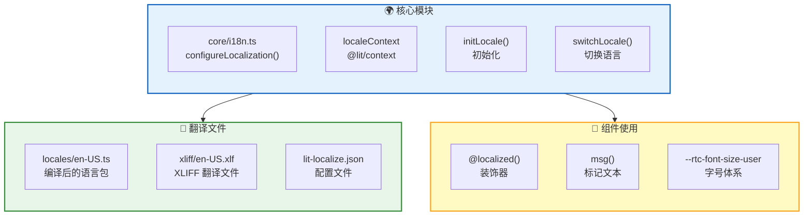
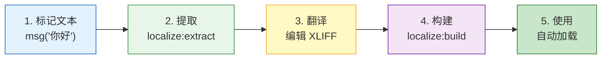

RTC Agent 基于 `@lit/localize` 构建完整的国际化系统，支持运行时语言切换，无需重新加载页面。

## 架构概览



## 初始化

### initLocale()

组件启动时调用 `initLocale()` 初始化语言环境：

```ts
import { initLocale } from '@rtc-agent/component/core/i18n.js';

// 在应用启动时调用
await initLocale();
```

**初始化逻辑**：

1. 检查 `localStorage`（键：`rtc-agent-locale`）中是否有保存的语言
2. 检查浏览器语言 `navigator.language` 是否在支持列表中
3. 回退到源语言 `zh-CN`
4. 同步 `document.documentElement.lang` 属性（屏幕阅读器发音规则）

### 配置

`lit-localize.json` 定义语言配置：

```json
{
  "sourceLocale": "zh-CN",
  "targetLocales": ["en-US"],
  "tsConfig": "tsconfig.json",
  "output": {
    "mode": "runtime",
    "localeCodesModule": "src/.generated/locale-codes.ts"
  }
}
```

## 切换语言

### switchLocale()

运行时切换语言：

```ts
import { switchLocale, type SupportedLocale } from '@rtc-agent/component/core/i18n.js';

// 切换到英文
await switchLocale('en-US');

// 切换回中文
await switchLocale('zh-CN');
```

**switchLocale() 行为**：

| 步骤 | 操作 |
|:----:|:----:|
| 1 | 调用 `@lit/localize` 的 `setLocale()` 加载语言包 |
| 2 | 保存到 `localStorage`（键：`rtc-agent-locale`） |
| 3 | 更新 `document.documentElement.lang` 属性 |
| 4 | 所有 `@localized()` 组件自动重新渲染 |

### 支持的语言

| 语言代码 | 语言 | 类型 |
|:--------:|:----:|:----:|
| `zh-CN` | 简体中文 | 源语言 |
| `en-US` | English | 目标语言 |

```ts
// 类型安全
type SupportedLocale = 'zh-CN' | 'en-US';

// 类型守卫
import { isValidLocale } from '@rtc-agent/component/core/i18n.js';
if (isValidLocale(userInput)) {
  await switchLocale(userInput);
}
```

## 在组件中使用

### @localized() 装饰器

使用 `@localized()` 装饰器标记需要响应语言变化的组件：

```ts
import { LitElement, html } from 'lit';
import { customElement } from 'lit/decorators.js';
import { localized, msg } from '@lit/localize';
import { consume } from '@lit/context';
import { localeContext, type LocaleContextValue } from '@rtc-agent/component/core/i18n.js';

@localized()
@customElement('my-component')
export class MyComponent extends LitElement {
  @consume({ context: localeContext, subscribe: true })
  @state()
  private _localeCtx: LocaleContextValue = { /* ... */ };

  render() {
    // 引用 locale 确保语言切换时重新渲染
    void this._localeCtx.locale;

    return html`
      <div>${msg('欢迎使用 RTC Agent')}</div>
      <p>${msg('这是一个国际化组件')}</p>
    `;
  }
}
```

### msg() 函数

`msg()` 标记需要翻译的文本：

```ts
import { msg, str } from '@lit/localize';

// 简单文本
msg('你好世界')

// 带变量的文本
const name = '用户';
msg(str`你好，${name}！`)

// 带 HTML 的文本（需转义）
msg(html`点击 <a href="/help">${msg('帮助')}</a>`)
```

### localeContext

通过 `@lit/context` 获取语言上下文：

```ts
import { consume } from '@lit/context';
import { localeContext, type LocaleContextValue } from '@rtc-agent/component/core/i18n.js';

@consume({ context: localeContext, subscribe: true })
@state()
private _localeCtx: LocaleContextValue = {
  locale: 'zh-CN',
  setLocale: async () => {},
  locales: ['zh-CN', 'en-US'],
};
```

## 添加翻译

### 翻译流程



### 步骤 1：标记文本

在组件中使用 `msg()` 包裹需要翻译的文本：

```ts
render() {
  return html`
    <h1>${msg('设置')}</h1>
    <p>${msg('选择界面语言')}</p>
  `;
}
```

### 步骤 2：提取翻译

运行提取命令生成 XLIFF 文件：

```bash
npm run localize:extract
```

这会在 `xliff/en-US.xlf` 中生成翻译条目：

```xml
<trans-unit id="s8ef06a6080e58381">
  <source>设置</source>
  <target state="new">设置</target>
  <note from="lit-localize">Settings panel title</note>
</trans-unit>
```

### 步骤 3：翻译文本

编辑 `xliff/en-US.xlf`，将 `<target>` 替换为翻译后的文本：

```xml
<trans-unit id="s8ef06a6080e58381">
  <source>设置</source>
  <target>Settings</target>
</trans-unit>
```

### 步骤 4：构建语言包

运行构建命令生成编译后的语言包：

```bash
npm run localize:build
```

这会在 `src/locales/en-US.ts` 中生成优化后的翻译映射。

## 字号体系

RTC Agent 提供基于 `--rtc-font-size-user` 的等比缩放字号体系。

### 基础字号

```css
rtc-agent {
  /* 设置基础字号（12-24px） */
  --rtc-font-size-user: 16px;
}
```

### 字号等级

所有字号 token 按基础字号等比缩放：

| Token | 计算公式 | 12px | 14px (默认) | 16px | 18px | 20px |
|:-----:|:--------:|:----:|:-----------:|:----:|:----:|:----:|
| `--rtc-font-size-xs` | `base * 0.857` | 10px | 12px | 14px | 15px | 17px |
| `--rtc-font-size-sm` | `base * 0.929` | 11px | 13px | 15px | 17px | 19px |
| `--rtc-font-size-base` | `base` | 12px | 14px | 16px | 18px | 20px |
| `--rtc-font-size-md` | `base * 1.143` | 14px | 16px | 18px | 21px | 23px |
| `--rtc-font-size-lg` | `base * 1.286` | 15px | 18px | 21px | 23px | 26px |
| `--rtc-font-size-xl` | `base * 1.429` | 17px | 20px | 23px | 26px | 29px |
| `--rtc-font-size-2xl` | `base * 1.714` | 21px | 24px | 27px | 31px | 34px |

### 设置面板集成

设置面板中提供字号调节控件：

```ts
// 在 rtc-settings-layout 中
private _renderAppearance() {
  return html`
    <div class="setting-row">
      <label for="font-size-input">${msg('字体大小')}</label>
      <input
        type="number"
        id="font-size-input"
        min="12"
        max="24"
        step="1"
        .value=${String(this._settingsCtx.state.appearance.fontSize)}
        @change=${(e: Event) => {
          const size = Number((e.target as HTMLInputElement).value);
          this._updateSetting('appearance', { fontSize: size });
        }}
      />
      <span>px</span>
    </div>
  `;
}
```

### DOM 副作用

`SettingsController` 自动将字号应用到文档根节点：

```ts
// SettingsController._applyFontSize()
document.documentElement.style.setProperty(
  '--rtc-font-size-user',
  `${clamped}px`
);
```

这确保所有 Shadow DOM 中的组件都能继承字号设置。

## 最佳实践

| 实践 | 说明 |
|:----:|:----:|
| ✅ 始终使用 `msg()` | 所有用户可见文本都应包裹在 `msg()` 中 |
| ✅ 引用 `locale` | 在 `render()` 中引用 `this._localeCtx.locale` 确保重渲染 |
| ✅ 使用 `@localized()` | 需要响应语言变化的组件必须添加此装饰器 |
| ✅ 类型安全 | 使用 `SupportedLocale` 类型和 `isValidLocale()` 守卫 |
| ❌ 不要硬编码 | 避免在 `msg()` 外硬编码用户可见文本 |
| ❌ 不要直接调用 `_setLocale` | 使用 `switchLocale()` 确保持久化和 DOM 同步 |

## 下一步

- [Component API](/docs/integration/component-api) — 了解完整的组件 API
- [Settings System](/docs/features/settings) — 了解全局设置系统
