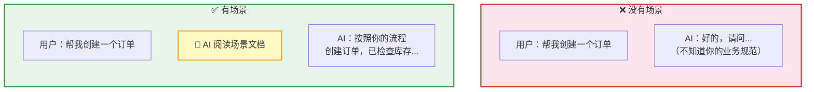
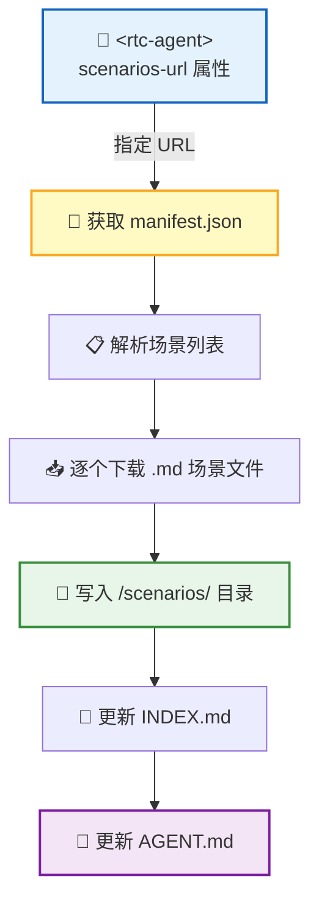
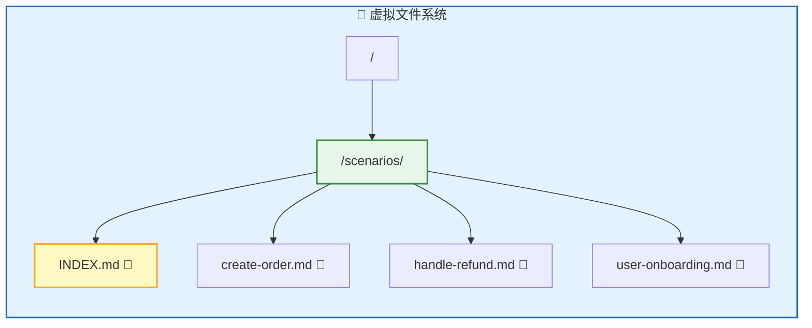
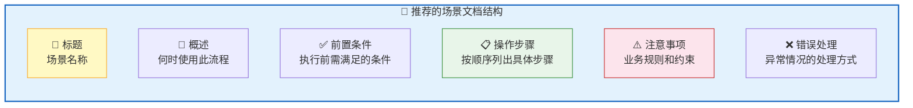
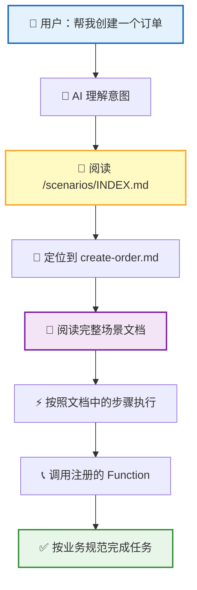

**Scenario（场景）** 是用 Markdown 编写的业务工作流文档。它告诉 AI 特定场景下的操作流程和注意事项——例如"如何创建订单"、"如何处理退款"——让 AI 在执行时遵循你的业务规范。

## 场景是什么



| 概念 | 说明 |
|:----:|:----:|
| 📄 场景文档 | 业务工作流说明，Markdown 格式 |
| 📡 加载方式 | 通过 `<rtc-agent scenarios-url="...">` 属性指定 URL |
| 💾 存储位置 | 虚拟文件系统的 `/scenarios/` 目录 |
| 📑 索引文件 | `/scenarios/INDEX.md` 自动更新 |
| 🧠 AI 使用 | AI 阅读场景文档，了解业务流程后按规范执行 |

> 💡 **一句话理解**：Function 告诉 AI"能做什么"，Scenario 告诉 AI"怎么做"。

## 加载流程



| 步骤 | 说明 |
|:----:|:----:|
| 1 | 宿主应用在 `<rtc-agent>` 组件上设置 `scenarios-url` 属性 |
| 2 | 组件从指定 URL 获取 `manifest.json`，了解有哪些场景 |
| 3 | 逐个下载 `.md` 场景文件，写入虚拟文件系统 |
| 4 | 自动生成索引和 Agent 指南，AI 即可阅读 |

## manifest.json

`manifest.json` 是场景清单，定义了所有可用的场景文件：

```json
{
  "version": 1,
  "scenarios": [
    {
      "slug": "create-order",
      "title": "创建订单",
      "file": "create-order.md"
    },
    {
      "slug": "handle-refund",
      "title": "处理退款",
      "file": "handle-refund.md"
    },
    {
      "slug": "user-onboarding",
      "title": "新用户引导",
      "file": "user-onboarding.md"
    }
  ]
}
```

| 字段 | 类型 | 说明 |
|:----:|:----:|:----:|
| `version` | `number` | 清单版本号，当前为 `1` |
| `scenarios` | `array` | 场景列表 |
| `scenarios[].slug` | `string` | 场景标识，用于 URL 路由和文件命名 |
| `scenarios[].title` | `string` | 场景标题，显示在索引中 |
| `scenarios[].file` | `string` | 场景 Markdown 文件名 |

> 📌 `slug` 建议使用小写字母加连字符的格式（如 `create-order`），避免空格和特殊字符。

## 目录结构



场景文件统一存储在 `/scenarios/` 目录下。系统自动生成 `INDEX.md` 索引文件，列出所有可用场景的标题和摘要，方便 AI 快速定位。

## 场景文档格式

场景文档使用标准 Markdown 编写。以下是推荐的结构：

```markdown
# 创建订单

## 概述
当用户需要创建新订单时，按照以下流程操作。

## 前置条件
- 用户已登录
- 商品库存充足（使用 `order.checkStock` 检查）

## 操作步骤
1. 确认用户要购买的商品和数量
2. 调用 `order.checkStock` 检查库存
3. 如果库存不足，告知用户并推荐替代商品
4. 调用 `order.create` 创建订单
5. 调用 `payment.charge` 发起支付
6. 告知用户订单号和预计发货时间

## 注意事项
- 单个订单最多包含 10 种商品
- 创建订单前必须确认收货地址
- 支付失败时，订单状态为 `pending`，保留 30 分钟

## 错误处理
| 错误 | 处理方式 |
|:----:|:--------:|
| 库存不足 | 告知用户，推荐替代商品 |
| 地址无效 | 引导用户修改地址 |
| 支付失败 | 保留订单，提示用户稍后重试 |
```

### 文档结构建议



> 💡 **写作原则**：写给 AI 看，而不是给开发者看。用清晰、具体的语言描述流程和规则，避免技术实现细节。

## AI 如何使用场景



| 阶段 | AI 的行为 |
|:----:|:---------:|
| 🔍 理解意图 | 分析用户需求，判断是否匹配已有场景 |
| 📑 查找场景 | 阅读 `INDEX.md`，找到对应场景文件 |
| 📖 学习流程 | 阅读场景文档，了解操作步骤和业务规则 |
| ⚡ 执行操作 | 调用注册的 Function，按文档指引完成任务 |
| ❌ 处理异常 | 遇到错误时，按照文档的错误处理指引应对 |

> 📌 场景文档让 AI 的行为从"通用"变为"专业"——它不再只是调用函数，而是按照你的业务规范完成整个工作流。

## 完整示例：接入场景

```html
<!-- 1. 准备场景文件 -->
<!-- https://example.com/scenarios/manifest.json -->
<!-- https://example.com/scenarios/create-order.md -->
<!-- https://example.com/scenarios/handle-refund.md -->

<!-- 2. 设置 scenarios-url -->
<rtc-agent scenarios-url="https://example.com/scenarios"></rtc-agent>

<!-- 3. AI 自动加载并使用场景文档 -->
```

## 编写建议

| 建议 | 说明 |
|:----:|:----:|
| 🎯 一个场景一个文件 | 保持文档聚焦，避免一个文件涵盖多个流程 |
| 📋 步骤要具体 | "调用 `order.create`" 比 "创建订单" 更有指导性 |
| ⚠️ 写清注意事项 | 业务规则（如数量限制、状态约束）是 AI 容易忽略的部分 |
| ❌ 覆盖错误场景 | 告诉 AI 出错时怎么办，比只写正常流程更重要 |
| 🔗 引用 Function 名称 | 直接引用注册的函数名，AI 能准确定位调用 |

## 下一步

- [Function 注册指南](/docs/integration/function-registration/) — 注册场景文档中引用的函数
- [Web Component API](/docs/integration/component-api/) — 了解 `scenarios-url` 属性的配置方式
- [核心协议 RTC](/docs/concepts/rtc/) — 了解 AI 执行操作的底层机制
