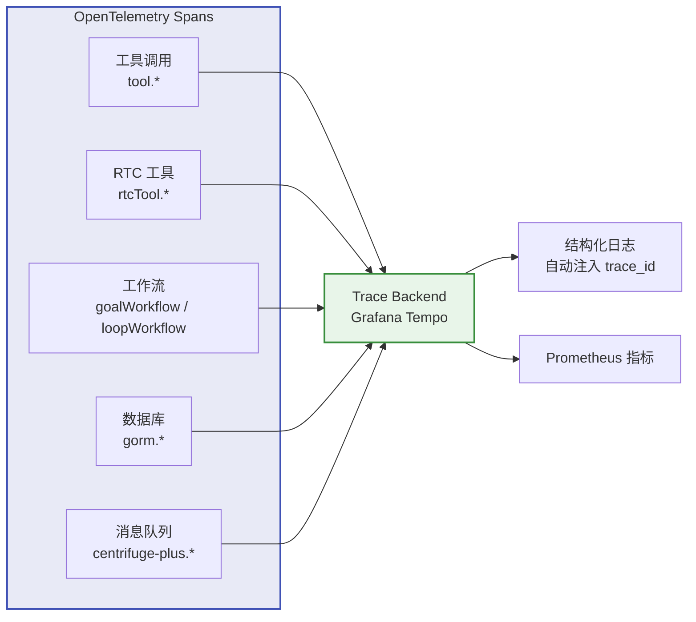

Agent 层是 LLM 智能的核心，包括 Turn 执行流、LLM 调用、Token 管理、上下文压缩、Sub-Agent 编排等。这些日志帮助理解 Agent 的决策过程和资源消耗。

## 日志事件

### LLM 调用与 Token

| 事件 | 触发时机 | 关键字段 |
|------|---------|---------|
| `[turnagent] llm.complete` | LLM 调用完成 | `session_id`, `turn_id`, `model`, `input_tokens`, `output_tokens`, `cached_read_tokens`, `cached_write_tokens`, `reasoning_tokens`, `total_tokens`, `cost_micros` |
| `[turnagent] token_callback.compression_approaching` | Token 用量接近压缩阈值 | `session_id`, `usage_ratio` |
| `[turnagent] cache hit rate below threshold` | 缓存命中率低于阈值 | `hit_rate`, `threshold` |
| `llm.http.request` | LLM HTTP 请求发出（payload 日志） | `method`, `url`, `host` |
| `llm.http.response (stream complete)` | LLM 流式响应完成（payload 日志） | `url`, `total_bytes`, `stream_complete` |
| `llm.http.error` | LLM 请求失败（payload 日志） | `url`, `error` |

> **注意**：每次 LLM 调用可能产生两条 `llm.complete` 日志——一条包含完整的 token 统计（带 model），另一条是增量统计（model 为空）。排查 token 消耗时关注带 model 的那条。

### 上下文压缩与摘要

| 事件 | 触发时机 | 关键字段 |
|------|---------|---------|
| `[turnagent] compact.start` | 压缩开始 | `session_id`, `turn_id` |
| `[turnagent] compact.completed` | 压缩完成 | `session_id`, `messages_before`, `messages_after`, `tokens_saved` |
| `[turnagent] compact.reestimate` | 重新估算 Token 数 | `session_id`, `old_tokens`, `new_tokens` |
| `[turnagent] compress.completed` | 上下文压缩完成 | `session_id`, `turn_id`, `messages_compressed` |
| `[turnagent] summarize.threshold_fallback` | 摘要阈值回退 | `session_id`, `threshold` |
| `[turnagent] summarize.llm_token_usage` | 摘要 LLM Token 消耗 | `input_tokens`, `output_tokens` |
| `[turnagent] summarize.llm_complete` | 摘要 LLM 调用完成 | - |
| `[turnagent] reactive_compact.start` | 响应式压缩开始 | `session_id`, `turn_id`, `reason` |

### Session Memory 提取

| 事件 | 触发时机 | 关键字段 |
|------|---------|---------|
| `[session_memory_extractor] extractor.start` | 记忆提取开始 | `session_id`, `message_count` |
| `[session_memory_extractor] extractor.done` | 记忆提取完成 | `session_id`, `memory_tokens` |
| `[session_memory_extractor] extractor.skip_threshold_not_met` | 未达到提取阈值 | `session_id`, `token_count`, `threshold` |
| `[triggerSessionMemoryExtraction] extracted` | 记忆提取成功 | `session_id`, `memory_tokens` |
| `save_session_memory.success` | Session 记忆提取成功（后台 Agent） | `session_id`, `memory_tokens` |
| `saveMemory.success` | 用户记忆保存成功 | `user_id`, `memory_id`, `category`, `importance` |
| `tool.webSearch.completed` | Web 搜索完成 | `session_id`, `query`, `result_count`, `provider` |
| `tool.webFetch.completed` | Web 抓取完成 | `session_id`, `url`, `bytes`, `status_code`, `cached` |

### 流式数据处理

| 事件 | 触发时机 | 关键字段 |
|------|---------|---------|
| `[turnagent] handleStreamEnd.start` | 流式响应结束处理 | `turn_id`, `session_id`, `role`, `token_usage_total`, `markdown_finalized`, `thinking_finalized` |
| `[turnagent] handleStreamEnd.update_token_usage` | 更新 Token 使用量 | `turn_id`, `session_id`, `input_tokens`, `output_tokens` |
| `[turnagent] appendStreamChunk.finalize` | 流式块最终合并 | `message_id`, `kind` (thinking/markdown), `chunk_count`, `full_content_len`, `full_content_preview` |
| `[turnagent] on_agent_events.start` | Agent 事件处理开始 | `session_id`, `turn_id` |
| `[turnagent] on_agent_events.done` | Agent 事件处理完成 | `session_id`, `turn_id` |
| `[turnagent] on_agent_events.interrupted` | Agent 事件处理被中断 | `session_id`, `turn_id`, `num_contexts` |

### Agent 输入与恢复

| 事件 | 触发时机 | 关键字段 |
|------|---------|---------|
| `[turnagent] gen_input.start` | 生成 LLM 输入开始 | `session_id`, `turn_id`, `checkpoint_id`, `item_count`, `is_resume` |
| `[turnagent] gen_resume.called` | 生成恢复参数 | `turn_id`, `session_id`, `checkpoint_id`, `interrupted_count`, `unhandled_count`, `newItems_count` |
| `[turnagent] gen_resume.resume_params` | 恢复参数详情 | `turn_id`, `session_id`, `interrupt_id`, `has_result` |
| `[turnagent] gen_resume.result` | 恢复结果 | `turn_id`, `session_id`, `consumed_count`, `has_resume_params` |
| `[turnagent] normalizeMessagesForLLM.applied` | 消息序列规范化 | `session_id`, `before`, `after` |

### Session Manager

| 事件 | 触发时机 | 关键字段 |
|------|---------|---------|
| `[turnagent] session_manager.created` | Session 管理器创建 | `session_id`, `turn_id`, `worker_id` |
| `[turnagent] session_manager.cleanup_done` | Session 管理器清理完成 | `session_id`, `turn_id` |

### 通知消息

| 事件 | 触发时机 | 关键字段 |
|------|---------|---------|
| `notificationMessage.created` | 通知消息创建（Loop 触发等） | `session_id`, `text_len` |
| `[primitives.CreateMessage]` | 消息持久化 | `id`, `session`, `turn`, `role`, `content_type` |

### Sub-Agent 管理

| 事件 | 触发时机 | 关键字段 |
|------|---------|---------|
| `[turnagent] subAgent.created` | Sub-Agent 创建 | `sub_agent_session_id`, `parent_session_id`, `mode` |
| `[turnagent] subAgent.work_submitted` | Sub-Agent 任务提交 | `sub_agent_session_id`, `turn_id` |
| `[turnagent] subAgent.async.returned_immediately` | 异步 Sub-Agent 立即返回 | `sub_agent_session_id` |
| `[turnagent] subAgent.resume.completed` | Sub-Agent 恢复完成 | `sub_agent_session_id` |
| `[turnagent] stopSubAgent.stopped` | Sub-Agent 已停止 | `sub_agent_session_id` |
| `[turnagent] stopSubAgent.completed` | Sub-Agent 完成清理 | `sub_agent_session_id` |
| `[turnagent] resumeParentAfterSubAgent.done` | 父 Session 恢复完成 | `parent_session_id` |
| `[turnagent] notifyParentAfterAsyncSubAgent.done` | 异步 Sub-Agent 通知父 Session | `parent_session_id` |

### 工具调用

| 事件 | 触发时机 | 关键字段 |
|------|---------|---------|
| `[turnagent] createTools.done` | Agent 工具创建完成 | `session_id`, `tool_count` |
| `[turnagent] createAgent.start` | Agent 创建开始 | `session_id`, `turn_id` |
| `[turnagent] createAgent.done` | Agent 创建完成 | `session_id`, `turn_id` |
| `[turnagent] createAgent.failed` | Agent 创建失败 | `session_id`, `error` |
| `[turnagent] todoWriteTool.publish_update` | Todo 工具更新发布 | `session_id`, `turn_id` |

## Loki 查询

### 查看 LLM Token 消耗趋势

```logql
{service="server"} | json input_tokens="input_tokens", output_tokens="output_tokens" | msg="[turnagent] llm.complete"
```

### 查看 Token 压缩预警

```logql
{service="server"} | json session_id="session_id", usage_ratio="usage_ratio" | msg="[turnagent] token_callback.compression_approaching"
```

### 追踪某个 Session 的压缩历史

```logql
{service="server"} | json session_id="session_id" | msg=~"\\[turnagent\\] (compact\\.(start|completed|reestimate)|compress\\.completed|reactive_compact\\.start)" | session_id="session-abc"
```

### 查看压缩节省的 Token 数

```logql
{service="server"} | json tokens_saved="tokens_saved" | msg="[turnagent] compact.completed"
```

### 查看 Session Memory 提取事件

```logql
{service="server"} | json session_id="session_id", memory_tokens="memory_tokens" | msg=~"\\[session_memory_extractor\\] extractor\\.(start|done)|\\[triggerSessionMemoryExtraction\\] extracted"
```

### 查看缓存命中率告警

```logql
{service="server"} | json hit_rate="hit_rate", threshold="threshold" | msg="[turnagent] cache hit rate below threshold"
```

### 追踪 Sub-Agent 创建与完成

```logql
{service="server"} | json sub_agent_session_id="sub_agent_session_id" | msg=~"\\[turnagent\\] (subAgent\\.(created|work_submitted|resume\\.completed|async\\.returned_immediately)|stopSubAgent\\.(stopped|completed))"
```

### 查看 Sub-Agent 错误

```logql
{service="server"} | json | msg=~"\\[turnagent\\] (subAgent|stopSubAgent|resumeParentAfterSubAgent|notifyParentAfterAsyncSubAgent)\\..*(failed|error)"
```

### 查看 Agent 创建失败

```logql
{service="server"} | json session_id="session_id", error="error" | msg="[turnagent] createAgent.failed"
```

### 查看 LLM 请求错误（payload 日志）

```logql
{service="server"} | json | msg="llm.http.error"
```

### 查看 LLM 初始化状态

```logql
{service="server"} | json provider="provider", model="model" | msg="LLM initialized"
```

### 查看 LLM 未配置的情况

```logql
{service="server"} | msg="LLM not configured"
```

### 查看流式处理耗时

```logql
{service="server"} | json chunk_count="chunk_count", full_content_len="full_content_len", kind="kind" | msg="[turnagent] appendStreamChunk.finalize"
```

### 查看 LLM 调用的 Token 详情（含缓存命中）

```logql
{service="server"} | json model="model", input_tokens="input_tokens", output_tokens="output_tokens", cached_read_tokens="cached_read_tokens", reasoning_tokens="reasoning_tokens", cost_micros="cost_micros" | msg="[turnagent] llm.complete" | model!=""
```

### 查看 Agent 事件中断

```logql
{service="server"} | json session_id="session_id", turn_id="turn_id", num_contexts="num_contexts" | msg="[turnagent] on_agent_events.interrupted"
```

### 查看消息规范化（上下文裁剪）

```logql
{service="server"} | json session_id="session_id", before="before", after="after" | msg="[turnagent] normalizeMessagesForLLM.applied"
```

### 查看恢复参数（排查 RTC 中断恢复）

```logql
{service="server"} | json turn_id="turn_id", interrupt_id="interrupt_id", has_result="has_result" | msg="[turnagent] gen_resume.resume_params"
```

### 查看通知消息创建

```logql
{service="server"} | json session_id="session_id", text_len="text_len" | msg="notificationMessage.created"
```

### 追踪某个 Session 的 Agent 执行全链路

```logql
{service="server"} | json session_id="session_id", msg="msg" | msg=~"\\[turnagent\\] (agent\\.process|createTurn|beginTurn|turn\\.(start|end)|llm\\.complete|on_agent_events|session_manager)" | session_id="session-abc"
```

## Prometheus 指标

| 指标 | 类型 | Labels | 用途 |
|------|------|--------|------|
| `rtc_llm_tokens_total` | Counter | `model`, `type` (input/output) | LLM Token 总消耗 |
| `rtc_llm_request_duration_seconds` | Histogram | `model`, `status` | LLM API 延迟 |
| `rtc_llm_http_request_total` | Counter | - | LLM HTTP 请求总数 |
| `rtc_llm_http_request_duration_seconds` | Histogram | - | LLM HTTP 请求延迟 |
| `rtc_llm_http_response_tokens_total` | Counter | - | LLM HTTP 响应 Token 数 |

### 常用 PromQL

```promql
# 每分钟 Token 消耗速率
sum by (model, type) (rate(rtc_llm_tokens_total[5m]))

# LLM API 延迟 P95
histogram_quantile(0.95, sum(rate(rtc_llm_request_duration_seconds_bucket[5m])) by (le, model))

# LLM 请求错误率
sum(rate(rtc_llm_request_duration_seconds_count{status="error"}[5m])) / sum(rate(rtc_llm_request_duration_seconds_count[5m]))
```

## OpenTelemetry 分布式追踪

除了结构化日志和 Prometheus 指标，Agent 层还通过 **OpenTelemetry** 自动为关键操作创建 Span，支持在 Grafana Tempo 等追踪后端中查看完整调用链。

> 💡 所有结构化日志自动注入 `trace_id` 和 `span_id`（来自 OpenTelemetry context），可通过 Trace ID 将日志与 Span 关联。详见 [通用日志查询模式 — 按 Trace ID 查询](/docs/operations/common-query-patterns/)。

### 追踪覆盖范围

| Span 名称 | 触发时机 | 关键属性 |
| --------- | -------- | -------- |
| `tool.searchMemory` | searchMemory 工具调用 | `query`, `limit`, `result_count` |
| `tool.saveMemory` | saveMemory 工具调用 | `category`, `importance` |
| `tool.updateMemory` | updateMemory 工具调用 | `memory_id` |
| `tool.deleteMemory` | deleteMemory 工具调用 | `memory_id` |
| `tool.listMemories` | listMemories 工具调用 | — |
| `tool.webSearch` | webSearch 工具调用 | `query`, `provider`, `result_count` |
| `tool.webFetch` | webFetch 工具调用 | `url`, `cached` |
| `tool.subAgent` | subAgent 工具调用 | `mode` |
| `tool.stopSubAgent` | stopSubAgent 工具调用 | — |
| `tool.createGoal` | createGoal 工具调用 | — |
| `tool.todoWrite` | todoWrite 工具调用 | — |
| `rtcTool.<name>` | RTC 工具调用（ls/read/write/grep/find/script 等） | `tool_name` |
| `goalWorkflow.onTurnComplete` | Goal 工作流转检查 | — |
| `loopWorkflow.onTurnComplete` | Loop 工作流进度检查 | — |
| `loopWorkflow.scheduleNext` | Loop 调度下一次执行 | — |
| `gorm.*` | 所有 SQL 操作（GORM 追踪插件） | SQL 语句、影响行数 |
| `centrifuge-plus.*` | Centrifuge 发布/订阅操作 | `channel`, `offset`, `queue` |

### 追踪架构



> 📌 OpenTelemetry 追踪在生产环境中通过配置 `TracerProvider` 启用。未配置时使用 no-op tracer，零开销。

## 告警规则

| 告警 | 条件 | 说明 |
|------|------|------|
| LLM 错误率过高 | LLM 请求错误率 > 5% | LLM 服务不稳定 |
| Token 消耗过快 | `rate(rtc_llm_tokens_total[5m])` 异常升高 | 可能存在上下文泄漏 |
| 缓存命中率低 | `cache hit rate below threshold` 频繁出现 | AutoCacheControl 可能失效 |
