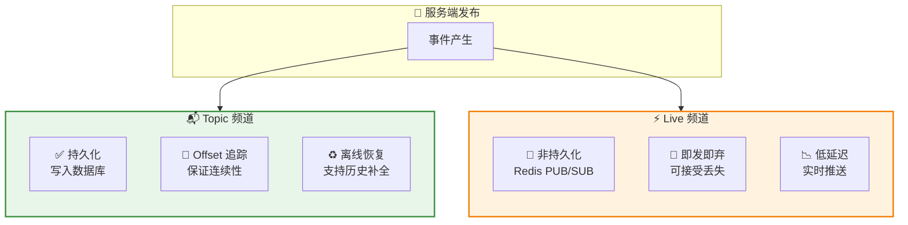
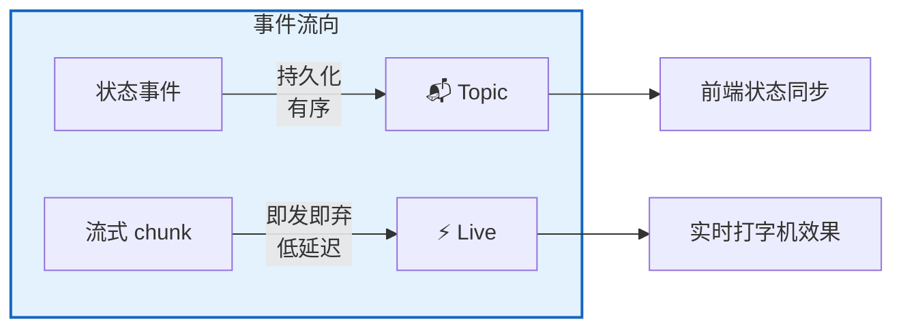
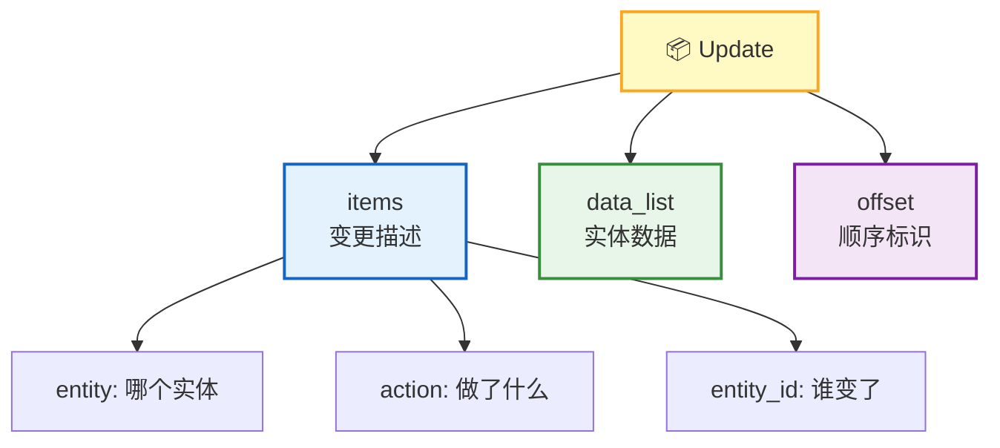
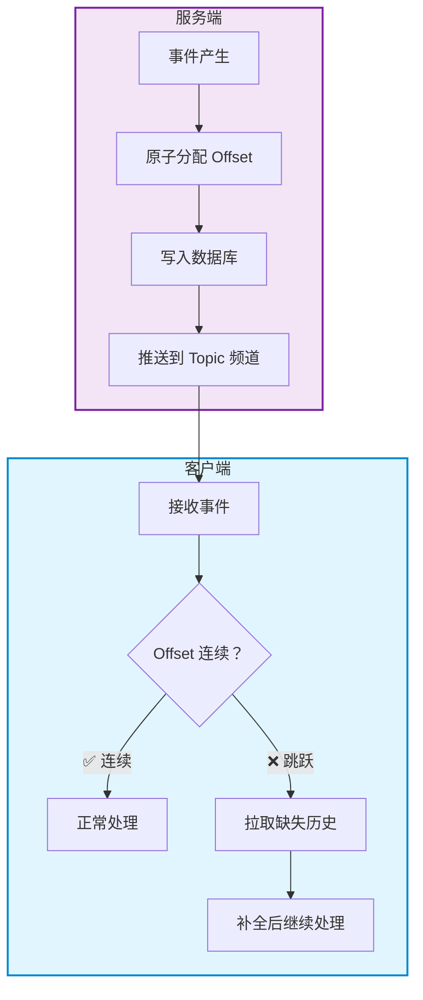
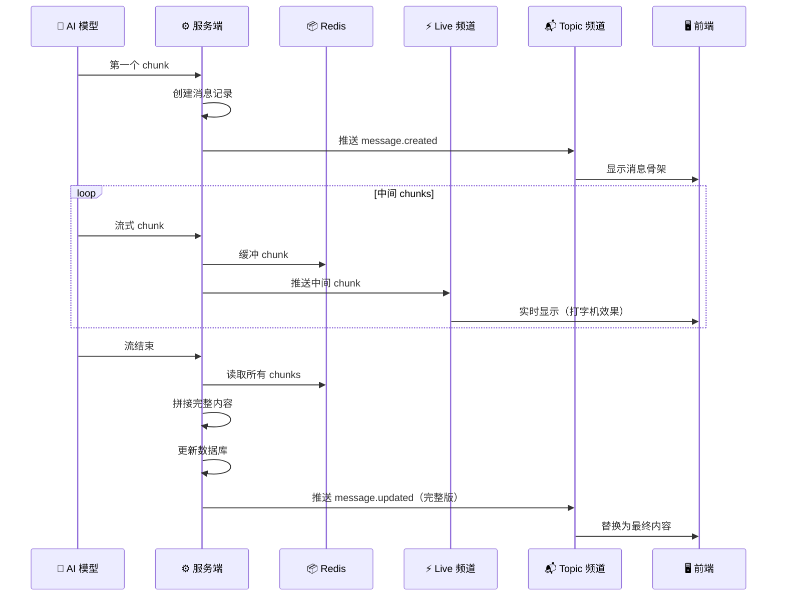
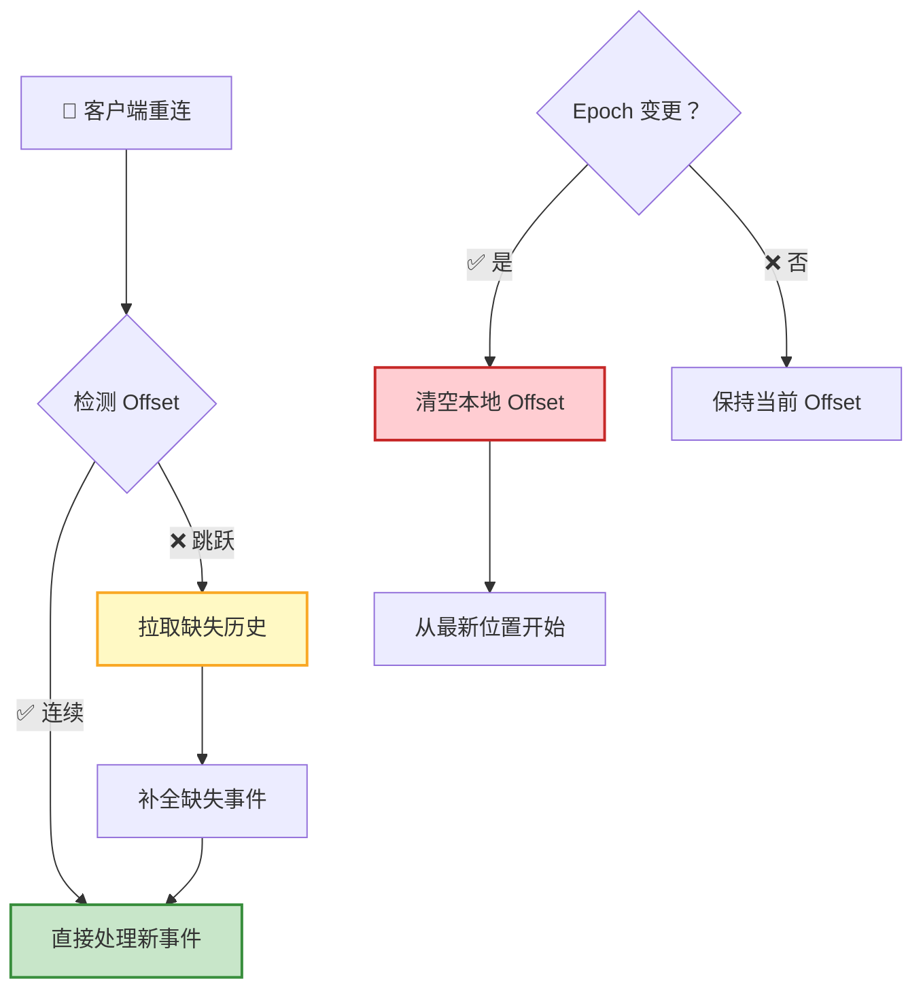
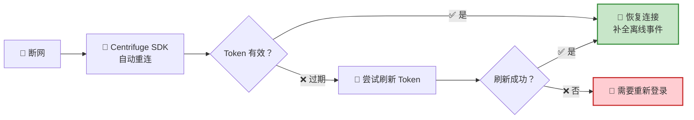

RTC Agent 通过 **Centrifuge WebSocket** 推送实时事件，采用 **双频道架构**：Topic 频道保证可靠性，Live 频道提供低延迟。前端收到事件后更新本地状态，实现前后端的实时同步。

## 双频道架构



| 频道 | 标识 | 存储 | 用途 | 特点 |
|------|------|:----:|------|------|
| **Topic** | `topic:u=<userID>` | 持久化 | 状态变更事件 | 可靠、有序、支持离线恢复 |
| **Live** | `live:u=<userID>` | 非持久化 | 流式消息中间 chunks | 低延迟、即发即弃 |

> 💡 **为什么需要两个频道？** 状态变更（如消息创建、Turn 完成）不能丢失——需要持久化和顺序保证。但流式输出的中间 chunk 只需要"尽快到达"——丢了也不要紧，因为最终会收到完整消息。分开处理，各取所长。

---

## 事件分布

| 事件类型 | Topic 频道 | Live 频道 | 说明 |
|---------|:----------:|:---------:|------|
| `session.created` | ✅ | ❌ | 会话创建 |
| `session.updated` | ✅ | ❌ | 会话更新（标题、状态等） |
| `turn.created` | ✅ | ❌ | Turn 创建 |
| `turn.updated` | ✅ | ❌ | Turn 状态变更 |
| `message.created` | ✅ | ❌ | 消息创建 |
| `message.updated`（流完成） | ✅ | ❌ | 流式消息的最终完整版本 |
| `message.updated`（流中间 chunk） | ❌ | ✅ | 打字机效果的实时片段 |
| `rtc.created` | ❌ | ❌ | 预留（当前未发出） |
| `rtc.updated` | ✅ | ❌ | RTC 状态变更 |



---

## Update 模型

每个事件都是一个 **Update**——描述实体（Session / Turn / Message / RTC）的变化：

```json
{
  "id": "update-uuid",
  "items": [
    { "entity": "message", "action": "created", "entity_id": "msg-uuid" }
  ],
  "data_list": [{ "id": "msg-uuid", "role": "assistant", "..." : "..." }],
  "offset": 42
}
```

| 字段 | 类型 | 说明 |
|------|:----:|------|
| `id` | UUID | Update 唯一标识 |
| `items` | array | 变化条目列表 |
| `items[].entity` | string | 实体类型：`session` / `turn` / `message` / `rtc`（`file` 为预留，当前未使用） |
| `items[].action` | string | 操作类型：`created` / `updated`（`deleted` 为预留，当前未使用；删除通过 `data_list` 中的 `deleted_at` 表达） |
| `items[].entity_id` | UUID | 实体 ID |
| `data_list` | array | 实体完整数据（可选，与 items 一一对应） |
| `offset` | integer | 用户维度单调递增偏移量 |



---

## Offset 机制

**Offset** 是事件可靠性的核心保障——每个 Topic 事件分配严格递增的 Offset，客户端通过检测 Offset 连续性发现丢失的事件。



| 特性 | 说明 |
|------|------|
| **单调递增** | 同一用户的 Topic 事件 Offset 严格递增 |
| **连续性检测** | 客户端发现 Offset 跳跃时自动补全 |
| **持久化** | Offset 存储在 IndexedDB，页面刷新后恢复 |
| **Epoch 机制** | 历史数据被清理时 Epoch 变更，客户端从最新位置开始 |
| **Gap 占位** | 离线恢复时，服务端发送 `{"type": "gap", "data": {}}` 事件填充 Offset 空洞，客户端收到后只推进 Offset，不做业务处理 |

> 💡 **类比**：Offset 就像邮件的编号。如果你收到了第 1、2、4 封信，你会意识到第 3 封丢了——然后去邮局补领。

---

## 流式消息流程

AI 回复采用流式输出，中间 chunks 通过 Live 频道实时推送，最终完整消息通过 Topic 频道保证可靠性。



| 阶段 | 频道 | 行为 |
|------|:----:|------|
| **首 chunk** | Topic | 创建消息记录，推送 `message.created`，同时写入 Redis 缓冲 |
| **中间 chunks** | Live | 追加到 Redis 缓冲，推送到 Live 频道实时显示 |
| **流结束** | Topic | 从 Redis 读取所有 chunks 拼接完整内容，更新数据库，推送 `message.updated` |

---

## 离线恢复

客户端断网重连后，系统自动检测 Offset 并补全缺失的事件。



| 场景 | 行为 | 用户感知 |
|------|------|----------|
| **短暂断网** | 自动推送离线期间的消息 | 无缝，消息自动出现 |
| **长时间断网** | 检测 Offset 跳跃，拉取历史 | 短暂加载后消息补齐 |
| **历史被清理** | Epoch 变更，从最新位置开始 | 历史消息不再显示 |

## 重连行为



| 组件 | 职责 |
|------|------|
| **Centrifuge SDK** | 自动重连、Token 刷新 |
| **IndexedDB** | 持久化 Offset，页面刷新后恢复 |
| **Topic 频道** | 保证离线事件不丢失 |

## 下一步

- [WebSocket RPC](/docs/protocol/rpc/) — 了解如何通过 RPC 执行业务操作
- [Remote Tool Calling](/docs/concepts/rtc/) — 了解 RTC 工具调用的完整生命周期
- [协议总览](/docs/protocol/) — 返回协议全景
