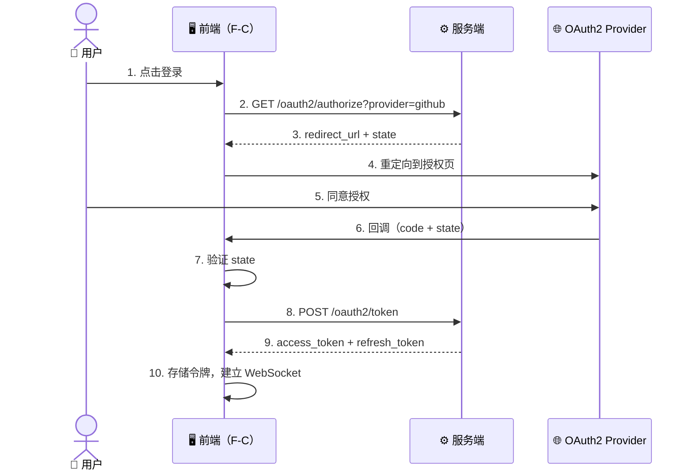
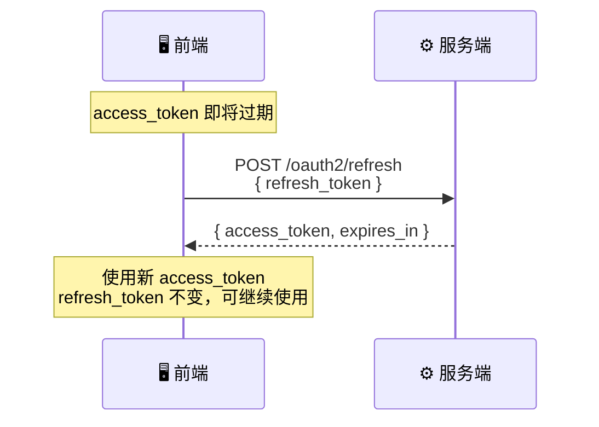
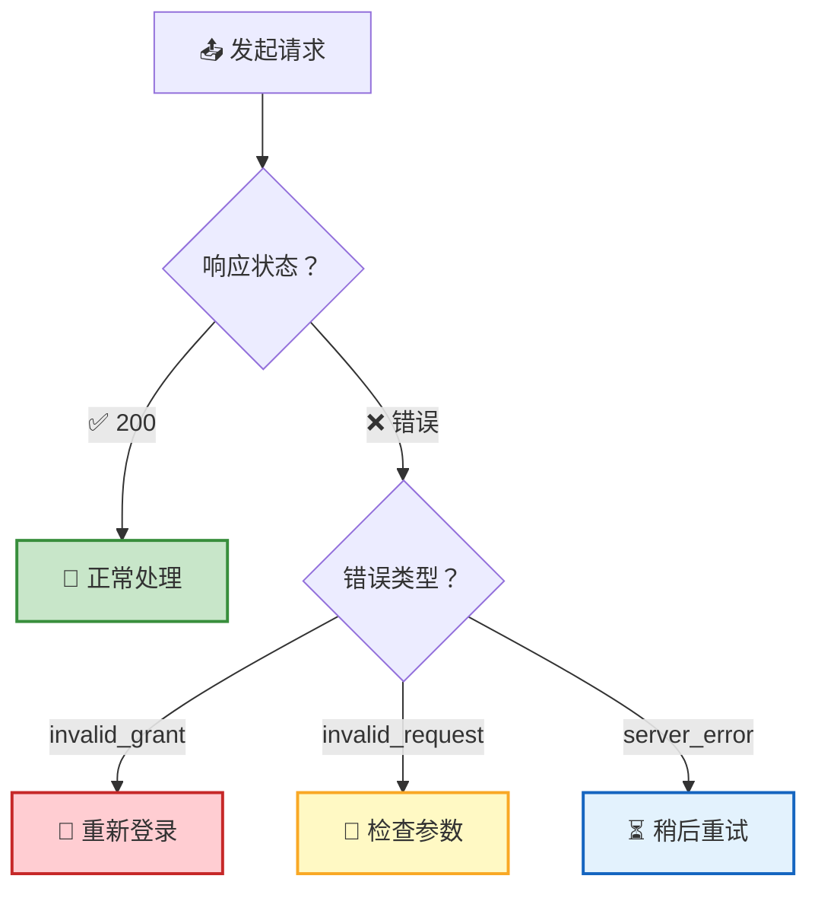

RTC Agent 的 HTTP API 提供 **3 个 OAuth2 端点**，处理用户认证和令牌管理。整个流程遵循标准 OAuth2 授权码模式，兼容 GitHub、Google 等常见 Provider。

## 认证流程



> 💡 **设计要点**：前端（F-C）调用 `/oauth2/authorize` 获取重定向 URL，将用户引导至 OAuth2 Provider 的授权页面。授权完成后，Provider 回调前端，前端拿到授权码后调用 `/oauth2/token` 完成令牌交换。

## 端点一览

| 端点 | 方法 | 功能 | 调用时机 |
|------|:----:|------|----------|
| `/oauth2/authorize` | GET | 获取授权重定向 URL | 用户点击登录 |
| `/oauth2/token` | POST | 授权码换取令牌 | 授权回调后 |
| `/oauth2/refresh` | POST | 刷新 access_token | 令牌即将过期 |

---

## GET /oauth2/authorize

获取 OAuth2 授权页面的重定向 URL。前端拿到 URL 后将用户引导至 Provider 的授权页面。

### 请求参数

| 参数 | 位置 | 必填 | 类型 | 说明 |
|------|:----:|:----:|:----:|------|
| `provider` | query | ✅ | string | OAuth2 Provider 名称（如 `"github"`） |
| `redirect_uri` | query | ❌ | string | 授权完成后的回调地址（可选，部分 Provider 需要） |

### 响应

```json
{
  "redirect_url": "https://github.com/login/oauth/authorize?client_id=xxx&state=yyy",
  "state": "a1b2c3d4e5"
}
```

| 字段 | 类型 | 说明 |
|------|:----:|------|
| `redirect_url` | string | OAuth2 Provider 授权页面的完整 URL |
| `state` | string | CSRF 防护随机状态参数，回调时必须原样传回 |

---

## POST /oauth2/token

使用授权码（Authorization Code）换取 access_token 和 refresh_token。这是 OAuth2 授权码流程的核心步骤。

### 请求体

```json
{
  "code": "auth_code_from_callback",
  "redirect_uri": "https://your-app.com/callback",
  "state": "a1b2c3d4e5",
  "device_id": "uuid-generated-by-client",
  "device_name": "Chrome on Mac",
  "user_agent": "Mozilla/5.0 ..."
}
```

| 字段 | 必填 | 类型 | 说明 |
|------|:----:|:----:|------|
| `code` | ✅ | string | 授权码，由授权回调 URL 的 query 参数携带 |
| `redirect_uri` | ❌ | string | 回调地址，建议与授权请求中的一致 |
| `state` | ✅ | string | CSRF 防护 state，必须与授权请求中的 state 一致且仅使用一次 |
| `device_id` | ❌ | string | 前端生成的设备 UUID，用于标识客户端设备 |
| `device_name` | ❌ | string | 设备显示名称，如 `"Chrome on Mac"` |
| `user_agent` | ❌ | string | 客户端 User-Agent，用于设备识别 |

### 响应

```json
{
  "access_token": "eyJhbGciOi...",
  "refresh_token": "dGhpcyBpcyBh...",
  "expires_in": 3600,
  "user_id": "user-uuid"
}
```

| 字段 | 类型 | 说明 |
|------|:----:|------|
| `access_token` | string | JWT access token，有效期由 `expires_in` 指定 |
| `refresh_token` | string | refresh token，用于在 access_token 过期后换取新 token |
| `expires_in` | integer | access token 过期时间（秒），通常为 **3600**（1 小时） |
| `user_id` | string | 已认证用户的唯一 ID |

### 令牌刷新



> 💡 **Refresh Token 复用**：refresh_token 在有效期内可**多次使用**，每次返回新的 access_token。refresh_token 本身不会被替换或撤销，直到自然过期（默认 30 天）。

---

## POST /oauth2/refresh

使用 refresh_token 换取新的 access_token。refresh_token 在有效期内可重复使用。

### 请求体

```json
{
  "refresh_token": "dGhpcyBpcyBh..."
}
```

| 字段 | 必填 | 类型 | 说明 |
|------|:----:|:----:|------|
| `refresh_token` | ✅ | string | refresh token，有效期内可重复使用 |

### 响应

```json
{
  "access_token": "eyJhbGciOi...(new)",
  "expires_in": 3600
}
```

| 字段 | 类型 | 说明 |
|------|:----:|------|
| `access_token` | string | 新的 JWT access token |
| `expires_in` | integer | 新 access token 过期时间（秒） |

---

## 错误处理

所有端点在出错时返回统一的错误格式：

```json
{
  "error": "invalid_grant",
  "error_description": "Authorization code has expired"
}
```

| 错误码 | HTTP 状态码 | 说明 | 常见原因 |
|--------|:----------:|------|----------|
| `invalid_request` | 400 | 请求参数无效 | 缺少必填字段、格式错误 |
| `invalid_client` | 400 | 客户端认证失败 | Provider 配置错误 |
| `invalid_grant` | 401 | 授权码无效或已过期 | 授权码已使用或超过有效期 |
| `server_error` | 500 | 服务器内部错误 | 服务端异常 |

> 💡 **Content-Type 支持**：POST 端点（`/oauth2/token` 和 `/oauth2/refresh`）同时支持 `application/json` 和 `application/x-www-form-urlencoded` 两种请求格式。



## 下一步

- [WebSocket RPC](/docs/protocol/rpc/) — 认证完成后，通过 WebSocket 进行业务操作
- [实时事件](/docs/protocol/events/) — 了解实时事件推送机制
- [协议总览](/docs/protocol/) — 返回协议全景
