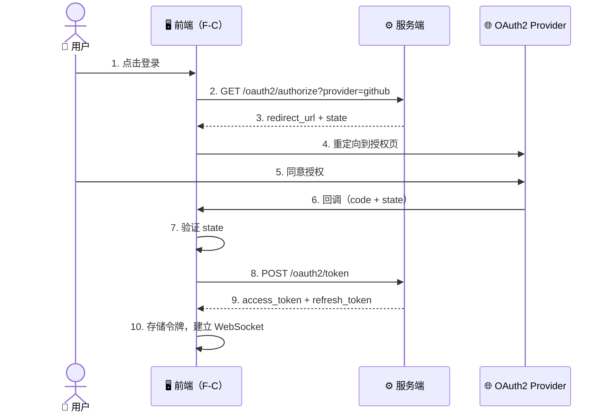
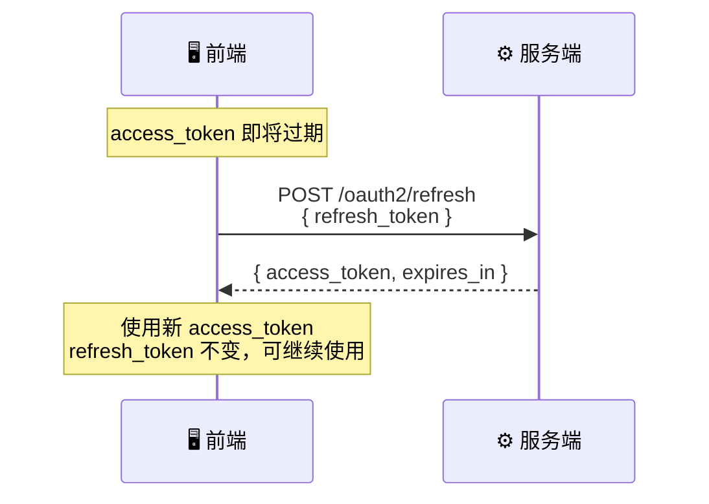
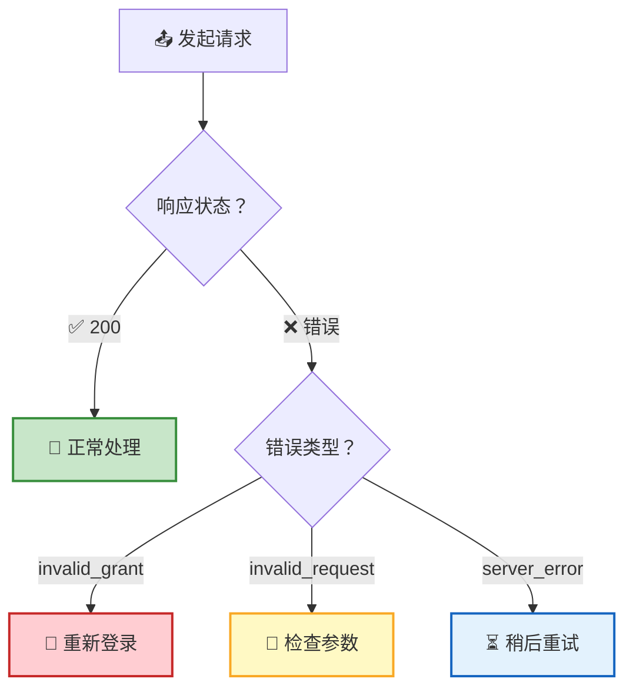
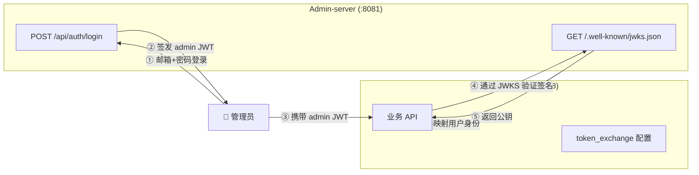

RTC Agent 的 HTTP API 包含三类端点：**OAuth2 认证**处理用户登录和令牌管理，**运维端点**提供健康检查和指标采集，**业务端点**支持中断应答与记忆导出。认证流程遵循标准 OAuth2 授权码模式，兼容 GitHub、Google 等常见 Provider。

## 端点一览

### OAuth2 认证端点

| 端点                                | 方法 | 功能                                     | 调用时机               |
| ----------------------------------- | ---- | ---------------------------------------- | ---------------------- |
| `/oauth2/authorize`                 | GET  | 获取授权重定向 URL                       | 用户点击登录           |
| `/oauth2/providers`                 | GET  | 获取已启用的 OAuth Provider 列表         | 前端初始化登录页       |
| `/oauth2/token`                     | POST | 授权码换取令牌 / RFC 8693 Token Exchange | 授权回调后 / 外部 JWT 换取 |
| `/oauth2/refresh`                   | POST | 刷新 access_token                        | 令牌即将过期           |

### Admin-server 端点（独立服务，端口 8081）

| 端点                           | 方法 | 功能                                | 认证       |
| ------------------------------ | ---- | ----------------------------------- | ---------- |
| `/api/auth/login`              | POST | 管理员邮箱密码登录                  | 无需认证   |
| `/api/auth/refresh`            | POST | 刷新 admin access_token             | 无需认证   |
| `/api/auth/me`                 | GET  | 获取当前管理员信息                  | Admin JWT  |
| `/api/auth/logout`             | POST | 登出，撤销 refresh_token            | Admin JWT  |
| `/.well-known/jwks.json`       | GET  | JWKS 公钥集合（供主服务器验证 JWT） | 无需认证   |
| `/health`                      | GET  | 健康检查                            | 无需认证   |

> 💡 Admin-server 是独立服务，通过 RFC 8693 Token Exchange 机制与主服务器集成。管理员登录 admin-server 后，其 JWT 可被主服务器识别为合法用户身份。详见下文 [Admin-server 认证](#admin-server-认证)。

**运维端点**（无需 JWT 认证）：`/healthz`（健康检查）、`/readyz`（就绪检查）、`/metrics`（Prometheus 指标）。

> 📌 **安全变更**：生产环境中 `/metrics` 和 debug 端点**强制**要求认证，未配置时将直接禁用。Server 还自动为 OAuth2 端点启用 IP 限流（5 req/s，突发 10），并添加 HSTS 和 Permissions-Policy 安全头。

**业务端点**（需要 JWT 认证）：`/api/sessions/{sessionID}/interrupts/{interruptID}/answer`（提交中断应答）、`/api/memories/export`（导出记忆数据）、`/api/credentials/temporary`（获取 S3 临时凭证）、`/api/presigned-url`（生成预签名 URL）。

## 认证流程


```mermaid
sequenceDiagram
    actor User as 👤 用户
    participant FE as 🖥️ 前端（F-C）
    participant Server as ⚙️ 服务端
    participant Provider as 🌐 OAuth2 Provider

    User->>FE: 1. 点击登录
    FE->>Server: 2. GET /oauth2/authorize?provider=github
    Server-->>FE: 3. redirect_url + state
    FE->>Provider: 4. 重定向到授权页
    User->>Provider: 5. 同意授权
    Provider->>FE: 6. 回调（code + state）
    FE->>FE: 7. 验证 state
    FE->>Server: 8. POST /oauth2/token
    Server-->>FE: 9. access_token + refresh_token
    FE->>FE: 10. 存储令牌，建立 WebSocket
```

> 💡 **设计要点**：前端（F-C）调用 `/oauth2/authorize` 获取重定向 URL，将用户引导至 OAuth2 Provider 的授权页面。授权完成后，Provider 回调前端，前端拿到授权码后调用 `/oauth2/token` 完成令牌交换。

---

## GET /oauth2/authorize

获取 OAuth2 授权页面的重定向 URL。前端拿到 URL 后将用户引导至 Provider 的授权页面。

### 请求参数

| 参数 | 位置 | 必填 | 类型 | 说明 |
|------|:----:|:----:|:----:|------|
| `provider` | query | ✅ | string | OAuth2 Provider 名称（如 `"github"`） |
| `redirect_uri` | query | ❌ | string | 授权完成后的回调地址（可选，部分 Provider 需要） |
| `code_challenge` | query | ❌ | string | PKCE code_challenge（RFC 7636），由 `code_verifier` 经 SHA-256 + base64url 编码得到 |
| `code_challenge_method` | query | ❌ | string | PKCE challenge 方法，推荐 `S256`（默认），也支持 `plain` |

### 响应

```json
{
  "redirect_url": "https://github.com/login/oauth/authorize?client_id=xxx&state=yyy",
  "state": "a1b2c3d4e5"
}
```

| 字段 | 类型 | 说明 |
|------|:----:|------|
| `redirect_url` | string | OAuth2 Provider 授权页面的完整 URL |
| `state` | string | CSRF 防护随机状态参数，回调时必须原样传回 |

---

## GET /oauth2/providers

获取当前已启用的 OAuth2 Provider 列表。前端在初始化登录页时调用此端点，动态展示可用的登录选项。

### 请求参数

无。

### 响应

```json
{
  "providers": ["github", "google"]
}
```

| 字段 | 类型 | 说明 |
|------|:----:|------|
| `providers` | string[] | 已启用的 Provider 名称列表（如 `"github"`、`"google"`、`"mock"`） |

> 💡 前端根据返回的 provider 列表动态渲染登录按钮。如果只启用了 mock provider，则列表为 `["mock"]`。

---

## POST /oauth2/token

使用授权码（Authorization Code）换取 access_token 和 refresh_token。这是 OAuth2 授权码流程的核心步骤。

### 请求体

```json
{
  "code": "auth_code_from_callback",
  "redirect_uri": "https://your-app.com/callback",
  "state": "a1b2c3d4e5",
  "device_id": "uuid-generated-by-client",
  "device_name": "Chrome on Mac",
  "user_agent": "Mozilla/5.0 ..."
}
```

| 字段 | 必填 | 类型 | 说明 |
|------|:----:|:----:|------|
| `code` | ✅ | string | 授权码，由授权回调 URL 的 query 参数携带 |
| `redirect_uri` | ❌ | string | 回调地址，建议与授权请求中的一致 |
| `state` | ✅ | string | CSRF 防护 state，必须与授权请求中的 state 一致且仅使用一次 |
| `device_id` | ❌ | string | 前端生成的设备 UUID，用于标识客户端设备 |
| `device_name` | ❌ | string | 设备显示名称，如 `"Chrome on Mac"` |
| `user_agent` | ❌ | string | 客户端 User-Agent，用于设备识别 |
| `code_verifier` | ❌ | string | PKCE code_verifier（RFC 7636），授权请求时传入 `code_challenge`，交换时传入原始 verifier |

> 📌 **PKCE 约束**：如果授权请求中携带了 `code_challenge`，则令牌交换时 `code_verifier` 变为**必填**，服务端将验证 `code_verifier` 与 `code_challenge` 的匹配性。

### 响应

```json
{
  "access_token": "eyJhbGciOi...",
  "refresh_token": "dGhpcyBpcyBh...",
  "expires_in": 3600,
  "user_id": "user-uuid"
}
```

| 字段 | 类型 | 说明 |
|------|:----:|------|
| `access_token` | string | JWT access token，有效期由 `expires_in` 指定 |
| `refresh_token` | string | refresh token，用于在 access_token 过期后换取新 token |
| `expires_in` | integer | access token 过期时间（秒），通常为 **3600**（1 小时） |
| `user_id` | string | 已认证用户的唯一 ID |

### 令牌刷新


```mermaid
sequenceDiagram
    participant FE as 🖥️ 前端
    participant Server as ⚙️ 服务端

    Note over FE: access_token 即将过期
    FE->>Server: POST /oauth2/refresh<br/>{ refresh_token }
    Server-->>FE: { access_token, expires_in }
    Note over FE: 使用新 access_token<br/>refresh_token 不变，可继续使用
```

> 💡 **Refresh Token 复用**：refresh_token 在有效期内可**多次使用**，每次返回新的 access_token。refresh_token 本身不会被替换或撤销，直到自然过期（默认 30 天）。

---

## POST /oauth2/token（Token Exchange — RFC 8693）

`POST /oauth2/token` 同时支持授权码换取令牌和 RFC 8693 Token Exchange 两种模式，通过 `grant_type` 区分。当 `grant_type` 为 `urn:ietf:params:oauth:grant-type:token-exchange` 时，进入 Token Exchange 模式——将外部 JWT（如 admin-server 签发的管理员 JWT）换取 RTC 主服务器的 access_token。

> 💡 **完整集成指南**：本节仅包含 API 协议细节。如需了解完整的 Token Exchange 集成流程（包括如何签发 JWT、配置 JWKS 端点、前端配置等），请参阅 [认证与授权 - Token Exchange 完整指南](/docs/integration/auth/#token-exchange-完整集成指南)。

### 请求体

```json
{
  "grant_type": "urn:ietf:params:oauth:grant-type:token-exchange",
  "subject_token": "eyJhbGciOi...(外部 JWT)",
  "subject_token_type": "urn:ietf:params:oauth:token-type:access_token",
  "device_id": "uuid-generated-by-client"
}
```

| 字段 | 必填 | 类型 | 说明 |
|------|:----:|:----:|------|
| `grant_type` | ✅ | string | 必须为 `urn:ietf:params:oauth:grant-type:token-exchange` |
| `subject_token` | ✅ | string | 外部 JWT（由受信任的签发方签发） |
| `subject_token_type` | ✅ | string | 令牌类型，通常为 `urn:ietf:params:oauth:token-type:access_token` |
| `device_id` | ✅ | string | RTC Agent 扩展字段，客户端设备 UUID（嵌入到签发的 JWT 中） |

> 💡 同时支持 `application/json` 和 `application/x-www-form-urlencoded` 两种 Content-Type。

### 响应

```json
{
  "access_token": "eyJhbGciOi...(RTC JWT)",
  "issued_token_type": "urn:ietf:params:oauth:token-type:access_token",
  "token_type": "Bearer",
  "expires_in": 3600
}
```

| 字段 | 类型 | 说明 |
|------|:----:|------|
| `access_token` | string | RTC 主服务器签发的 JWT，有效期由 `expires_in` 指定 |
| `issued_token_type` | string | 固定为 `urn:ietf:params:oauth:token-type:access_token` |
| `token_type` | string | 固定为 `Bearer` |
| `expires_in` | integer | access token 过期时间（秒），通常为 **3600**（1 小时） |

### 错误码

Token Exchange 错误响应遵循标准 OAuth2 错误格式：

```json
{
  "error": "invalid_grant",
  "error_description": "Invalid subject_token"
}
```

| HTTP 状态码 | `error` 值 | 含义 |
| :---: | --- | --- |
| 400 | `invalid_request` | 缺少必填字段或 grant_type 不正确 |
| 400 | `invalid_grant` | subject_token 无效、JWT 签名验证失败或签发方不受信任 |
| 401 | `invalid_grant` | JWT 验证失败且无法刷新 JWKS |
| 500 | `server_error` | 服务端内部错误 |
| 503 | `temporarily_unavailable` | 身份提供方暂时不可用（JWKS 端点无法访问） |

> 💡 **错误格式说明**：Token Exchange 端点使用标准 OAuth2 错误格式（`error` + `error_description`），与 `/oauth2/token` 的其他模式保持一致。这与 Admin-server 端点使用的统一响应格式（`success` + `errorCode` + `errorMessage`，始终返回 HTTP 200）不同。
>
> 📌 **前置条件**：主服务器需在 `config.yaml` 中配置 `token_exchange.external_issuers` 以信任对应的 JWT 签发方。详见 [Admin-server 认证](#admin-server-认证)。

---

## POST /oauth2/refresh

使用 refresh_token 换取新的 access_token。refresh_token 在有效期内可重复使用。

### 请求体

```json
{
  "refresh_token": "dGhpcyBpcyBh..."
}
```

| 字段 | 必填 | 类型 | 说明 |
|------|:----:|:----:|------|
| `refresh_token` | ✅ | string | refresh token，有效期内可重复使用 |

### 响应

```json
{
  "access_token": "eyJhbGciOi...(new)",
  "expires_in": 3600
}
```

| 字段 | 类型 | 说明 |
|------|:----:|------|
| `access_token` | string | 新的 JWT access token |
| `expires_in` | integer | 新 access token 过期时间（秒） |

---

## 错误处理

所有端点在出错时返回统一的错误格式：

```json
{
  "error": "invalid_grant",
  "error_description": "Authorization code has expired"
}
```

| 错误码 | HTTP 状态码 | 说明 | 常见原因 |
|--------|:----------:|------|----------|
| `invalid_request` | 400 | 请求参数无效 | 缺少必填字段、格式错误 |
| `invalid_client` | 400 | 客户端认证失败 | Provider 配置错误 |
| `invalid_grant` | 401 | 授权码无效或已过期 | 授权码已使用或超过有效期 |
| `server_error` | 500 | 服务器内部错误 | 服务端异常 |

> 💡 **Content-Type 支持**：POST 端点（`/oauth2/token` 和 `/oauth2/refresh`）同时支持 `application/json` 和 `application/x-www-form-urlencoded` 两种请求格式。


```mermaid
flowchart TD
    A["📤 发起请求"] --> B{"响应状态？"}
    B -->|"✅ 200"| C["🎉 正常处理"]
    B -->|"❌ 错误"| D{"错误类型？"}
    D -->|"invalid_grant"| E["🔄 重新登录"]
    D -->|"invalid_request"| F["🔧 检查参数"]
    D -->|"server_error"| G["⏳ 稍后重试"]

    style C fill:#c8e6c9,stroke:#388e3c,stroke-width:2px
    style E fill:#ffcdd2,stroke:#c62828,stroke-width:2px
    style F fill:#fff9c4,stroke:#f9a825,stroke-width:2px
    style G fill:#e3f2fd,stroke:#1565c0,stroke-width:2px
```

---

## 运维端点

运维端点无需 JWT 认证，供基础设施层调用。

### GET /healthz

健康检查端点，用于负载均衡器和 Kubernetes liveness probe。

**响应**：

```json
{"status": "ok"}
```

### GET /readyz

就绪检查端点，用于 Kubernetes readiness probe。仅当服务完全启动并可接收请求时返回 200。会检查数据库、Redis 和 Centrifuge 的连接状态。

**响应**（服务就绪时）：

```json
{
  "status": "ready",
  "checks": {
    "db": "ok",
    "redis": "ok",
    "centrifuge": "ok"
  }
}
```

**响应**（服务未就绪时，HTTP 503）：

```json
{
  "status": "not ready",
  "checks": {
    "db": "ok",
    "redis": "error",
    "centrifuge": "not configured"
  }
}
```

| 字段                | 类型   | 说明                                                       |
| ------------------- | ------ | ---------------------------------------------------------- |
| `status`            | string | 整体状态：`"ready"` 或 `"not ready"`                       |
| `checks`            | object | 各依赖组件的检查结果                                       |
| `checks.db`         | string | 数据库连接状态：`"ok"` 或 `"error"`                        |
| `checks.redis`      | string | Redis 连接状态：`"ok"` 或 `"error"`                        |
| `checks.centrifuge` | string | Centrifuge 状态：`"ok"`、`"error"` 或 `"not configured"`   |

### GET /metrics

Prometheus 指标端点，暴露服务运行指标，供监控系统（Prometheus / Grafana）采集。

**响应**：`text/plain` 格式的 Prometheus 指标。

**认证**：Basic Auth，通过 `metrics.user` 和 `metrics.password` 配置。生产环境**必须**配置认证，否则 `/metrics` 端点将被直接禁用；开发环境未配置时仍可访问。

> 💡 完整的 Prometheus 指标列表、Grafana 仪表盘和告警规则参见 [可观测性监控](/docs/operations/monitoring/)。

---

## 业务端点

业务端点需要 JWT 认证（`Authorization: Bearer <token>` 请求头）。开发模式下支持 `X-User-ID` / `X-Device-ID` 请求头旁路。

### POST /api/sessions/{sessionID}/interrupts/{interruptID}/answer

提交中断应答。当 AI 在执行过程中遇到需要用户决策的问题时，会通过中断机制暂停并向前端发送提问。前端收集用户回答后，通过此端点提交。

**路径参数**：

| 参数           | 类型   | 说明                         |
| -------------- | ------ | ---------------------------- |
| `sessionID`    | UUID   | 会话 ID                      |
| `interruptID`  | string | 中断 ID（由中断事件携带）    |

**请求体**：

```json
{
  "answer": "用户对中断问题的回答"
}
```

| 字段     | 必填 | 类型   | 说明           |
| -------- | ---- | ------ | -------------- |
| `answer` | ✅   | string | 用户的回答内容 |

**响应**：成功时返回 202 Accepted，响应体为 `{"status": "accepted"}`。

> 💡 内部实现使用 Redis 的 `SET+PUBLISH` 模式将应答投递给等待中的中断处理协程，确保应答不丢失。详见 [中断处理流程](/docs/features/messaging/)。

### POST /api/memories/export

导出记忆数据为 OKF（Open Knowledge Format）bundle。支持按范围（会话 / 用户 / 全局）、类型、标签过滤。

**请求体**：

```json
{
  "scope": "user",
  "scopeId": "user-uuid",
  "format": "okf-bundle",
  "types": ["user", "feedback"],
  "tags": ["work"],
  "includeLog": false
}
```

| 字段           | 必填 | 类型       | 说明                                                     |
| -------------- | ---- | ---------- | -------------------------------------------------------- |
| `scope`        | ✅   | string     | 导出范围：`session` / `user` / `global`                  |
| `scopeId`      | ✅   | string     | 范围对应的 ID（session UUID / user UUID / 空字符串）     |
| `format`       | ✅   | string     | 导出格式，当前仅支持 `okf-bundle`                        |
| `types`        | —    | string[]   | 按记忆类型过滤（可选）                                   |
| `tags`         | —    | string[]   | 按标签过滤（可选）                                       |
| `includeLog`   | —    | boolean    | 是否生成 log.md（默认 false）                            |

**响应**：`Content-Type: application/gzip`，返回 gzip 压缩的 OKF bundle 流。

> 💡 由于采用流式响应，一旦开始写入响应体后发生错误，将无法返回 JSON 错误响应。客户端应通过 HTTP 状态码和 `Content-Length` 判断导出是否成功。
>
> 📌 OKF bundle 中的时间戳统一使用 **UTC 时区**，格式为 RFC 3339（如 `2026-09-26T08:30:00Z`）。

---

## Admin-server 认证

Admin-server 是独立于主服务器的管理服务，提供管理员登录、用户管理等功能。管理员通过 admin-server 登录后获得 JWT，该 JWT 可通过 RFC 8693 Token Exchange 机制被主服务器识别。

> 💡 **完整集成指南**：本节仅包含 Admin-server 的 API 协议细节。如需了解完整的 Token Exchange 集成流程（包括架构、配置、JWT 签发、JWKS 端点等），请参阅 [认证与授权 - Token Exchange 完整指南](/docs/integration/auth/#token-exchange-完整集成指南)。

### 架构关系


```mermaid
flowchart LR
    subgraph Admin["Admin-server (:8081)"]
        LOGIN["POST /api/auth/login"]
        JWKS["GET /.well-known/jwks.json"]
    end

    subgraph Main["Main Server (:8888)"]
        TE["token_exchange 配置"]
        API["业务 API"]
    end

    AdminUser["👤 管理员"] -->|"① 邮箱+密码登录"| LOGIN
    LOGIN -->|"② 签发 admin JWT"| AdminUser
    AdminUser -->|"③ 携带 admin JWT"| API
    API -->|"④ 通过 JWKS 验证签名"| JWKS
    JWKS -->|"⑤ 返回公钥"| API
    API -->|"⑥ 验证通过，映射用户身份"| Main
```

### 主服务器配置

在主服务器的 `config.yaml` 中配置 `token_exchange` 以信任 admin-server 签发的 JWT：

```yaml
token_exchange:
  external_issuers:
    - name: "admin-server"
      issuer: "http://admin-server:8081"       # admin-server 地址
      jwks_uri: "http://admin-server:8081/.well-known/jwks.json"
      allowed_algorithms: ["RS256", "ES256"]
      cache_ttl: 3600
      claims_mapping:
        sub: "sub"
        email: "email"
        name: "name"
        avatar_url: "picture"
```

| 字段 | 说明 |
| --- | --- |
| `name` | issuer 标识名称 |
| `issuer` | JWT `iss` claim 必须匹配的值 |
| `jwks_uri` | JWKS 公钥端点地址 |
| `allowed_algorithms` | 允许的签名算法（推荐 ES256 或 RS256） |
| `cache_ttl` | JWKS 公钥缓存时间（秒） |
| `claims_mapping` | JWT claims 到用户字段的映射 |

### JWT 密钥管理

Admin-server 使用非对称密钥签名 JWT，支持 RS256 / ES256 / EdDSA 等算法。主服务器通过 JWKS 端点获取公钥进行验证，无需共享密钥。

```bash
# 方式一：使用 admin keygen 子命令（推荐）
./bin/rtc-agent admin keygen                        # 默认 RS256
./bin/rtc-agent admin keygen --algorithm ES256      # ES256（推荐用于生产）
./bin/rtc-agent admin keygen --algorithm EdDSA      # EdDSA（Ed25519）
./bin/rtc-agent admin keygen --force                 # 强制覆盖已有密钥

# 方式二：使用脚本（兼容旧版）
./scripts/generate-keys.sh all     # RS256 + ES256
./scripts/generate-keys.sh es256   # 仅 ES256

# 自动模式（Docker 部署时自动生成）
# Docker 容器首次启动时，docker-entrypoint.sh 会自动检测并生成 RS256 密钥对
# 密钥存储在 Docker named volume（full-admin-server-keys）中，跨重启持久化
# 生产环境建议使用持久化密钥，避免重启后所有 JWT 失效
```

| 环境 | 密钥存储建议 |
| --- | --- |
| 开发 | 本地 `etc/keys/` 目录（已在 `.gitignore` 中排除 `*.pem`） |
| Docker | Named volume `full-admin-server-keys`（自动生成，跨重启持久化） |
| 生产 | KMS 服务（AWS KMS / 阿里云凭据管家 / HashiCorp Vault） |

> 💡 建议每 90 天轮换密钥。轮换时保留旧公钥 24-48 小时以兼容已签发的 token，详见 `etc/keys/README.md`。

### Admin-server 端点详情

> 💡 Admin-server 使用 Ant Design Pro 统一响应格式：成功时 `{ "success": true, "data": {...} }`，失败时 `{ "success": false, "errorCode": "...", "errorMessage": "..." }`（HTTP 状态码始终为 200）。
>
> 📌 **例外**：`/health` 健康检查端点在数据库不可用时返回 HTTP 503（而非 200），以便负载均衡器和 Kubernetes 探针正确识别服务状态。

#### POST /api/auth/login

管理员邮箱密码登录。

**请求体**：

```json
{
  "email": "admin@example.com",
  "password": "your-password"
}
```

**成功响应**（200）：

```json
{
  "success": true,
  "data": {
    "access_token": "eyJhbGciOi...",
    "refresh_token": "dGhpcyBpcyBh...",
    "expires_in": 3600,
    "token_type": "Bearer",
    "user": {
      "id": "uuid",
      "email": "admin@example.com",
      "name": "Admin",
      "avatar_url": ""
    }
  }
}
```

#### POST /api/auth/refresh

使用 refresh_token 换取新的 access_token。每次刷新会同时返回新的 refresh_token（轮换机制），旧 refresh_token 立即失效。

**请求体**：

```json
{
  "refresh_token": "previous-refresh-token"
}
```

**成功响应**（200）：

```json
{
  "success": true,
  "data": {
    "access_token": "eyJhbGciOi...(new)",
    "refresh_token": "rt_...(new)",
    "expires_in": 3600,
    "token_type": "Bearer"
  }
}
```

#### GET /api/auth/me

获取当前管理员信息。需要 `Authorization: Bearer <admin-jwt>` 请求头。

**成功响应**（200）：

```json
{
  "success": true,
  "data": {
    "id": "uuid",
    "email": "admin@example.com",
    "name": "Admin",
    "avatar_url": ""
  }
}
```

#### POST /api/auth/logout

撤销 refresh_token。需要 JWT 认证。

**请求体**：

```json
{
  "refresh_token": "refresh-token-to-revoke"
}
```

**成功响应**（200）：

```json
{
  "success": true,
  "data": {
    "status": "ok"
  }
}
```

#### GET /.well-known/jwks.json

返回 admin-server 的 JWK Set（RFC 7517），主服务器通过此端点获取公钥以验证 JWT 签名。

### 错误码参考

Admin-server 错误响应始终返回 HTTP 200，通过 `errorCode` 字段区分错误类型：

| `errorCode` | 触发场景 | 说明 |
| --- | --- | --- |
| `invalid_request` | 请求体格式错误、字段校验失败 | 客户端应检查请求参数 |
| `invalid_credentials` | 邮箱或密码错误 | 登录凭证不正确 |
| `invalid_grant` | refresh_token 无效、已撤销或已过期 | 应引导用户重新登录 |
| `unauthorized` | 缺少/无效/过期的 Authorization 头 | JWT 认证失败 |
| `user_not_found` | 用户 ID 对应的用户不存在 | 数据一致性异常 |
| `server_error` | 服务器内部错误（密钥生成失败、数据库异常等） | 可重试，持续发生需排查 |

## 下一步

- [WebSocket RPC](/docs/protocol/rpc/) — 认证完成后，通过 WebSocket 进行业务操作
- [实时事件](/docs/protocol/events/) — 了解实时事件推送机制
- [对象存储](/docs/integration/object-storage/) — 使用 S3 SDK 进行文件上传和下载
- [协议总览](/docs/protocol/) — 返回协议全景
