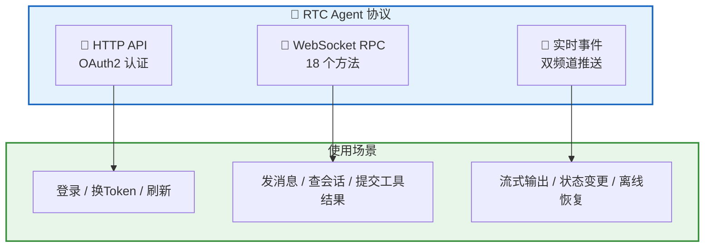
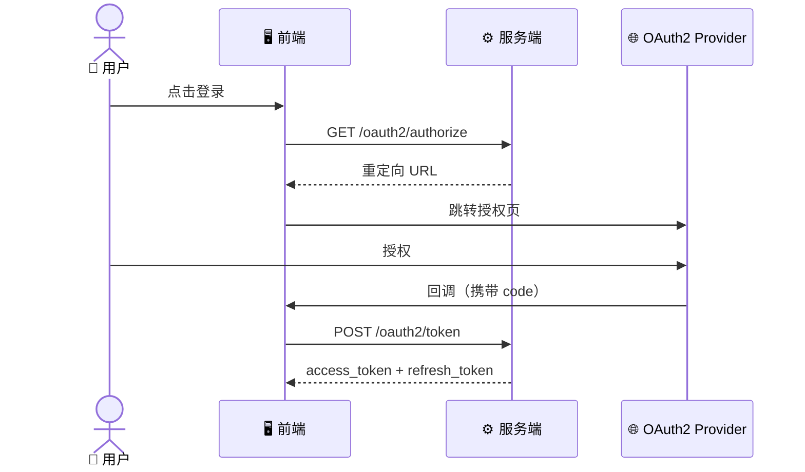
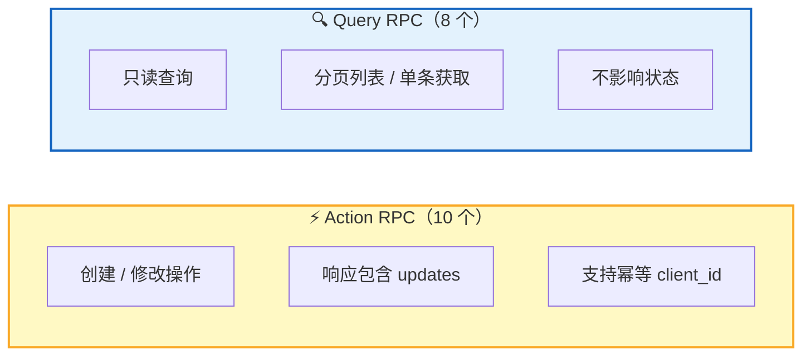
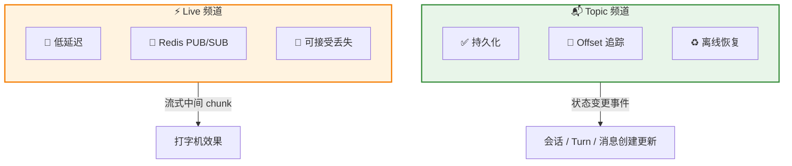
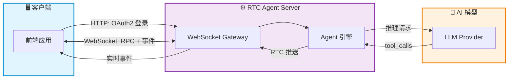

RTC Agent 的协议由三层组成，各司其职：**HTTP API** 负责认证、**WebSocket RPC** 承载所有业务操作、**实时事件**驱动前后端状态同步。

## 协议分层

| 层 | 协议 | 用途 | 特点 |
|:--:|:----:|------|------|
| 🔐 **认证层** | HTTPS | OAuth2 授权码流程 | 标准 HTTP，兼容所有 OAuth2 Provider |
| 💬 **操作层** | WebSocket RPC | 会话、消息、Turn、RTC 操作 | 18 个方法，分为 Action 和 Query 两类 |
| 📢 **事件层** | WebSocket Pub/Sub | 实时状态推送 | 双频道（Topic + Live），支持离线恢复 |

## 认证层：HTTP API

处理用户登录和令牌管理，遵循标准 OAuth2 授权码流程。

**3 个端点**覆盖完整认证生命周期：

| 端点 | 方法 | 功能 |
|------|:----:|------|
| `/oauth2/authorize` | GET | 获取 OAuth2 授权重定向 URL |
| `/oauth2/token` | POST | 授权码换取 access_token |
| `/oauth2/refresh` | POST | 刷新 access_token |

👉 [详细文档：HTTP API](/docs/protocol/http-api/)

## 操作层：WebSocket RPC

所有业务操作通过 WebSocket RPC 完成——发消息、查会话、提交工具结果，都在一条持久连接上。

**4 个业务域，18 个方法**：

| 域 | Action | Query |
|:--:|:------:|:-----:|
| **Session** | `close` · `update` · `fork` · `compact` | `list` · `get` |
| **Message** | `send` | `list` · `get` |
| **Turn** | `stop` | `list` · `get` |
| **RTC** | `update_status` · `submit_result` | `list` · `get` |

👉 [详细文档：WebSocket RPC](/docs/protocol/rpc/)

## 事件层：实时事件

服务端通过 **双频道** 架构推送实时事件，兼顾可靠性和低延迟。

| 频道 | 用途 | 特性 |
|------|------|------|
| **Topic** | 状态变更事件 | 持久化、Offset 追踪、离线恢复 |
| **Live** | 流式消息中间 chunks | 非持久化、低延迟、即发即弃 |

👉 [详细文档：实时事件](/docs/protocol/events/)

## 数据流全景

## 下一步

- [HTTP API](/docs/protocol/http-api/) — OAuth2 认证端点的详细定义
- [WebSocket RPC](/docs/protocol/rpc/) — 18 个 RPC 方法的完整参考
- [实时事件](/docs/protocol/events/) — 双频道事件推送机制
- [架构总览](/docs/architecture/) — 了解 RTC Agent 的整体架构设计
