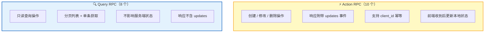
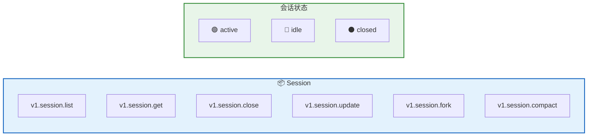
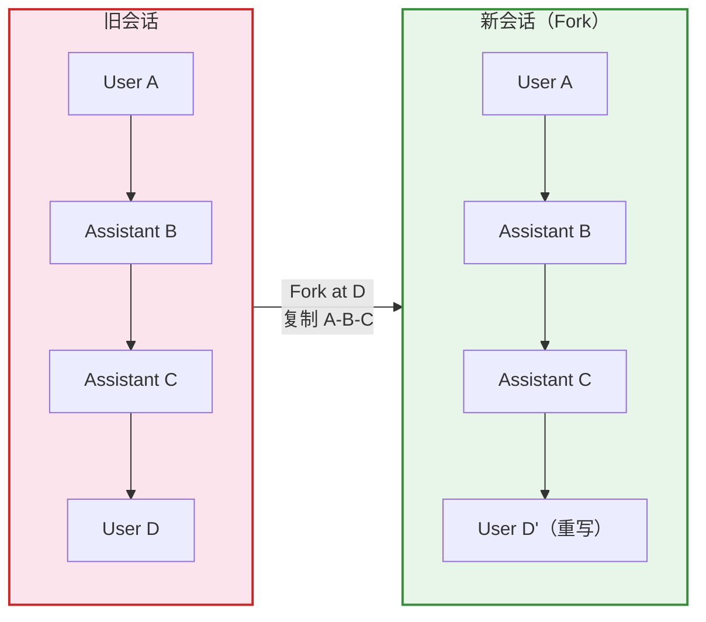
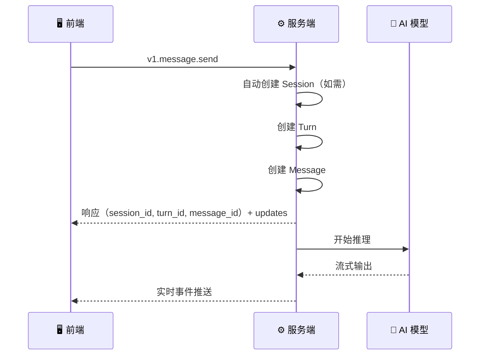
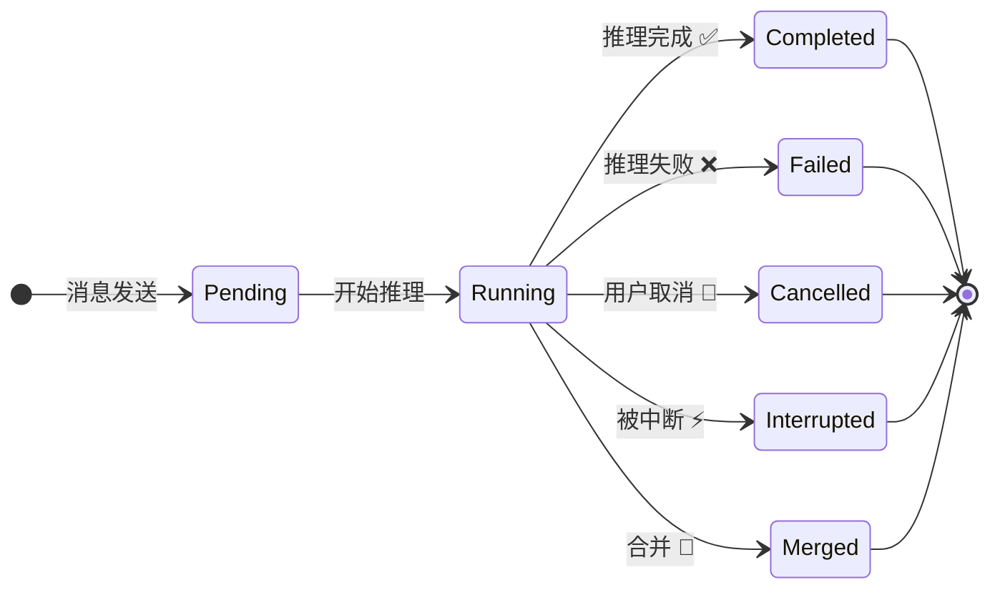
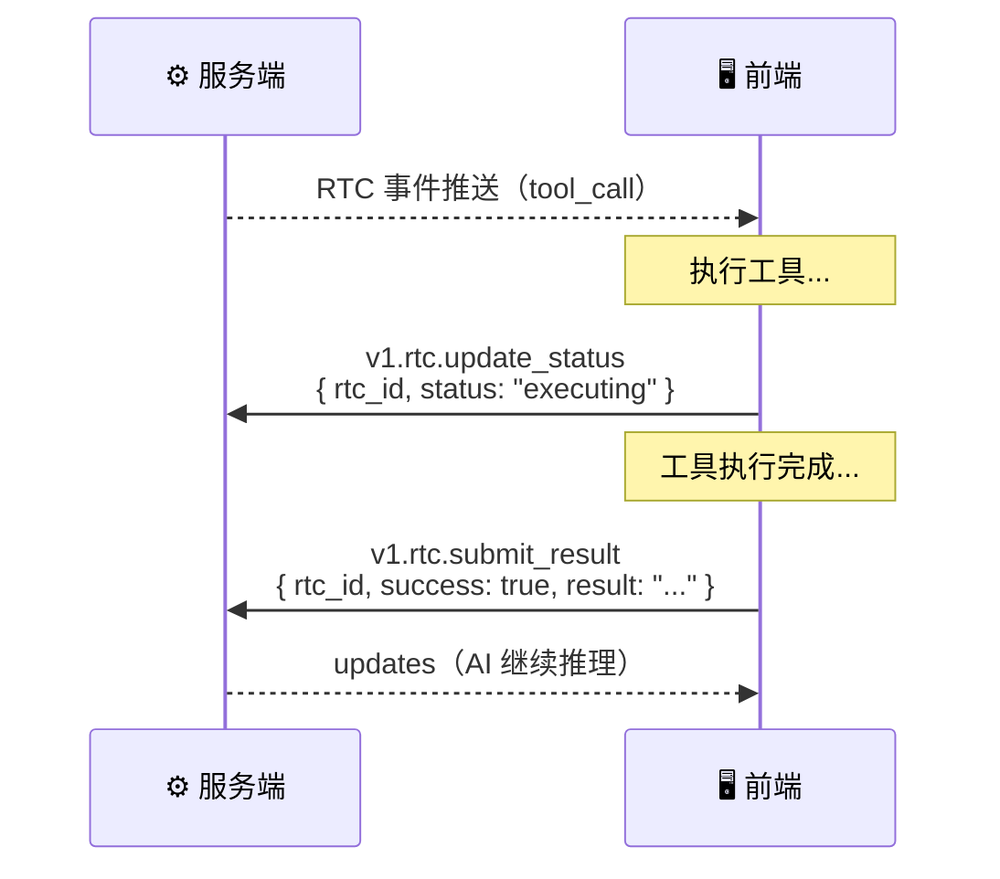
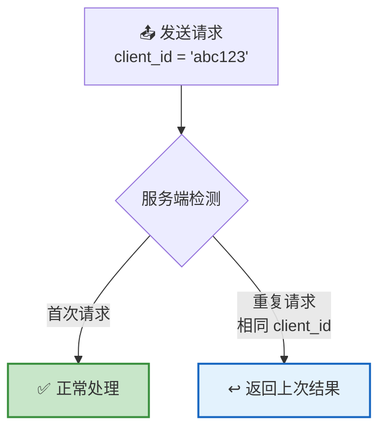
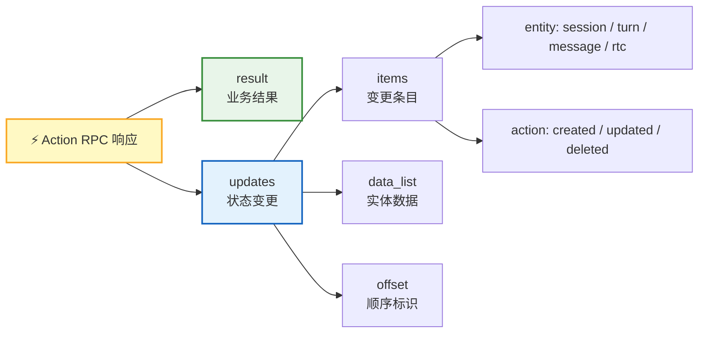

认证完成后，前端通过一条 **WebSocket 持久连接** 完成所有业务操作。RPC 共定义 **18 个方法**，分为 **Action（操作类）** 和 **Query（查询类）** 两种类型。

## RPC 分类



| 对比 | Action RPC | Query RPC |
|------|:----------:|:---------:|
| **操作类型** | 创建 / 修改 / 删除 | 只读查询 |
| **响应包含 updates** | ✅ 是 | ❌ 否 |
| **幂等支持** | ✅ client_id | — |
| **典型场景** | 发消息、关闭会话 | 加载消息列表 |

---

## 方法一览

18 个方法按 **4 个业务域** 组织：

| 域 | Action | Query |
|:--:|:------:|:-----:|
| **Session** | `v1.session.close` · `v1.session.update` · `v1.session.fork` · `v1.session.compact` | `v1.session.list` · `v1.session.get` |
| **Message** | `v1.message.send` | `v1.message.list` · `v1.message.get` |
| **Turn** | `v1.turn.stop` | `v1.turn.list` · `v1.turn.get` |
| **RTC** | `v1.rtc.update_status` · `v1.rtc.submit_result` | `v1.rtc.list` · `v1.rtc.get` |

---

## Session 域

会话是用户与 AI 对话的容器。每个会话包含多条消息和多个 Turn。



| 方法 | 类型 | 功能 | 关键参数 |
|------|:----:|------|----------|
| `v1.session.list` | 🔍 Query | 获取会话列表 | `cursor`（分页），`limit`（默认 20） |
| `v1.session.get` | 🔍 Query | 获取单个会话 | `session_id` |
| `v1.session.close` | ⚡ Action | 关闭会话 | `session_id`，`client_id` |
| `v1.session.update` | ⚡ Action | 更新会话标题 / 软删除 | `session_id`，`title`，`deleted_at` |
| `v1.session.fork` | ⚡ Action | 分叉对话（基于历史消息创建新会话） | `old_server_session_id`，`new_client_session_id`，`old_server_message_id`，`content_data`，`limit`（默认 200，最多 1000） |
| `v1.session.compact` | ⚡ Action | 手动触发上下文压缩 | `session_id`，`custom_instruction` |

### Fork 分叉对话



> 💡 **Fork 的典型场景**：用户想从历史对话的某个分叉点开始新的方向。指定旧消息位置，系统复制之前的上下文，用新消息替换指定位置之后的内容，并触发新的 AI 推理。

---

## Message 域

消息是会话中的基本通信单元，支持多种内容类型。

| 方法 | 类型 | 功能 | 关键参数 |
|------|:----:|------|----------|
| `v1.message.send` | ⚡ Action | 发送消息（自动创建 session 和 turn） | `content_data`，`client_session_id`，`client_id`，`server_session_id`（可选） |
| `v1.message.list` | 🔍 Query | 获取消息列表 | `session_id`，`cursor`（global_offset），`limit`（默认 50） |
| `v1.message.get` | 🔍 Query | 获取单条消息 | `message_id` |

### 消息发送流程



> 💡 **自动创建**：调用 `v1.message.send` 时，如果 `server_session_id` 为空，服务端会自动创建新会话。这意味着"新建对话"和"发送消息"可以合并为一次调用。

### 内容类型

| 类型 | 说明 | Data 结构 |
|------|------|-----------|
| `markdown` | Markdown 文本 | 字符串 |
| `text` | 纯文本 | 字符串 |
| `thinking` | AI 推理过程 | 字符串 |
| `summary` | 上下文摘要 | `SummaryItem[]` |
| `toolcall_input` | 工具调用请求 | `ToolCall` 对象 |
| `toolcall_output` | 工具调用结果 | `ToolCall` 对象 |

---

## Turn 域

Turn 代表一次完整的 AI 推理轮次——从用户发消息到 AI 完成响应。



| 方法 | 类型 | 功能 | 关键参数 |
|------|:----:|------|----------|
| `v1.turn.stop` | ⚡ Action | 停止当前 Turn | `session_id`，`client_id` |
| `v1.turn.list` | 🔍 Query | 获取 Turn 列表 | `session_id`，`cursor`，`limit`（默认 50） |
| `v1.turn.get` | 🔍 Query | 获取单个 Turn | `turn_id` |

| 状态 | 说明 |
|:----:|------|
| `pending` | 等待开始 |
| `running` | AI 正在推理 |
| `completed` | 推理完成 |
| `failed` | 推理失败 |
| `cancelled` | 用户主动取消 |
| `interrupted` | 被系统中断 |
| `merged` | 与其他 Turn 合并 |

---

## RTC 域

RTC（Remote Tool Calling）是 AI 调用前端工具的机制。前端通过 RTC 域的 RPC 上报工具执行状态和结果。



| 方法 | 类型 | 功能 | 关键参数 |
|------|:----:|------|----------|
| `v1.rtc.update_status` | ⚡ Action | 更新 RTC 执行状态 | `rtc_id`，`status`，`client_id` |
| `v1.rtc.submit_result` | ⚡ Action | 提交工具执行结果 | `rtc_id`，`success`，`result` / `error`，`client_id` |
| `v1.rtc.list` | 🔍 Query | 获取 RTC 列表 | `session_id`，`cursor`，`limit`（默认 50） |
| `v1.rtc.get` | 🔍 Query | 获取单个 RTC | `rtc_id` |

### RTC 状态流转

| 状态 | 说明 | 前端操作 |
|:----:|------|----------|
| `pending` | 等待前端接收 | 收到 RTC 事件 |
| `sent` | 已送达前端 | 展示工具调用 UI |
| `executing` | 正在执行 | 调用 `update_status` |
| `completed` | 执行成功 | 调用 `submit_result(success=true)` |
| `failed` | 执行失败 | 调用 `submit_result(success=false)` |
| `timeout` | 执行超时 | 系统自动标记 |
| `rejected` | 用户拒绝 | 用户点击拒绝 |

---

## 幂等机制

所有 Action RPC 支持 **`client_id` 幂等**——客户端生成的唯一 ID，确保重复请求不会产生副作用。



> 💡 **为什么需要幂等？** WebSocket 消息可能因网络问题重发。`client_id` 保证"发一次"和"发两次"的效果完全相同——前端可以放心重试，无需担心重复创建消息或重复执行工具。

| 特性 | 说明 |
|------|------|
| **生成方** | 客户端（前端） |
| **格式** | 字符串，建议使用 UUID |
| **作用域** | 同一方法内唯一 |
| **重复行为** | 返回首次处理的结果，不创建新记录 |

---

## Update 模型

Action RPC 的响应统一包含 **`result`** 和 **`updates`** 两部分：

```json
{
  "result": { "...业务数据..." },
  "updates": [
    {
      "id": "update-uuid",
      "items": [
        { "entity": "message", "action": "created", "entity_id": "msg-uuid" }
      ],
      "data_list": [{ "...实体完整数据..." }],
      "offset": 42
    }
  ]
}
```



> 💡 **前端收到 updates 后**：直接更新本地状态（IndexedDB / 内存），保持与服务端一致。无需再发一次查询请求——这就是"操作即同步"的设计理念。

## 下一步

- [实时事件](/docs/protocol/events/) — 了解 updates 背后的双频道推送机制
- [Remote Tool Calling](/docs/concepts/rtc/) — 深入了解 RTC 工具调用的完整生命周期
- [协议总览](/docs/protocol/) — 返回协议全景
